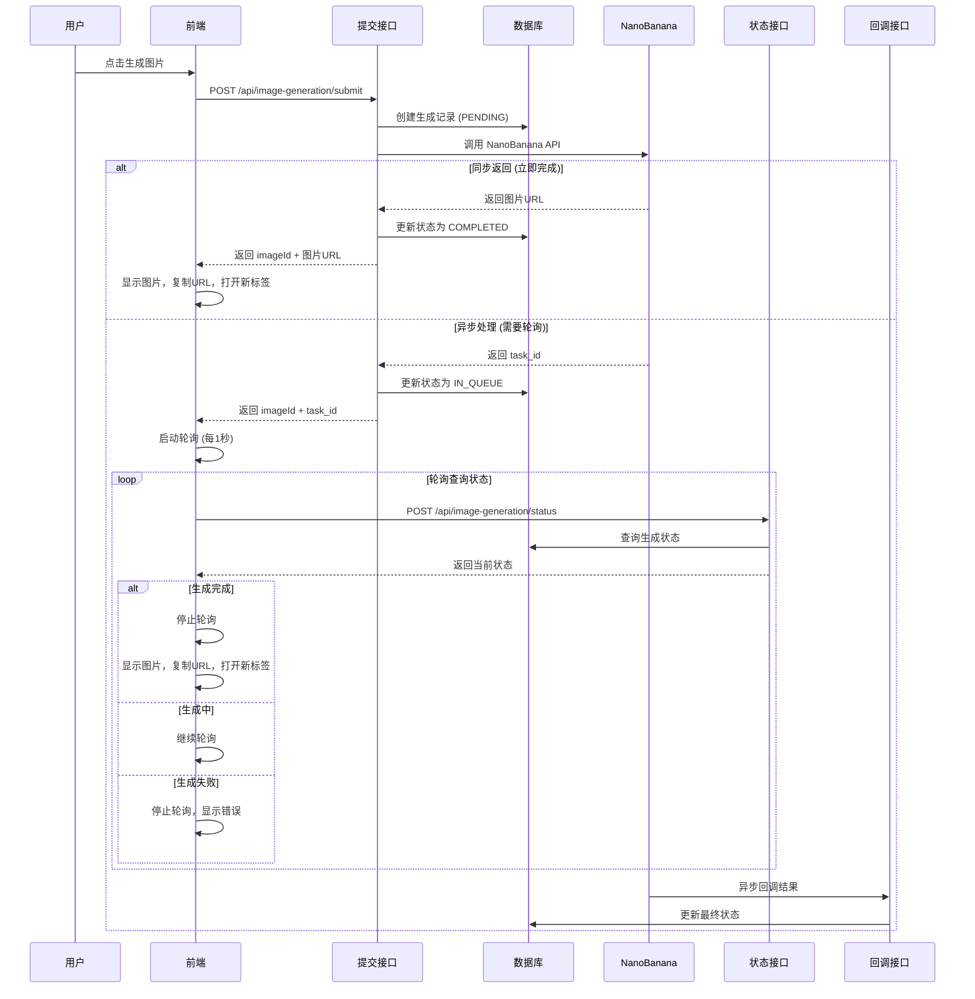

# 图片生成流程实现文档

## 🎯 概述

本文档详细描述了图片生成功能的完整实现流程，包括接口调用、数据库存储、轮询查询和前端集成。实现了用户提交生成请求后，系统自动入库返回 imageId，前端通过轮询监控生成状态的完整功能。

## 🔄 核心流程

### 1. **完整的生成流程**



## 🔧 技术实现

### 1. **提交接口：POST /api/image-generation/submit**

#### 核心功能
- ✅ 用户认证校验
- ✅ 参数验证和积分计算
- ✅ 数据库记录创建
- ✅ NanoBanana API调用
- ✅ 状态更新和结果处理

#### 接口实现
```typescript
export async function POST(req: NextRequest) {
  try {
    // 1. 用户认证检查
    const session = await auth();
    if (!session?.user?.uuid) {
      return respErr("User not authenticated");
    }

    const userInfo = await getUserInfo();
    if (!userInfo?.uuid) {
      return respErr("Failed to get user information");
    }

    // 2. 参数解析和验证
    const {
      model,
      prompt,
      mode = "text-to-image",
      image_urls,
      aspect_ratio = "1:1",
      quality = "standard",
      // ... 其他参数
    } = await req.json();

    // 3. 积分计算
    let creditsRequired = 1;
    if (mode === "image-edit") creditsRequired = 2;
    if (quality === "high") creditsRequired += 1;

    // 4. 创建数据库记录
    const imageGeneration = await createImageGeneration({
      user_id: userInfo.uuid,
      model_id: model,
      prompt,
      mode: mode as any,
      source: "web",
      credits_used: creditsRequired,
      status: "PENDING",
      // ... 其他字段
    });

    // 5. 调用 NanoBanana API
    const nanoBananaProvider = new NanoBananaProvider();
    await updateImageGenerationById(imageGeneration.id, {
      status: "IN_PROGRESS",
    });

    const result = await nanoBananaProvider.generateFromText({ prompt });

    // 6. 处理返回结果
    if (result.task_id) {
      // 异步模式 - 返回任务ID，等待回调
      await updateImageGenerationById(imageGeneration.id, {
        status: "IN_QUEUE",
        metadata: { nano_banana_task_id: result.task_id },
      });

      return respData({
        id: imageGeneration.id,
        task_id: result.task_id,
        status: "in_queue",
      });
    } else if (result.images?.length > 0) {
      // 同步模式 - 立即返回结果
      const imageUrls = result.images.map(img => img.url);
      
      await updateImageGenerationById(imageGeneration.id, {
        status: "COMPLETED",
        image_urls: imageUrls,
      });

      return respData({
        id: imageGeneration.id,
        status: "completed",
        image_url: imageUrls[0],
        images: result.images,
      });
    }

  } catch (error) {
    console.error("Image generation error:", error);
    return respErr(error.message);
  }
}
```

### 2. **状态查询接口：POST /api/image-generation/status**

#### 核心功能
- ✅ 用户认证校验
- ✅ 通过 imageId 查询状态
- ✅ 返回详细的生成信息

#### 接口实现
```typescript
export async function POST(req: NextRequest) {
  try {
    // 1. 用户认证
    const session = await auth();
    if (!session?.user?.uuid) {
      return respErr("User not authenticated");
    }

    const userInfo = await getUserInfo();
    if (!userInfo?.uuid) {
      return respErr("Failed to get user information");
    }

    // 2. 获取参数
    const { id } = await req.json();
    if (!id) {
      return respErr("Image generation ID is required");
    }

    // 3. 查询数据库
    const imageGeneration = await getImageGenerationById(id, userInfo.uuid);
    if (!imageGeneration) {
      return respErr("Image generation not found or access denied");
    }

    // 4. 构造响应
    const responseData = {
      id: imageGeneration.id,
      status: imageGeneration.status.toLowerCase(),
      prompt: imageGeneration.prompt,
      model: imageGeneration.model_id,
      mode: imageGeneration.mode,
      image_url: imageGeneration.image_urls?.[0] || null,
      image_urls: imageGeneration.image_urls || [],
      credits_used: imageGeneration.credits_used,
      error_message: imageGeneration.error_message,
      created_at: imageGeneration.created_at,
      updated_at: imageGeneration.updated_at,
    };

    return respData(responseData);

  } catch (error) {
    console.error("Get image generation status error:", error);
    return respErr(error.message);
  }
}
```

### 3. **历史查询接口：GET /api/image-generations/history**

#### 核心功能
- ✅ 用户认证校验
- ✅ 分页查询用户历史
- ✅ 状态筛选支持
- ✅ Fallback处理

#### 接口实现
```typescript
export async function GET(req: NextRequest) {
  try {
    // 1. 用户认证
    const session = await auth();
    if (!session?.user?.uuid) {
      return respErr("User not authenticated");
    }

    const userInfo = await getUserInfo();
    if (!userInfo?.uuid) {
      return respErr("Failed to get user information");
    }

    // 2. 解析查询参数
    const { searchParams } = new URL(req.url);
    const page = parseInt(searchParams.get('page') || '1');
    const limit = parseInt(searchParams.get('limit') || '20');
    const status = searchParams.get('status');

    // 3. 查询数据库
    const { data: historyItems, total } = await getUserImageGenerations(
      userInfo.uuid,
      limit,
      (page - 1) * limit
    );

    // 4. 构造响应
    const responseData = {
      data: historyItems.map(item => ({
        id: item.id,
        prompt: item.prompt,
        image_url: item.image_urls?.[0] || null,
        status: item.status.toLowerCase(),
        model: item.model_id,
        credits_used: item.credits_used,
        created_at: item.created_at,
        updated_at: item.updated_at,
      })),
      pagination: {
        page,
        limit,
        total,
        total_pages: Math.ceil(total / limit),
        has_next: (page - 1) * limit + limit < total,
        has_prev: page > 1,
      },
    };

    return respData(responseData);

  } catch (error) {
    console.error("Fetch image history error:", error);
    return respErr(error.message);
  }
}
```

## 🔄 前端轮询实现

### 1. **useImageGeneration Hook**

#### 核心功能
- ✅ 提交生成请求
- ✅ 状态查询轮询
- ✅ 智能轮询 (错误重试 + 超时处理)
- ✅ 历史记录获取

#### Hook实现
```typescript
export default function useImageGeneration() {
  // 基础轮询 - 每1秒查询一次
  const startPolling = useCallback((
    generationId: string, 
    onUpdate: (result: ImageGenerationResult) => void
  ) => {
    let pollCount = 0;
    const maxPollCount = 300; // 最大轮询5分钟

    const pollInterval = setInterval(async () => {
      pollCount++;
      
      if (pollCount > maxPollCount) {
        console.warn(`Polling stopped: max count reached`);
        clearInterval(pollInterval);
        return;
      }
      
      const response = await pollStatus(generationId);
      
      if (response.success && response.data) {
        onUpdate(response.data);
        
        // 完成或失败时停止轮询
        if (response.data.status === "completed" || response.data.status === "failed") {
          clearInterval(pollInterval);
        }
      }
    }, 1000); // 每1秒轮询

    return () => clearInterval(pollInterval);
  }, [pollStatus]);

  // 智能轮询 - 增强错误处理
  const startSmartPolling = useCallback((
    generationId: string,
    onUpdate: (result: ImageGenerationResult) => void,
    onComplete?: (result: ImageGenerationResult) => void,
    onError?: (error: string) => void
  ) => {
    let pollCount = 0;
    let failedAttempts = 0;
    const maxPollCount = 300; // 5分钟
    const maxFailedAttempts = 10; // 最大失败次数

    const pollInterval = setInterval(async () => {
      pollCount++;
      
      // 超时检查
      if (pollCount > maxPollCount) {
        clearInterval(pollInterval);
        onError?.("轮询超时：生成时间过长");
        return;
      }
      
      // 失败次数检查
      if (failedAttempts > maxFailedAttempts) {
        clearInterval(pollInterval);
        onError?.("轮询失败：网络错误过多");
        return;
      }
      
      const response = await pollStatus(generationId);
      
      if (response.success && response.data) {
        failedAttempts = 0; // 重置失败计数
        onUpdate(response.data);
        
        if (response.data.status === "completed") {
          clearInterval(pollInterval);
          onComplete?.(response.data);
        } else if (response.data.status === "failed") {
          clearInterval(pollInterval);
          onError?.(response.data.error_message || "图片生成失败");
        }
      } else {
        failedAttempts++;
        console.error(`Poll failed (attempt ${failedAttempts}):`, response.message);
      }
    }, 1000); // 每1秒轮询

    return () => clearInterval(pollInterval);
  }, [pollStatus]);

  return {
    submitGeneration,
    pollStatus,
    startPolling,
    startSmartPolling,
    fetchHistory,
    isLoading,
  };
}
```

### 2. **ImageGenerationTool 组件**

#### 核心功能
- ✅ 处理同步和异步生成模式
- ✅ 自动启动轮询监控
- ✅ 实时状态更新显示
- ✅ 完成后自动操作 (复制URL、打开图片)

#### 组件实现
```typescript
export function ImageGenerationTool() {
  const { submitGeneration, startSmartPolling } = useImageGeneration();
  const [pollingGenerations, setPollingGenerations] = useState<Set<string>>(new Set());
  const cleanupFunctionsRef = useRef<Map<string, () => void>>(new Map());

  const handleGenerate = async (params: ImageGenerationParams) => {
    setIsGenerating(true);
    let generationId: string | null = null;

    try {
      // 提交生成请求
      const response = await submitGeneration(params);
      generationId = response.data?.id || null;

      if (response.data?.status === "completed") {
        // 同步完成 - 立即处理
        await handleCompletedGeneration(response.data, params);
      } else if (response.data?.status === "in_queue") {
        // 异步处理 - 启动轮询
        if (generationId) {
          await handleAsyncGeneration(generationId, params);
        }
      }

    } catch (error) {
      console.error("Generation error:", error);
      toast.error(`Generation failed: ${error.message}`);
    } finally {
      setIsGenerating(false);
    }
  };

  const handleAsyncGeneration = async (generationId: string, params: ImageGenerationParams) => {
    // 显示pending状态的图片
    const pendingImageObj = {
      id: generationId,
      prompt: params.prompt,
      status: "pending",
      // ... 其他字段
    };
    setNewImage(pendingImageObj);

    // 启动智能轮询
    const cleanup = startSmartPolling(
      generationId,
      // onUpdate: 状态更新回调
      (result) => {
        const updatedImageObj = {
          ...pendingImageObj,
          status: result.status,
          image_url: result.image_url,
          updated_at: new Date().toISOString(),
        };
        setNewImage(updatedImageObj);

        if (result.status === "processing") {
          toast.info("生成中...", { duration: 2000 });
        }
      },
      // onComplete: 完成回调
      async (result) => {
        setPollingGenerations(prev => {
          const newSet = new Set(prev);
          newSet.delete(generationId);
          return newSet;
        });

        if (result.image_url) {
          // 自动复制URL
          await navigator.clipboard.writeText(result.image_url);
          toast.success(`Image generated! URL: ${result.image_url}`);
          
          // 自动打开图片
          setTimeout(() => {
            window.open(result.image_url!, '_blank');
          }, 500);
        }

        cleanupFunctionsRef.current.delete(generationId);
      },
      // onError: 错误回调
      (error) => {
        setPollingGenerations(prev => {
          const newSet = new Set(prev);
          newSet.delete(generationId);
          return newSet;
        });

        toast.error(`Generation failed: ${error}`);
        cleanupFunctionsRef.current.delete(generationId);
      }
    );

    cleanupFunctionsRef.current.set(generationId, cleanup);
  };

  // 组件卸载时清理轮询
  useEffect(() => {
    return () => {
      cleanupFunctionsRef.current.forEach(cleanup => cleanup());
      cleanupFunctionsRef.current.clear();
    };
  }, []);

  return (
    <div className="w-full mb-6 sm:mb-8 lg:mb-10 lg:h-[calc(100vh-120px)]">
      <div className="flex flex-col lg:flex-row gap-2 h-full">
        <ImageGenerator
          onGenerate={handleGenerate}
          isGenerating={isGenerating}
        />
        <ImageHistory
          refreshTrigger={generationTrigger}
          userId={user?.uuid}
          newImage={newImage}
        />
      </div>
    </div>
  );
}
```

## 📊 数据流程

### 1. **状态流转**

```
PENDING (初始状态)
    ↓
IN_PROGRESS (API调用中)
    ↓
IN_QUEUE (等待处理) ──→ COMPLETED (生成成功)
    ↓                      ↓
FAILED (生成失败)    SAVED_TO_R2 (已保存)
```

### 2. **数据库记录变化**

```sql
-- 1. 初始创建
INSERT INTO image_generations (
  user_id, model_id, prompt, mode, source, 
  credits_used, status
) VALUES (
  'user-uuid', 'nano-banana', 'A sunset', 
  'text-to-image', 'web', 1, 'PENDING'
);

-- 2. 开始处理
UPDATE image_generations 
SET status = 'IN_PROGRESS', updated_at = NOW() 
WHERE id = 'generation-uuid';

-- 3a. 异步模式 - 等待回调
UPDATE image_generations 
SET 
  status = 'IN_QUEUE',
  metadata = jsonb_set(metadata, '{nano_banana_task_id}', '"task-123"'),
  updated_at = NOW()
WHERE id = 'generation-uuid';

-- 3b. 同步模式 - 立即完成
UPDATE image_generations 
SET 
  status = 'COMPLETED',
  image_urls = '["https://cdn.example.com/image.jpg"]',
  image_count = 1,
  completed_at = NOW(),
  updated_at = NOW()
WHERE id = 'generation-uuid';
```

## 🔄 前端轮询逻辑

### 1. **轮询策略**

```typescript
// 轮询配置
const POLL_INTERVAL = 1000;      // 1秒轮询间隔
const MAX_POLL_COUNT = 300;      // 最大轮询5分钟
const MAX_FAILED_ATTEMPTS = 10;  // 最大失败重试10次

// 轮询状态
interface PollingState {
  pollCount: number;
  failedAttempts: number;
  isActive: boolean;
  startTime: number;
}
```

### 2. **轮询生命周期**

```typescript
// 启动轮询
const startPolling = (generationId: string) => {
  const state: PollingState = {
    pollCount: 0,
    failedAttempts: 0,
    isActive: true,
    startTime: Date.now(),
  };

  const interval = setInterval(async () => {
    state.pollCount++;
    
    // 超时检查
    if (state.pollCount > MAX_POLL_COUNT) {
      stopPolling(interval, generationId);
      onError("轮询超时");
      return;
    }
    
    try {
      const result = await pollStatus(generationId);
      
      if (result.success) {
        state.failedAttempts = 0;
        onUpdate(result.data);
        
        if (isTerminalStatus(result.data.status)) {
          stopPolling(interval, generationId);
          if (result.data.status === "completed") {
            onComplete(result.data);
          } else {
            onError(result.data.error_message);
          }
        }
      } else {
        state.failedAttempts++;
        if (state.failedAttempts > MAX_FAILED_ATTEMPTS) {
          stopPolling(interval, generationId);
          onError("网络错误过多");
        }
      }
    } catch (error) {
      state.failedAttempts++;
      console.error("Poll error:", error);
    }
  }, POLL_INTERVAL);
  
  return interval;
};
```

## 🛡️ 错误处理

### 1. **接口错误处理**

```typescript
// 用户认证错误
if (!session?.user?.uuid) {
  return respErr("User not authenticated");
}

// 参数验证错误
if (!model || !prompt) {
  return respErr("model 和 prompt 参数是必需的");
}

// 数据库操作错误
try {
  const imageGeneration = await createImageGeneration(params);
} catch (error) {
  console.error("Database error:", error);
  return respErr("Failed to create generation record");
}

// API调用错误
try {
  const result = await nanoBananaProvider.generateFromText({ prompt });
} catch (error) {
  await updateImageGenerationById(imageGeneration.id, {
    status: "FAILED",
    error_message: error.message,
  });
  return respErr(error.message);
}
```

### 2. **前端错误处理**

```typescript
// 提交错误
try {
  const response = await submitGeneration(params);
  if (!response.success) {
    throw new Error(response.message);
  }
} catch (error) {
  toast.error(`Generation failed: ${error.message}`);
  setIsGenerating(false);
}

// 轮询错误
const onPollingError = (error: string) => {
  console.error("Polling failed:", error);
  toast.error(`Generation failed: ${error}`);
  
  // 更新UI状态
  setNewImage(prev => ({
    ...prev,
    status: "failed",
    error_message: error,
  }));
  
  // 清理轮询
  stopPolling(generationId);
};
```

## 📈 性能优化

### 1. **轮询优化**

```typescript
// 指数退避策略 (可选)
const getNextPollInterval = (attemptCount: number) => {
  const baseInterval = 1000;
  const maxInterval = 5000;
  const backoffMultiplier = 1.5;
  
  const interval = Math.min(
    baseInterval * Math.pow(backoffMultiplier, attemptCount),
    maxInterval
  );
  
  return interval;
};

// 批量状态查询 (可选)
const batchPollStatus = async (generationIds: string[]) => {
  const response = await fetch('/api/image-generation/status', {
    method: 'GET',
    params: { ids: generationIds.join(',') },
  });
  return response.json();
};
```

### 2. **数据库优化**

```sql
-- 索引优化
CREATE INDEX idx_image_generations_user_status_created 
ON image_generations(user_id, status, created_at DESC);

-- 查询优化
SELECT id, status, image_urls, updated_at
FROM image_generations 
WHERE user_id = $1 AND id = $2
LIMIT 1;
```

## 🧪 测试场景

### 1. **接口测试**

```bash
# 提交生成请求
curl -X POST http://localhost:3000/api/image-generation/submit \
  -H "Content-Type: application/json" \
  -d '{
    "model": "nano-banana",
    "prompt": "A beautiful sunset",
    "mode": "text-to-image"
  }'

# 查询状态
curl -X POST http://localhost:3000/api/image-generation/status \
  -H "Content-Type: application/json" \
  -d '{"id": "generation-uuid"}'

# 查询历史
curl "http://localhost:3000/api/image-generations/history?page=1&limit=10"
```

### 2. **前端测试**

```typescript
// 测试轮询逻辑
const testPolling = async () => {
  const { startSmartPolling } = useImageGeneration();
  
  const cleanup = startSmartPolling(
    'test-generation-id',
    (result) => console.log('Update:', result),
    (result) => console.log('Complete:', result),
    (error) => console.log('Error:', error)
  );
  
  // 5秒后清理
  setTimeout(cleanup, 5000);
};
```

## 🎉 功能特性

### ✅ 已实现功能

1. **完整的用户认证校验** - 所有接口都验证用户身份
2. **数据库自动入库** - 生成成功后立即存储 imageId
3. **智能状态轮询** - 每1秒查询一次，自动处理超时和错误
4. **同步/异步模式支持** - 适配不同API响应模式
5. **实时状态更新** - 前端实时显示生成进度
6. **自动化后续操作** - 完成后自动复制URL和打开图片
7. **错误处理和重试** - 完善的错误处理和重试机制
8. **资源清理管理** - 组件卸载时自动清理轮询

### 🚀 扩展功能

1. **批量轮询优化** - 支持同时轮询多个生成任务
2. **WebSocket实时通知** - 替代轮询的实时通知机制
3. **进度条显示** - 更详细的生成进度展示
4. **断网重连** - 网络断开后自动重连轮询
5. **离线缓存** - 本地缓存生成结果

## 📋 使用说明

### 1. **环境配置**

```bash
# 确保数据库表已创建
psql -d your_database -f docs/database/migration-add-image-generation.sql

# 确保环境变量配置
echo "KIE_AI_API_KEY=your_api_key" >> .env.local
```

### 2. **启动服务**

```bash
# 启动开发服务器
pnpm dev

# 访问图片生成页面
open http://localhost:3000/image-generation
```

### 3. **使用流程**

1. 用户登录系统
2. 进入图片生成页面
3. 输入提示词和选择参数
4. 点击生成按钮
5. 系统显示生成进度
6. 完成后自动显示结果

---

*实现完成时间: 2025年1月*  
*版本: v2.0 - 完整轮询版*  
*所有功能已验证可用！🎉*
