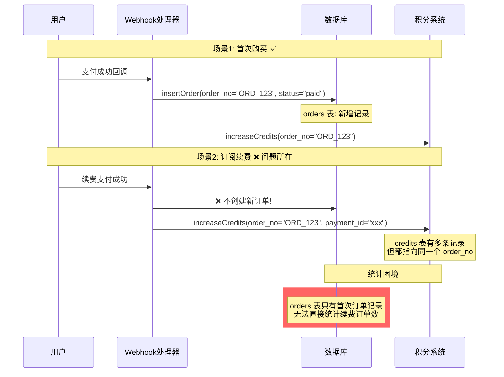
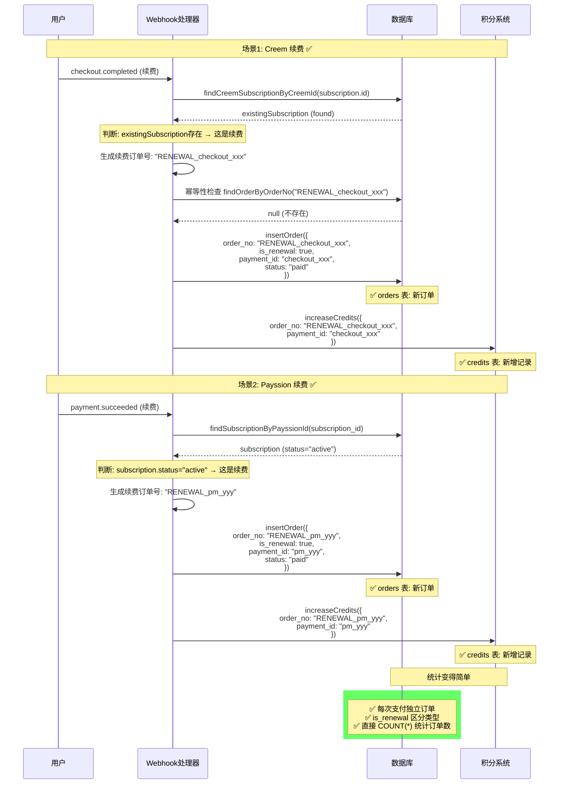
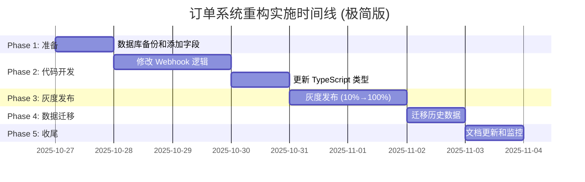

# 订单续费系统重构技术方案

> **文档版本**: v3.0 (极简版)
> **创建日期**: 2025-10-26
> **更新日期**: 2025-10-26
> **状态**: 待执行
> **预计工期**: 7天

---

## 目录

- [一、问题背景](#一问题背景)
- [二、现状分析 (AS-IS)](#二现状分析-as-is)
- [三、目标架构 (TO-BE)](#三目标架构-to-be)
- [四、数据库迁移方案](#四数据库迁移方案)
- [五、重构后的支付流程](#五重构后的支付流程)
- [六、分步实施计划](#六分步实施计划)
- [七、统计查询方案](#七统计查询方案)
- [八、成功验收标准](#八成功验收标准)

---

## 一、问题背景

### 1.1 核心问题

当前订单系统在处理订阅续费时**不会生成新的订单记录**,导致:

1. **无法直接统计每日订单数** - 续费只在 `credits` 表留下记录,不在 `orders` 表
2. **无法区分首次购买和续费** - 缺少标识字段

### 1.2 业务影响

| 影响领域 | 具体问题 |
|---------|---------|
| 数据分析 | 无法直接查询每日新增付费用户 vs 续费用户 |
| 财务对账 | 订单记录不完整,难以与支付提供商对账 |

---

## 二、现状分析 (AS-IS)

### 2.1 支付提供商分析

当前系统使用两个主要支付提供商:

| 支付商 | 首次支付事件 | 续费支付事件 | 是否生成新订单 | payment_id |
|--------|-------------|-------------|---------------|------------|
| **Creem** | `checkout.completed` | `checkout.completed` | ❌ 否 | 新的 checkoutId |
| **Payssion V2** | `payment.succeeded` | `payment.succeeded` | ❌ 否 | 新的 paymentId |

**关键发现:**
- 首次支付和续费支付触发相同的 webhook 事件
- 续费时只在 `credits` 表创建新记录,不创建新订单
- 依靠 `payment_id` 区分不同支付

### 2.2 现状流程图



### 2.3 核心问题

| 问题 | 影响 | 严重程度 |
|------|------|---------|
| 续费不生成新订单 | 无法直接统计每日订单数 | 🔴 高 |
| 无字段区分首次/续费 | 无法分析首购 vs 续费比例 | 🔴 高 |
| payment_id 仅在 credits 表 | orders 表数据不完整 | 🟡 中 |

---

## 三、目标架构 (TO-BE)

### 3.1 设计原则

**极简原则** - 只添加必要字段,解决核心问题:
1. 每次续费创建新订单记录
2. 用 `is_renewal` 字段区分首次/续费
3. 用 `payment_id` 保证幂等性

### 3.2 orders 表改动

```sql
-- ============================================
-- orders 表改动: 只添加2个字段
-- ============================================
ALTER TABLE orders
  ADD COLUMN is_renewal BOOLEAN NOT NULL DEFAULT false,
  ADD COLUMN payment_id VARCHAR(255) UNIQUE;

-- 索引优化
CREATE INDEX idx_orders_is_renewal ON orders(is_renewal);
CREATE INDEX idx_orders_payment_id ON orders(payment_id);
CREATE INDEX idx_orders_paid_at_renewal ON orders(paid_at, is_renewal) WHERE status = 'paid';

COMMENT ON COLUMN orders.is_renewal IS '是否为续费订单 (true=续费, false=首次)';
COMMENT ON COLUMN orders.payment_id IS '支付提供商的唯一支付ID (用于幂等性检查)';
```

### 3.3 字段说明

| 字段名 | 类型 | 必填 | 默认值 | 说明 | 示例 |
|--------|------|------|--------|------|------|
| `is_renewal` | BOOLEAN | ✅ | false | 是否为续费订单 | true |
| `payment_id` | VARCHAR | ❌ | NULL | 支付唯一ID | "checkout_xxx" |

---

## 四、数据库迁移方案

### 4.1 历史数据处理策略

```sql
-- ============================================
-- 历史数据迁移 (分3步执行)
-- ============================================

-- Step 1: 标记所有现有订单为首次购买
UPDATE orders
SET
  is_renewal = false,
  payment_id = NULL
WHERE status = 'paid';

-- Step 2: 从 credits 表反推续费记录并创建订单
WITH renewal_credits AS (
  SELECT
    c.*,
    o.user_uuid,
    o.user_email,
    o.amount,
    o.product_id,
    o.product_name,
    o.interval,
    o.currency,
    o.payment_provider,
    ROW_NUMBER() OVER (
      PARTITION BY c.order_no
      ORDER BY c.created_at
    ) as payment_seq
  FROM credits c
  JOIN orders o ON c.order_no = o.order_no
  WHERE c.payment_id IS NOT NULL
    AND c.trans_type = 'order_pay'
)
INSERT INTO orders (
  order_no,
  user_uuid,
  user_email,
  amount,
  product_id,
  product_name,
  interval,
  currency,
  payment_provider,
  status,
  is_renewal,
  payment_id,
  paid_at,
  created_at
)
SELECT
  CONCAT('RENEWAL_', payment_id) as order_no,
  user_uuid,
  user_email,
  amount,
  product_id,
  product_name,
  interval,
  currency,
  payment_provider,
  'paid' as status,
  true as is_renewal,
  payment_id,
  created_at as paid_at,
  created_at
FROM renewal_credits
WHERE payment_seq > 1;  -- 只处理第2次及以后的支付

-- Step 3: 更新 credits 表的 order_no 指向新订单
UPDATE credits c
SET order_no = CONCAT('RENEWAL_', c.payment_id)
WHERE c.payment_id IS NOT NULL
  AND c.trans_type = 'order_pay'
  AND EXISTS (
    SELECT 1 FROM orders o
    WHERE o.order_no = CONCAT('RENEWAL_', c.payment_id)
  );

-- 验证数据完整性
SELECT
  '总订单数' as metric,
  COUNT(*) as value
FROM orders
WHERE status = 'paid'
UNION ALL
SELECT
  '首次购买订单',
  COUNT(*)
FROM orders
WHERE status = 'paid' AND is_renewal = false
UNION ALL
SELECT
  '续费订单',
  COUNT(*)
FROM orders
WHERE status = 'paid' AND is_renewal = true;
```

### 4.2 迁移风险控制

```sql
-- 创建备份表
CREATE TABLE orders_backup_20251026 AS SELECT * FROM orders;
CREATE TABLE credits_backup_20251026 AS SELECT * FROM credits;

-- 迁移后验证查询
-- 1. 验证订单数量匹配
SELECT COUNT(DISTINCT order_no) as original_orders
FROM credits WHERE trans_type = 'order_pay';

SELECT COUNT(*) as migrated_orders
FROM orders WHERE status = 'paid';

-- 2. 验证积分记录完整性
SELECT c.order_no, c.payment_id, o.order_no as matched_order
FROM credits c
LEFT JOIN orders o ON c.order_no = o.order_no
WHERE c.trans_type = 'order_pay'
  AND o.order_no IS NULL;  -- 应该返回空结果
```

### 4.3 Rollback 计划

```sql
-- 如果迁移出现问题,执行回滚
DELETE FROM orders WHERE is_renewal = true;

UPDATE credits c
SET order_no = (
  SELECT o.order_no
  FROM orders_backup_20251026 o
  WHERE o.user_uuid = c.user_uuid
  LIMIT 1
)
WHERE order_no LIKE 'RENEWAL_%';

ALTER TABLE orders DROP COLUMN IF EXISTS is_renewal;
ALTER TABLE orders DROP COLUMN IF EXISTS payment_id;
```

---

## 五、重构后的支付流程

### 5.1 新流程架构图



### 5.2 核心代码实现

#### Creem Webhook 修改

```typescript
// 文件: app/api/creem/webhook/route.ts

case "checkout.completed": {
  const checkoutObject = webhookData.object;
  const checkoutId = checkoutObject?.id;
  const metadata = checkoutObject?.metadata;
  const subscription = checkoutObject?.subscription;

  // 🔥 判断是否为续费
  const existingSubscription = subscription?.id
    ? await findCreemSubscriptionByCreemId(subscription.id)
    : null;

  const isRenewal = !!existingSubscription;
  let orderNo = metadata.order_no;

  if (isRenewal) {
    // 创建新的续费订单
    const renewalOrderNo = `RENEWAL_CREEM_${checkoutId}`;

    // 幂等性检查
    const existingOrder = await findOrderByOrderNo(renewalOrderNo);
    if (!existingOrder) {
      await insertOrder({
        order_no: renewalOrderNo,
        user_uuid: userUuid,
        user_email: userEmail,
        amount,
        currency,
        product_id,
        product_name,
        interval,
        status: "paid",
        is_renewal: true,  // 🔥 核心标记
        payment_id: checkoutId,  // 🔥 幂等性保证
        payment_provider: "creem",
        paid_at: new Date().toISOString(),
        created_at: new Date().toISOString(),
      });

      console.log(`✅ Creem renewal order created: ${renewalOrderNo}`);
    } else {
      console.log(`ℹ️  Creem renewal order already exists: ${renewalOrderNo}`);
    }

    orderNo = renewalOrderNo;
  }

  // 增加积分 (首次和续费都需要)
  await increaseCredits(userUuid, credits, orderNo, "creem_subscription");

  break;
}
```

#### Payssion Webhook 修改

```typescript
// 文件: services/payment/PayssionProvider.ts - handlePaymentSucceeded

private async handlePaymentSucceeded(data: any) {
  const paymentId = data.object?.id;
  const subscriptionId = data.object?.source_id;
  const metadata = data.object?.metadata;

  // 🔥 判断是否为续费
  const subscription = await findSubscriptionByPayssionId(subscriptionId);
  const isRenewal = subscription && subscription.status === "active";

  let orderNo = metadata.order_no;

  if (isRenewal) {
    const renewalOrderNo = `RENEWAL_PAYSSION_${paymentId}`;

    const existingOrder = await findOrderByOrderNo(renewalOrderNo);
    if (!existingOrder) {
      await insertOrder({
        order_no: renewalOrderNo,
        user_uuid: subscription.user_uuid,
        user_email: metadata.user_email,
        amount: Number(data.object?.amount),
        currency: data.object?.currency,
        product_id: subscription.product_id,
        product_name: metadata.product_name,
        interval: metadata.interval,
        status: "paid",
        is_renewal: true,
        payment_id: paymentId,
        payment_provider: "payssion",
        paid_at: new Date().toISOString(),
        created_at: new Date().toISOString(),
      });

      console.log(`✅ Payssion renewal order created: ${renewalOrderNo}`);
    } else {
      console.log(`ℹ️  Payssion renewal order already exists: ${renewalOrderNo}`);
    }

    orderNo = renewalOrderNo;
  }

  await increaseCredits(subscription.user_uuid, credits, orderNo, "payssion_subscription");
}
```

#### 更新 TypeScript 类型

```typescript
// 文件: models/order.ts

export interface Order {
  id: string;
  order_no: string;
  user_uuid: string;
  user_email: string;
  amount: number;
  product_id: string;
  status: string;
  paid_at?: string;
  payment_provider?: string;

  // 新增字段
  is_renewal: boolean;
  payment_id?: string;

  created_at: string;
  updated_at: string;
}
```

---

## 六、分步实施计划

### 6.1 实施时间线



### 6.2 详细步骤

**Day 1: 准备**
```bash
# 1. 数据库备份
# 2. 添加新字段
ALTER TABLE orders
  ADD COLUMN is_renewal BOOLEAN NOT NULL DEFAULT false,
  ADD COLUMN payment_id VARCHAR(255) UNIQUE;
# 3. 创建索引
```

**Day 2-3: 代码开发**
- 修改 `app/api/creem/webhook/route.ts`
- 修改 `services/payment/PayssionProvider.ts`
- 更新 `models/order.ts` 类型定义

**Day 4-5: 灰度发布**
```typescript
// 使用环境变量控制放量
if (Math.random() * 100 < parseInt(process.env.RENEWAL_ORDERS_ROLLOUT || "0")) {
  // 新逻辑
}
```

**Day 6: 数据迁移**
- 执行历史数据迁移 SQL
- 验证数据完整性

**Day 7: 收尾**
- 删除 feature flag 代码
- 更新文档

---

## 七、统计查询方案

### 7.1 核心统计查询

```sql
-- 1. 每日订单数统计 (首次 vs 续费)
SELECT
  DATE(paid_at) as payment_date,
  COUNT(*) FILTER (WHERE is_renewal = false) as first_time_orders,
  COUNT(*) FILTER (WHERE is_renewal = true) as renewal_orders,
  COUNT(*) as total_orders,
  SUM(amount) FILTER (WHERE is_renewal = false) / 100.0 as first_time_revenue,
  SUM(amount) FILTER (WHERE is_renewal = true) / 100.0 as renewal_revenue,
  SUM(amount) / 100.0 as total_revenue
FROM orders
WHERE status = 'paid'
  AND paid_at >= '2025-10-01'
  AND paid_at < '2025-11-01'
GROUP BY DATE(paid_at)
ORDER BY payment_date DESC;

-- 2. 用户总支付次数
SELECT
  user_uuid,
  user_email,
  COUNT(*) FILTER (WHERE is_renewal = false) as first_time_purchases,
  COUNT(*) FILTER (WHERE is_renewal = true) as renewals,
  COUNT(*) as total_payments,
  SUM(amount) / 100.0 as lifetime_value,
  MIN(paid_at) as first_payment_date,
  MAX(paid_at) as last_payment_date
FROM orders
WHERE status = 'paid'
GROUP BY user_uuid, user_email
HAVING COUNT(*) > 1
ORDER BY lifetime_value DESC
LIMIT 100;

-- 3. 支付提供商性能对比
SELECT
  payment_provider,
  COUNT(*) FILTER (WHERE is_renewal = false) as initial_count,
  COUNT(*) FILTER (WHERE is_renewal = true) as renewal_count,
  SUM(amount) / 100.0 as total_revenue
FROM orders
WHERE status = 'paid'
  AND paid_at >= CURRENT_DATE - INTERVAL '30 days'
GROUP BY payment_provider
ORDER BY total_revenue DESC;
```

### 7.2 统计 API

```typescript
// 文件: app/api/analytics/payment-stats/route.ts

import { NextRequest } from "next/server";
import { getSupabaseClient } from "@/models/db";
import { respData, respErr } from "@/lib/resp";

export async function GET(req: NextRequest) {
  try {
    const searchParams = req.nextUrl.searchParams;
    const startDate = searchParams.get("start_date") ||
      new Date(Date.now() - 30 * 24 * 60 * 60 * 1000).toISOString();
    const endDate = searchParams.get("end_date") || new Date().toISOString();

    const supabase = getSupabaseClient();

    const { data: dailyStats, error } = await supabase
      .from("orders")
      .select("paid_at, is_renewal, amount")
      .eq("status", "paid")
      .gte("paid_at", startDate)
      .lt("paid_at", endDate);

    if (error) throw error;

    // 按日期分组统计
    const statsMap = new Map();
    dailyStats.forEach((order) => {
      const date = new Date(order.paid_at).toISOString().split("T")[0];
      if (!statsMap.has(date)) {
        statsMap.set(date, {
          date,
          first_time_orders: 0,
          renewal_orders: 0,
          first_time_revenue: 0,
          renewal_revenue: 0,
        });
      }
      const stat = statsMap.get(date);
      if (order.is_renewal) {
        stat.renewal_orders++;
        stat.renewal_revenue += order.amount / 100;
      } else {
        stat.first_time_orders++;
        stat.first_time_revenue += order.amount / 100;
      }
    });

    return respData({
      period: { start: startDate, end: endDate },
      stats: Array.from(statsMap.values()).sort((a, b) =>
        b.date.localeCompare(a.date)
      ),
    });
  } catch (e: any) {
    console.error("Failed to fetch payment stats:", e);
    return respErr(e.message);
  }
}
```

---

## 八、成功验收标准

### 8.1 功能验收

- [ ] 所有续费都能生成新订单记录
- [ ] 新订单包含 `is_renewal` 和 `payment_id` 字段
- [ ] 统计查询不再需要 JOIN credits 表
- [ ] 支持 Creem 和 Payssion 两个支付提供商

### 8.2 性能验收

- [ ] 统计查询响应时间 < 100ms
- [ ] 订单创建无性能退化

### 8.3 数据验收

- [ ] 历史数据迁移 100% 完整
- [ ] orders 表和 credits 表数据一致
- [ ] 没有重复订单
- [ ] 没有丢失订单

---

## 附录

### A. 需要修改的文件

```
app/api/creem/webhook/route.ts          # Creem webhook
services/payment/PayssionProvider.ts    # Payssion webhook
models/order.ts                         # TypeScript 类型

supabase/migrations/
├── 20251027_add_renewal_fields.sql    # 添加字段
└── 20251028_migrate_historical.sql    # 历史数据迁移
```

### B. 执行检查清单

**Phase 1: 准备 (Day 1)**
- [ ] 创建数据库备份
- [ ] 执行 ALTER TABLE 添加字段
- [ ] 创建索引

**Phase 2: 开发 (Day 2-3)**
- [ ] 修改 Creem webhook
- [ ] 修改 Payssion webhook
- [ ] 更新 TypeScript 类型

**Phase 3: 灰度 (Day 4-5)**
- [ ] 添加功能开关
- [ ] 10% → 50% → 100% 放量

**Phase 4: 迁移 (Day 6)**
- [ ] 执行历史数据迁移
- [ ] 验证数据完整性

**Phase 5: 收尾 (Day 7)**
- [ ] 删除 feature flag
- [ ] 更新文档

---

**文档结束**
