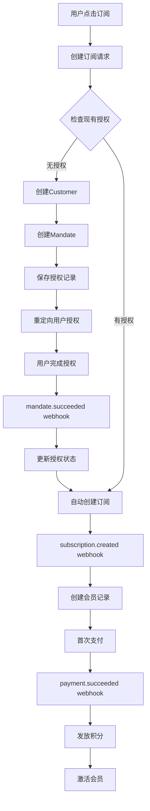

# Payssion V2 订阅流程完整分析

## 🎯 流程概览

Payssion V2 订阅系统采用了 **Mandate → Subscription → Payment** 三阶段模式，确保用户授权后能够自动续费。

## 📋 1. Checkout 阶段详细步骤

### 1.1 订单创建位置和逻辑

**核心文件**: `/app/api/subscription/create/route.ts`
- **关键函数**: `POST` (行33-164)
- **触发条件**: 用户在定价页面点击订阅按钮

**流程**:
```typescript
// 第1步: 用户认证验证 (行37-43)
const user_uuid = await getUserUuid();
if (!user_uuid) return respErr("Unauthorized");

// 第2步: 参数验证 (行61-84) 
const { product_id, amount, interval, payment_method } = body;
if (!["month", "year"].includes(interval)) {
  return respErr("Only monthly and yearly subscriptions are supported");
}

// 第3步: 构建订阅请求 (行108-121)
const subscriptionRequest = {
  userUuid: user_uuid,
  amount: amount,
  paymentMethod: payment_method, // mir, yoomoney, sberpay, tbank
  planType: planType, // monthly/yearly
  returnUrl: returnUrl
};

// 第4步: 调用订阅服务 (行126-129)
const subscriptionService = new SubscriptionService();
const result = await subscriptionService.createSubscription(subscriptionRequest);
```

### 1.2 Customer 创建过程

**核心文件**: `/services/payment/PayssionProvider.ts`
- **关键函数**: `createOrGetCustomer` (行541-659)

**实现详情**:
```typescript
// 创建 Payssion V2 Customer
const customerParams = {
  email: userEmail,
  reference: `usr${Date.now()}`
};

// API 调用
const response = await fetch(`${this.config.v2.baseUrl}/v2/customers`, {
  method: "POST",
  headers: {
    "Content-Type": "application/json", 
    Authorization: `Bearer ${this.config.v2.apiKey}`
  },
  body: JSON.stringify(customerParams)
});
```

### 1.3 授权流程 (Mandate)

**核心文件**: `/services/payment/PayssionProvider.ts`
- **关键函数**: `createMandate` (行664-797)
- **数据库表**: `payssion_mandates`

**流程步骤**:
```typescript
// 1. 检查现有授权 (行136-146)
const existingMandate = await findActivePayssionMandateByUserUuid(
  request.userUuid, 
  request.paymentMethod
);

// 2. 创建新授权 (行156-178)
const mandateRequest = {
  userUuid: request.userUuid,
  paymentMethod: request.paymentMethod,
  returnUrl: request.returnUrl,
  reference: `mdt${Date.now()}`
};

// 3. 保存到数据库 (行193-205)
await insertPayssionMandate({
  user_uuid: request.userUuid,
  mandate_id: mandateId,
  payment_method: request.paymentMethod,
  status: "pending",
  authorization_url: mandateResponse.redirectUrl
});
```

### 1.4 订阅创建逻辑

**核心文件**: `/services/payment/PayssionProvider.ts`
- **关键函数**: `createSubscription` (行802-898)

**实现**:
```typescript
// 订阅参数构建
const params = {
  reference: request.reference || `sub${Date.now()}`,
  mandate_id: request.mandateId,
  email: request.userEmail,
  currency: request.currency,
  amount: (request.amount / 100).toFixed(2), // 美分转美元
  interval_unit: request.planType === "monthly" ? "month" : "year",
  times: 1
};

// API 调用
const response = await fetch(`${this.config.v2.baseUrl}/v2/subscriptions`, {
  method: "POST",
  headers: {
    "Content-Type": "application/json",
    Authorization: `Bearer ${this.config.v2.apiKey}`
  },
  body: JSON.stringify(params)
});
```

## 🎣 2. Webhook 处理阶段

### 2.1 Webhook 入口处理

**核心文件**: `/app/api/payssion/v2-webhook/route.ts`
- **关键函数**: `POST` (行7-183)
- **签名验证**: 行28-116

### 2.2 mandate.succeeded 事件处理

**核心文件**: `/services/payment/PayssionProvider.ts`
- **关键函数**: `handleMandateAuthorized` (行1189-1244)

**业务逻辑**:
```typescript
// 1. 更新 mandate 状态 (行1214-1216)
await this.updateMandateStatus(mandateId, "authorized");

// 2. 触发订阅创建 (行1219-1226)
if (mandateStatus === "succeeded") {
  await this.triggerSubscriptionCreation(mandateId);
}

// 3. 发送用户通知 (行1229)
await this.sendMandateNotification(mandateId, "authorized");
```

**数据库操作**:
- 更新 `payssion_mandates.status = 'authorized'`
- 触发自动订阅创建流程

### 2.3 subscription.created 事件处理

**核心文件**: `/services/payment/PayssionProvider.ts`
- **关键函数**: `handleSubscriptionCreated` (行1249-1337)

**核心操作**:
```typescript
// 1. 提取订阅信息
const subscriptionId = subscriptionData.id;
const mandateId = subscriptionData.mandate_id;
const planType = intervalUnit === "month" ? "monthly" : "yearly";

// 2. 创建/更新会员记录
await createOrUpdateMembership(
  userUuid,
  planType, 
  subscriptionId,
  "payssion"
);
```

**数据库操作**:
- 更新/创建 `memberships` 记录
- 设置会员状态为 `active`

### 2.4 payment.succeeded 事件处理

**核心文件**: `/services/payment/PayssionProvider.ts`
- **关键函数**: `handlePaymentSucceeded` (行1366-1387)
- **业务处理**: `handleSubscriptionPaymentSuccess` (行1393-1470)

**详细流程**:
```typescript
// 1. 获取支付信息
const amount = String(Math.round(parseFloat(data.amount) * 100)); // 转美分
const subscriptionId = data.source_id || data.subscription_id;
const userUuid = await PaymentProcessingService.getUserUuidFromSubscription(subscriptionId);

// 2. 幂等性检查 (行1421-1432)
const alreadyProcessed = await PaymentProcessingService.checkPaymentAlreadyProcessed(
  paymentId, userUuid
);

// 3. 处理支付业务逻辑 (行1442-1450)
const processingResult = await PaymentProcessingService.processSubscriptionPayment({
  paymentId,
  userUuid, 
  amount,
  subscriptionId,
  userEmail: data.customer_id || data.email,
  paymentMethod: data.payment_method
});
```

## 🗄️ 3. 数据库表操作详情

### 3.1 核心数据库表

1. **`payssion_mandates`** - 授权管理
   - **文件**: `/models/payssionMandate.ts`
   - **关键字段**: `mandate_id`, `status`, `payment_method`

2. **`orders`** - 订单管理 (复用现有表)
   - **扩展字段**: `payssion_mandate_id`, `subscription_status`, `next_billing_date`

3. **`memberships`** - 会员管理 (复用现有表)
   - **文件**: `/models/membership.ts`
   - **关键字段**: `subscription_id`, `status`, `end_date`

4. **`credits`** - 积分管理 (复用现有表)
   - **用于**: 支付成功后的积分发放

### 3.2 关键数据库操作

**授权创建**:
```typescript
// models/payssionMandate.ts 行22-35
await insertPayssionMandate({
  user_uuid, user_email, mandate_id,
  payment_method, status: "pending",
  authorization_url
});
```

**会员更新**:
```typescript
// models/membership.ts 行54-69  
await updateMembership(userUuid, {
  end_date: newEndDate.toISOString(),
  status: "active",
  subscription_id: subscriptionId
});
```

**积分发放**:
```typescript
// services/payment/PaymentProcessingService.ts 行83-88
await increaseCredits({
  user_uuid: userUuid,
  trans_type: CreditsTransType.OrderPay,
  credits: credits,
  order_no: paymentId
});
```

## 🔧 4. 核心业务逻辑定位

### 4.1 支付处理服务

**核心文件**: `/services/payment/PaymentProcessingService.ts`
- **主要功能**: 统一处理支付成功后的业务逻辑
- **关键方法**: 
  - `processSubscriptionPayment` (行28-72)
  - `checkPaymentAlreadyProcessed` (行129-175)

### 4.2 订阅服务统一入口

**核心文件**: `/services/subscriptionService.ts`
- **主要功能**: 统一不同支付提供商的订阅逻辑
- **关键方法**:
  - `createSubscription` (行59-105)
  - `createPayssionSubscription` (行110-286)

### 4.3 配置管理

**核心文件**: `/config/payssion.ts`
- **产品配置**: 行37-42 (价格-积分-会员类型映射)
- **支付方式映射**: 行45-50
- **环境配置**: 行53-72

## 🎯 5. 实际流程确认

### 1. Checkout 阶段

**1.1 创建订单**
- **文件**: `/services/subscriptionService.ts`
- **关键代码**: 行447-498 `createPendingOrder` 函数
- **状态**: `"pending"` ✅ (已修复)

**1.2 创建 Customer**  
- **文件**: `/services/payment/PayssionProvider.ts`
- **关键代码**: 行541-659 `createOrGetCustomer` 函数
- **逻辑**: 先检查现有客户，不存在则创建新客户

**1.3 创建/检查 Mandate（授权）**
- **文件**: `/services/payment/PayssionProvider.ts` 
- **关键代码**: 行664-797 `createMandate` 函数
- **数据库表**: `payssion_mandates`

**1.4 用户授权**
- **重定向**: 用户跳转到 Payssion 授权页面
- **返回**: 用户完成授权后，Payssion 发送 webhook

**❌ 注意**: 当前实现中，如果已有授权，会直接创建订阅，但**不会自动付款**

### 2. Webhook 阶段

**2.1 mandate.succeeded 事件**
- **文件**: `/services/payment/PayssionProvider.ts`
- **关键代码**: 行1189-1244 `handleMandateAuthorized` 函数
- **操作**: 
  - 更新 mandate 状态为 `"authorized"`
  - 触发订阅创建 (行1221)

**2.2 subscription.created 事件**
- **文件**: `/services/payment/PayssionProvider.ts`
- **关键代码**: 行1249-1337 `handleSubscriptionCreated` 函数  
- **操作**: 创建/更新 membership 记录

**2.3 payment.succeeded 事件**
- **文件**: `/services/payment/PayssionProvider.ts`
- **关键代码**: 行1393-1470 `handleSubscriptionPaymentSuccess` 函数
- **操作**: 
  - 更新订单状态为 `"paid"`
  - 增加用户积分
  - 激活会员状态

## 📊 6. 流程图总结



## 📍 关键文件路径汇总

1. **API 入口**: `/app/api/subscription/create/route.ts`
2. **Webhook 处理**: `/app/api/payssion/v2-webhook/route.ts`  
3. **订阅服务**: `/services/subscriptionService.ts`
4. **支付提供商**: `/services/payment/PayssionProvider.ts`
5. **支付处理**: `/services/payment/PaymentProcessingService.ts`
6. **授权模型**: `/models/payssionMandate.ts`
7. **会员模型**: `/models/membership.ts`
8. **配置管理**: `/config/payssion.ts`

## ⚠️ 流程中发现的潜在问题

1. **订阅创建时机**: 目前在 mandate 授权成功后自动创建订阅，但可能需要等待首次支付成功
2. **会员激活时机**: 应该在 `payment.succeeded` 时激活，而不是 `subscription.created` 时

## 📋 测试要点

**测试用户**: `f54371bb-72c1-4c41-91ef-3c9c0b924704`

**测试步骤**:
1. 确认订单创建状态为 `"pending"`
2. 检查 mandate 是否正确创建
3. 验证用户授权后的 webhook 处理
4. 确认订阅创建和首次支付
5. 验证积分发放和会员激活

**关键检查点**:
- `orders` 表的 `status` 字段变化: `pending` → `paid`
- `payssion_mandates` 表的记录创建和状态更新: `pending` → `authorized`
- `memberships` 表的记录创建和激活: `status = "active"`
- `credits` 表的积分增加记录

## 🔧 已修复的问题

1. **订单状态不匹配**: 已将订单创建时的状态从 `"created"` 修改为 `"pending"`，确保 webhook 处理时能正确找到订单

---

**生成时间**: 2025-06-26
**分析文件**: Payssion V2 订阅系统完整流程
**用途**: 测试和开发参考