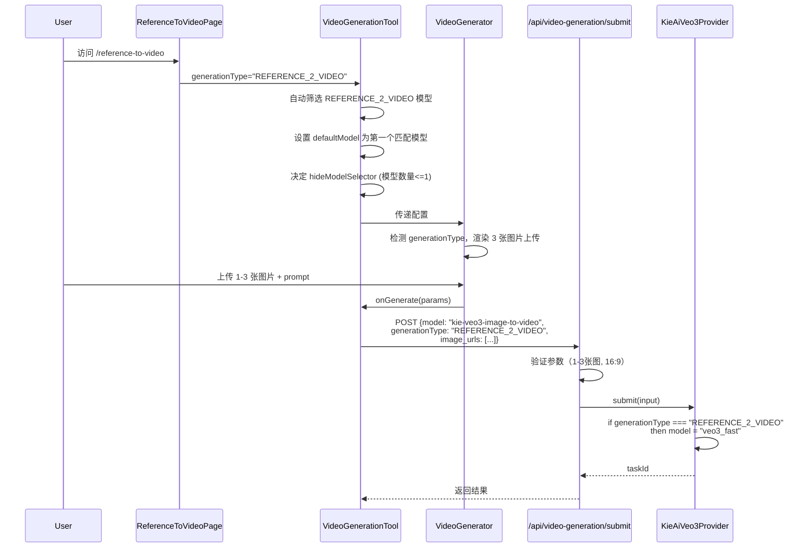

# Reference-to-Video 技术方案设计文档 V3（最优方案）

## 1. 方案概述

### 1.1 核心理念

**完全复用现有 VideoGenerationTool 组件**，通过模型配置中的 `generationType` 字段驱动 Reference-to-Video 功能，无需 effect 参数。

### 1.2 关键优势

- **零新组件开发**：复用 VideoGenerationTool、VideoGenerator、ImageUploader
- **配置驱动**：通过模型配置的 generationType 字段自动识别功能类型
- **最小代码改动**：仅需添加模型配置和少量后端逻辑
- **维护成本极低**：与现有功能共享代码基础
- **用户体验一致**：与 image-to-video 交互模式相同

## 2. 实施方案

### 2.1 模型配置（核心）

#### 文件：`config/video-models.ts`

```typescript
// 新增 Reference-to-Video 专用模型配置
// 注意：id 使用 kie-veo3-image-to-video 以复用后端逻辑
"kie-veo3-reference-to-video": {
  id: "kie-veo3-image-to-video",  // 使用现有模型 ID
  name: "Veo3 Reference-to-Video",
  type: VideoModelType.IMAGE_TO_VIDEO,
  provider: VideoModelProvider.KIEAI,
  displayName: "Veo 3.1 (Consistent Character)",
  perSecondCredits: 1.5,
  description: "Create videos with consistent character identity using 1-3 reference images",
  features: ["wait 200s", "Character Consistency", "1-3 Reference Images"],

  // 根据 API 要求锁定参数（Reference-to-Video 模式）
  supportedAspectRatios: ["16:9"],  // 只支持 16:9
  supportedDurations: [8],           // 固定 8 秒（与 kie-veo3-image-to-video 一致）
  supportedResolutions: ["1080p"],   // 固定 1080p
  supportsAudio: false,              // Reference-to-Video 不支持音频

  // 图片配置
  imageCapabilities: {
    maxImages: 3,  // 支持 1-3 张参考图片
    labels: ["Reference 1", "Reference 2", "Reference 3"],
  },

  // 其他配置
  estimatedGenerationTime: 240,

  // 关键：标识这是 Reference-to-Video 模式
  generationType: "REFERENCE_2_VIDEO"
}
```

### 2.2 前端实现（极简化）

#### 文件：`app/[locale]/(home)/reference-to-video/page.tsx`

```tsx
import { VideoGenerationTool } from "@/components/blocks/ai-video-generation-tool";
import { getTranslations } from "next-intl/server";

export async function generateMetadata({ params: { locale } }) {
  const t = await getTranslations();

  return {
    title: "Reference-to-Video (Consistent Character) | Veo3",
    description: "Turn 1–3 reference images into consistent-character videos",
    keywords: "reference-to-video, consistent character, Veo3",
  };
}

export default async function ReferenceToVideoPage() {
  return (
    <>
      {/* Hero Section */}
      <div className="text-center py-12">
        <h1 className="text-4xl font-bold">
          Reference-to-Video with Consistent Characters
        </h1>
        <p className="mt-4 text-xl text-muted-foreground">
          Upload multiple reference images to create videos with consistent
          character identity
        </p>
      </div>

      {/* Video Generation Tool - 极简配置 */}
      <VideoGenerationTool
        mode="image-to-video"
        generationType="REFERENCE_2_VIDEO"

      {/* 其他页面组件... */}
    </>
  );
}
```

### 2.3 VideoGenerationTool 组件（智能处理）

#### 文件：`components/blocks/ai-video-generation-tool/index.tsx`

组件内部自动处理所有参考生视频逻辑：

````typescript
interface VideoGenerationToolProps {
  mode: "text-to-video" | "image-to-video";
  generationType?: string;  // 新增：指定生成类型（如 REFERENCE_2_VIDEO）
}

export function VideoGenerationTool({
  mode,
  generationType,  // 接收 generationType
  ...props
}: VideoGenerationToolProps) {

  // 根据 generationType 自动筛选模型
  const availableModels = useMemo(() => {
    const allModels = Object.values(VIDEO_MODELS);

    // 如果指定了 generationType，只显示匹配的模型
    if (generationType) {
      return allModels.filter(m => m.generationType === generationType);
    }

    // 否则显示该模式下的所有模型
    return allModels.filter(m => m.type === mode);
  }, [mode, generationType]);

  // 自动设置默认模型（第一个可用模型）
  const defaultModel = availableModels[0]?.id;


  // 处理视频生成
  const handleGenerate = async (params: VideoGenerationParams) => {
    setIsGenerating(true);

    // 获取当前模型配置
    const modelConfig = getVideoModel(params.model);

    let finalParams = { ...params };

    // 优先使用传入的 generationType，其次使用模型配置的
    if (generationType) {
      finalParams.generationType = generationType;
    } else if (modelConfig?.generationType) {
      finalParams.generationType = modelConfig.generationType;
    }

    const result = await submitGeneration({
      model: finalParams.model,
      prompt: finalParams.prompt.trim(),
      generationType: finalParams.generationType,
      // ... 其他参数
    });

    // ... 后续逻辑 ...
  };

  return (
    <VideoGenerator
      availableModels={availableModels}
      defaultModel={defaultModel}
      hideModelSelector={hideModelSelector}
      onGenerate={handleGenerate}
      // ... 其他 props
    />
  );
}

### 2.4 VideoGenerator 组件（UI 适配）

#### 文件：`components/blocks/video-generator/index.tsx`

根据模型的 `generationType` 调整 UI 显示：

```typescript
// 在组件中检测是否是 Reference-to-Video 模式
const modelConfig = getVideoModel(selectedModel);
const isReferenceToVideo = modelConfig?.generationType === "REFERENCE_2_VIDEO";

// 根据模式调整提示文本
const getImageUploadLabel = () => {
  if (isReferenceToVideo) {
    return "Upload 1-3 reference images for consistent character";
  }
  // 默认文本
  return modelConfig?.imageCapabilities?.maxImages > 1
    ? "Upload images (first and last frame)"
    : "Upload an image";
};

// 参数选择器根据模式禁用某些选项
{!isReferenceToVideo && (
  // 只在非 Reference-to-Video 模式下显示这些选项
  <AspectRatioSelector />
  <DurationSelector />
)}
````

### 2.5 ImageUploader 组件扩展（最小改动）

#### 文件：`components/blocks/video-generator/ImageUploader.tsx`

只需要支持 3 张图片的显示：

```typescript
// 修改状态数组大小
const [isUploadingImages, setIsUploadingImages] = useState<boolean[]>(
  Array(maxImages).fill(false) // 动态数组大小
);

// 渲染逻辑调整（约第 200 行）
return (
  <div className="space-y-4">
    {/* 根据 maxImages 渲染上传区域 */}
    {maxImages === 1 && (
      // 单图上传（现有逻辑）
      <SingleImageUpload />
    )}

    {maxImages === 2 && (
      // 双图上传（现有逻辑）
      <DualImageUpload />
    )}

    {maxImages >= 3 && (
      // 多图上传（新增）
      <div className="grid grid-cols-3 gap-4">
        {[...Array(maxImages)].map((_, index) => (
          <ImageUploadSlot
            key={index}
            index={index}
            imageUrl={uploadedImageUrls[index]}
            isUploading={isUploadingImages[index]}
            label={
              modelConfig?.imageCapabilities?.labels?.[index] ||
              `Image ${index + 1}`
            }
            onUpload={(file) => handleImageUpload(file, index)}
            onRemove={() => removeImage(index)}
          />
        ))}
      </div>
    )}

    {/* 状态提示 */}
    {maxImages > 1 && uploadedImageUrls.filter(Boolean).length > 0 && (
      <p className="text-sm text-muted-foreground">
        {uploadedImageUrls.filter(Boolean).length}/{maxImages} images uploaded
        {modelConfig?.imageCapabilities?.minImages &&
          uploadedImageUrls.filter(Boolean).length <
            modelConfig.imageCapabilities.minImages &&
          ` (Minimum ${modelConfig.imageCapabilities.minImages} required)`}
      </p>
    )}
  </div>
);
```

### 2.6 后端改动（最小化）

#### 文件：`app/api/video-generation/submit/route.ts`

```typescript
// 在解析请求参数后（约第 125 行后）
const modelConfig = getVideoModel(model);

// 自动设置 generationType（新增逻辑）
let generationType = body.generationType;
if (!generationType && modelConfig?.generationType) {
  generationType = modelConfig.generationType; // 从模型配置获取
}

// 验证 Reference-to-Video 特殊要求（约第 335 行后）
if (generationType === "REFERENCE_2_VIDEO") {
  // 验证图片数量
  const minImages = modelConfig?.imageCapabilities?.minImages || 1;
  const maxImages = modelConfig?.imageCapabilities?.maxImages || 3;

  if (
    !image_urls ||
    image_urls.length < minImages ||
    image_urls.length > maxImages
  ) {
    return respErr(
      `REFERENCE_2_VIDEO requires ${minImages}-${maxImages} reference images`
    );
  }
}

// 传递到 Provider（约第 390 行）
if (isKieAiModel(finalModel)) {
  input.generationType = generationType;
}
```

#### 文件：`services/providers/KieAiVeo3Provider.ts`

```typescript
// 在 submit 方法中（构建请求 body 部分）
if (input.generationType) {
  body.generationType = input.generationType;
}

// 确保使用正确的模型
if (input.generationType === "REFERENCE_2_VIDEO") {
  body.model = "veo3_fast"; // API 要求
  body.aspectRatio = "16:9"; // API 要求
}
```

### 2.7 ImageUploader 渲染逻辑

**现有逻辑已经支持：**

1. 根据 `modelConfig.imageCapabilities.maxImages` 自动设置图片数量
2. 根据模型配置限制参数选择（比例、时长、分辨率）
3. 通过模型配置驱动 UI 行为

## 3. 数据流



## 6. 核心设计亮点

### 6.1 极简页面设计

- 页面只需传递 `generationType="REFERENCE_2_VIDEO"`
- 无需关心模型选择、UI 控制等细节
- 所有复杂逻辑封装在组件内部
- 真正的"一个参数搞定一切"

### 6.2 智能组件封装

- VideoGenerationTool 内部自动处理：
  - 筛选符合 generationType 的模型
  - 设置默认模型
  - 决定是否显示选择器
  - 传递 generationType 到后端
- 完美的封装和单一职责

### 6.3 配置驱动架构

- 通过模型配置的 `generationType` 字段驱动整个系统
- 新增模型只需修改配置
- 页面代码零改动

### 6.4 自动化处理链

- 从页面到组件到后端的全链路自动化
- 每一层都通过 generationType 智能适配
- 无需手动协调各层逻辑

## 8. 测试要点

- [ ] 模型配置的 generationType 正确读取
- [ ] VideoGenerationTool 自动传递 generationType
- [ ] 上传 1-3 张图片正常工作
- [ ] 超过 3 张图片被拒绝
- [ ] 参数锁定生效（16:9, 8 秒）
- [ ] Provider 使用 veo3_fast 模型
- [ ] API 验证逻辑正确

附录：

# Generate Veo 3.1 AI Video(Fast&Quality)

> Create a new video generation task using the Veo3.1 AI model.

## OpenAPI

```yaml veo3-api/veo3-api.json post /api/v1/veo/generate
paths:
  path: /api/v1/veo/generate
  method: post
  servers:
    - url: https://api.kie.ai
      description: API Server
  request:
    security:
      - title: BearerAuth
        parameters:
          query: {}
          header:
            Authorization:
              type: http
              scheme: bearer
              description: >-
                All APIs require authentication via Bearer Token.


                Get API Key: 

                1. Visit [API Key Management Page](https://kie.ai/api-key) to
                get your API Key


                Usage:

                Add to request header:

                Authorization: Bearer YOUR_API_KEY
          cookie: {}
    parameters:
      path: {}
      query: {}
      header: {}
      cookie: {}
    body:
      application/json:
        schemaArray:
          - type: object
            properties:
              prompt:
                allOf:
                  - type: string
                    description: >-
                      Text prompt describing the desired video content. Required
                      for all generation modes.


                      - Should be detailed and specific in describing video
                      content

                      - Can include actions, scenes, style and other information

                      - For image-to-video, describe how you want the image to
                      come alive
                    example: A dog playing in a park
              imageUrls:
                allOf:
                  - type: array
                    items:
                      type: string
                    description: >-
                      Image URL list (used in image-to-video mode). Supports 1
                      or 2 images:


                      - **1 image**: The generated video will unfold around this
                      image, with the image content presented dynamically

                      - **2 images**: The first image serves as the video's
                      first frame, and the second image serves as the video's
                      last frame, with the video transitioning between them

                      - Must be valid image URLs

                      - Images must be accessible to the API server.
                    example:
                      - http://example.com/image1.jpg
                      - http://example.com/image2.jpg
              model:
                allOf:
                  - type: string
                    description: >-
                      Select the model type to use.


                      - veo3: Veo 3.1 Quality, supports both text-to-video and
                      image-to-video generation

                      - veo3_fast: Veo3.1 Fast generation model, supports both
                      text-to-video and image-to-video generation
                    enum:
                      - veo3
                      - veo3_fast
                    default: veo3_fast
                    example: veo3_fast
              generationType:
                allOf:
                  - type: string
                    description: >-
                      Video generation mode (optional). Specifies different
                      video generation approaches:


                      - **TEXT_2_VIDEO**: Text-to-video - Generate videos using
                      only text prompts

                      - **FIRST_AND_LAST_FRAMES_2_VIDEO**: First and last frames
                      to video - Flexible image-to-video generation mode
                        - 1 image: Generate video based on the provided image
                        - 2 images: First image as first frame, second image as last frame, generating transition video
                      - **REFERENCE_2_VIDEO**: Reference-to-video - Generate
                      videos based on reference images, requires 1-3 images in
                      imageUrls (minimum 1, maximum 3)


                      **Important Notes**:

                      - REFERENCE_2_VIDEO mode currently only supports veo3_fast
                      model and 16:9 aspect ratio

                      - If not specified, the system will automatically
                      determine the generation mode based on whether imageUrls
                      are provided
                    enum:
                      - TEXT_2_VIDEO
                      - FIRST_AND_LAST_FRAMES_2_VIDEO
                      - REFERENCE_2_VIDEO
                    example: TEXT_2_VIDEO
              aspectRatio:
                allOf:
                  - type: string
                    description: >-
                      Video aspect ratio. Specifies the dimension ratio of the
                      generated video. Available options:


                      - 16:9: Landscape video format, supports 1080P HD video
                      generation (**Only 16:9 aspect ratio supports 1080P**)

                      - 9:16: Portrait video format, suitable for mobile short
                      videos


                      Default value is 16:9.
                    enum:
                      - "16:9"
                      - "9:16"
                      - Auto
                    default: "16:9"
                    example: "16:9"
              seeds:
                allOf:
                  - type: integer
                    description: >-
                      (Optional) Random seed parameter to control the randomness
                      of the generated content. Value range: 10000-99999. The
                      same seed will generate similar video content, different
                      seeds will generate different content. If not provided,
                      the system will assign one automatically.
                    minimum: 10000
                    maximum: 99999
                    example: 12345
              callBackUrl:
                allOf:
                  - type: string
                    description: >-
                      Completion callback URL for receiving video generation
                      status updates.


                      - Optional but recommended for production use

                      - System will POST task completion status to this URL when
                      the video generation is completed

                      - Callback will include task results, video URLs, and
                      status information

                      - Your callback endpoint should accept POST requests with
                      JSON payload

                      - For detailed callback format and implementation guide,
                      see [Callback
                      Documentation](./generate-veo-3-video-callbacks)

                      - Alternatively, use the Get Video Details endpoint to
                      poll task status
                    example: http://your-callback-url.com/complete
              enableFallback:
                allOf:
                  - type: boolean
                    description: >-
                      Deprecated Enable fallback functionality. When set to
                      true, if the official Veo3.1 video generation service is
                      unavailable or encounters exceptions, the system will
                      automatically switch to a backup model for video
                      generation to ensure task continuity and reliability.
                      Default value is false.


                      - When fallback is enabled, backup model will be used for
                      the following errors:
                        - public error minor upload
                        - Your prompt was flagged by Website as violating content policies
                        - public error prominent people upload
                      - Fallback mode requires 16:9 aspect ratio and uses 1080p
                      resolution by default

                      - **Note**: Videos generated through fallback mode cannot
                      be accessed via the Get 1080P Video endpoint

                      - **Credit Consumption**: Successful fallback has
                      different credit consumption, please see
                      https://kie.ai/billing for billing details


                      **Note: This parameter is deprecated. Please remove this
                      parameter from your requests. The system has automatically
                      optimized the content review mechanism without requiring
                      manual fallback configuration.**
                    default: false
                    example: false
                    deprecated: true
              enableTranslation:
                allOf:
                  - type: boolean
                    description: >-
                      Enable prompt translation to English. When set to true,
                      the system will automatically translate prompts to English
                      before video generation for better generation results.
                      Default value is true.


                      - true: Enable translation, prompts will be automatically
                      translated to English

                      - false: Disable translation, use original prompts
                      directly for generation
                    default: true
                    example: true
              watermark:
                allOf:
                  - type: string
                    description: >-
                      Watermark text.


                      - Optional parameter

                      - If provided, a watermark will be added to the generated
                      video
                    example: MyBrand
            required: true
            requiredProperties:
              - prompt
            example:
              prompt: A dog playing in a park
              imageUrls:
                - http://example.com/image1.jpg
                - http://example.com/image2.jpg
              model: veo3_fast
              watermark: MyBrand
              callBackUrl: http://your-callback-url.com/complete
              aspectRatio: "16:9"
              seeds: 12345
              enableFallback: false
              enableTranslation: true
              generationType: REFERENCE_2_VIDEO
        examples:
          example:
            value:
              prompt: A dog playing in a park
              imageUrls:
                - http://example.com/image1.jpg
                - http://example.com/image2.jpg
              model: veo3_fast
              watermark: MyBrand
              callBackUrl: http://your-callback-url.com/complete
              aspectRatio: "16:9"
              seeds: 12345
              enableFallback: false
              enableTranslation: true
              generationType: REFERENCE_2_VIDEO
  response:
    "200":
      application/json:
        schemaArray:
          - type: object
            properties:
              code:
                allOf:
                  - type: integer
                    enum:
                      - 200
                      - 400
                      - 401
                      - 402
                      - 404
                      - 422
                      - 429
                      - 455
                      - 500
                      - 501
                      - 505
                    description: >-
                      Response status code


                      - **200**: Success - Request has been processed
                      successfully

                      - **400**: 1080P is processing. It should be ready in 1-2
                      minutes. Please check back shortly.

                      - **401**: Unauthorized - Authentication credentials are
                      missing or invalid

                      - **402**: Insufficient Credits - Account does not have
                      enough credits to perform the operation

                      - **404**: Not Found - The requested resource or endpoint
                      does not exist

                      - **422**: Validation Error - Request parameters failed
                      validation. When fallback is not enabled and generation
                      fails, error message format: Your request was rejected by
                      Flow(original error message). You may consider using our
                      other fallback channels, which are likely to succeed.
                      Please refer to the documentation.

                      - **429**: Rate Limited - Request limit has been exceeded
                      for this resource

                      - **455**: Service Unavailable - System is currently
                      undergoing maintenance

                      - **500**: Server Error - An unexpected error occurred
                      while processing the request

                      - **501**: Generation Failed - Video generation task
                      failed

                      - **505**: Feature Disabled - The requested feature is
                      currently disabled
              msg:
                allOf:
                  - type: string
                    description: Error message when code != 200
                    example: success
              data:
                allOf:
                  - type: object
                    properties:
                      taskId:
                        type: string
                        description: >-
                          Task ID, can be used with Get Video Details endpoint
                          to query task status
                        example: veo_task_abcdef123456
        examples:
          example:
            value:
              code: 200
              msg: success
              data:
                taskId: veo_task_abcdef123456
        description: Request successful
    "500":
      _mintlify/placeholder:
        schemaArray:
          - type: any
            description: Server Error
        examples: {}
        description: Server Error
  deprecated: false
  type: path
components:
  schemas: {}
```
