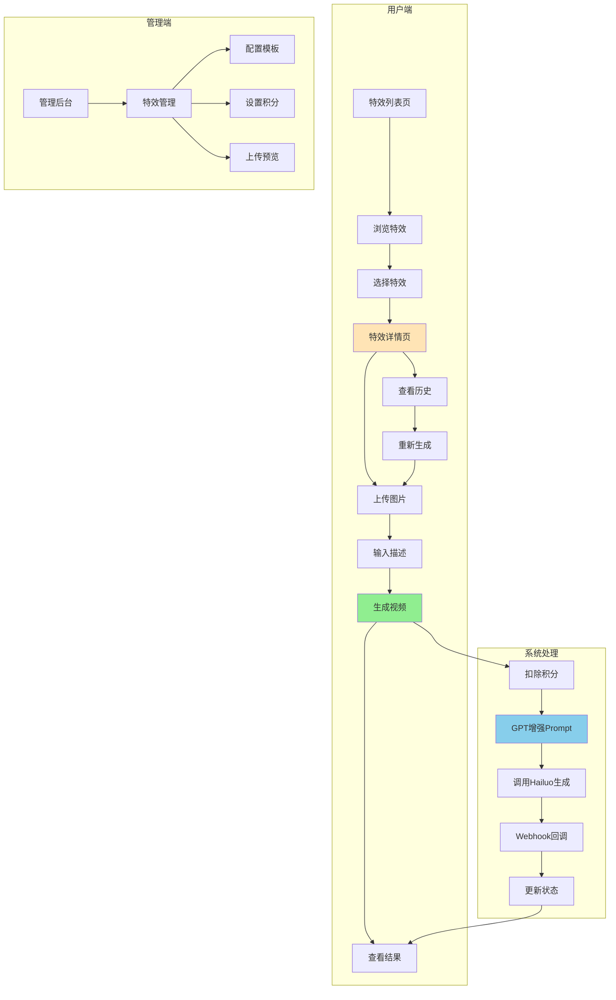
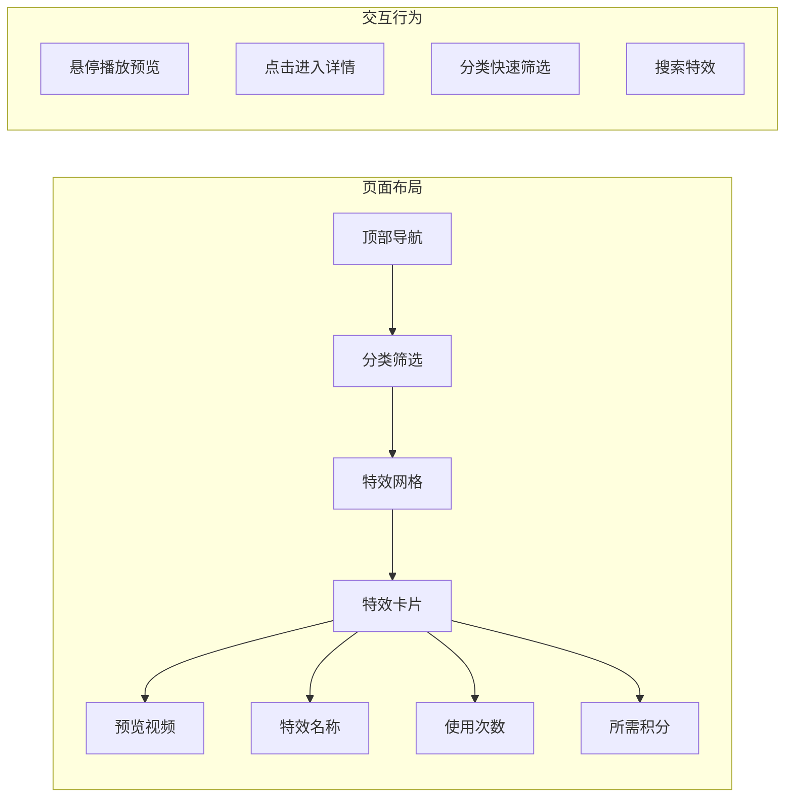
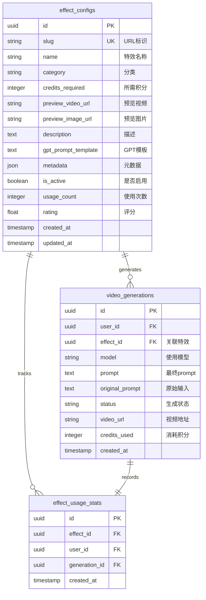
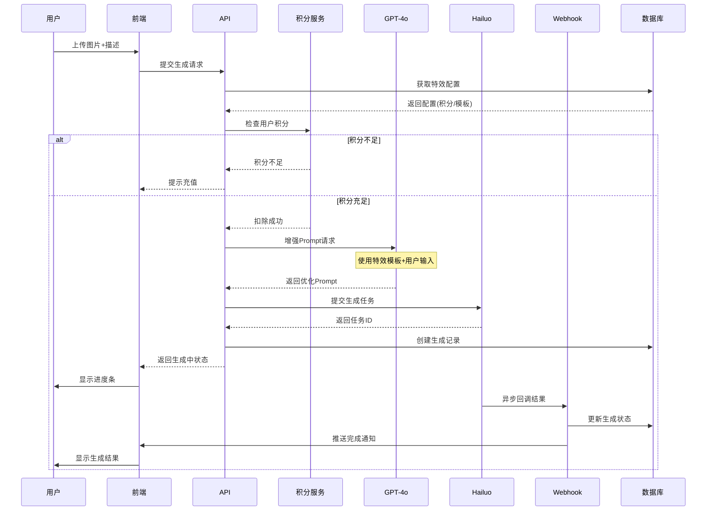
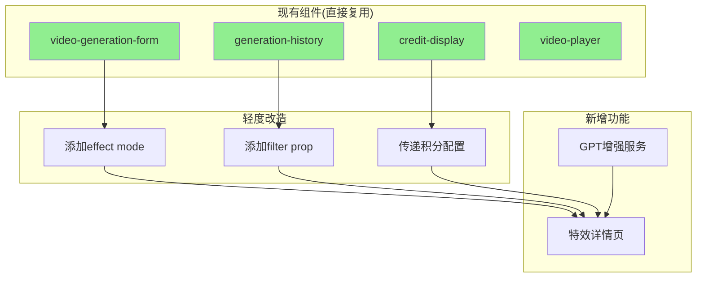
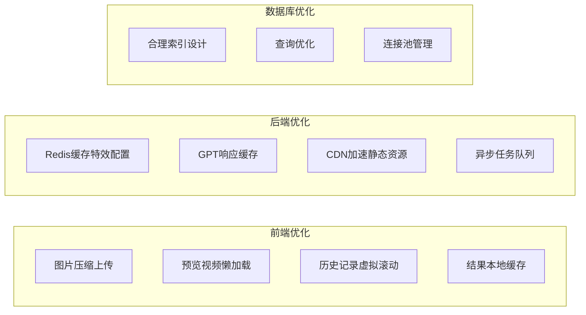
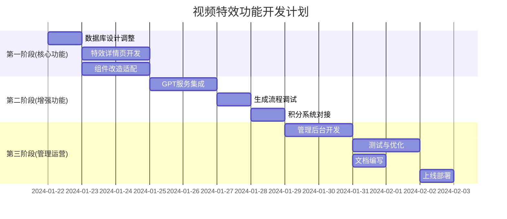

# 📋 视频特效功能产品需求文档 V2.0

> 创建日期：2025-01-22  
> 文档版本：V2.0  
> 适用项目：Veo3 AI (veo3ai.io)

## 一、产品概述

**功能定位**：为Veo3 AI平台提供模板化视频特效生成能力，用户上传图片即可一键生成特定风格的视频效果。

**核心价值**：
- 降低视频创作门槛，无需专业知识
- 提供多样化特效模板，满足不同创作需求
- 通过GPT智能优化，提升生成质量

**技术栈**：
- 前端：Next.js 14, TypeScript, Tailwind CSS
- 数据库：Supabase (PostgreSQL)
- AI模型：GPT-4o (prompt增强), Hailuo (视频生成)
- 计费：积分系统（0.25美金 = 10积分）

## 二、功能架构



## 三、核心页面设计

### 3.1 特效列表页 `/video-effects`



**设计要点**：
- 网格布局，响应式适配
- 卡片展示预览视频、标题、热度、积分
- 支持分类筛选：热门、最新、动作、风格、场景等

### 3.2 特效详情页 `/video-effects/[slug]`

**页面布局**：
```
┌────────────────────────────────────────────────┐
│  🎬 特效标题  |  使用次数: 1.2k  |  ⭐ 4.8分    │
├────────────────────────────────────────────────┤
│  预览展示区 (自动播放示例视频)                    │
├──────────────────┬─────────────────────────────┤
│                  │                             │
│  视频生成器       │  生成历史                    │
│                  │                             │
│  [上传图片区]     │  [历史列表]                  │
│  [描述输入框]     │  - 生成时间                  │
│  所需积分: 20     │  - 状态                      │
│  [生成按钮]       │  - 操作按钮                  │
│                  │                             │
├──────────────────┴─────────────────────────────┤
│  使用教程 | 最佳实践 | 常见问题 | 用户案例        │
└────────────────────────────────────────────────┘
```

**交互设计**：
- 拖拽上传图片，支持预览
- 实时显示所需积分
- 生成过程显示进度条
- WebSocket实时状态更新
- 历史记录支持筛选和重新生成

## 四、数据模型设计



### 数据库迁移SQL

```sql
-- 在现有 effect_configs 表添加积分配置
ALTER TABLE effect_configs 
ADD COLUMN IF NOT EXISTS credits_required INTEGER DEFAULT 10;

-- 创建使用统计表
CREATE TABLE IF NOT EXISTS effect_usage_stats (
  id UUID PRIMARY KEY DEFAULT gen_random_uuid(),
  effect_id UUID REFERENCES effect_configs(id) ON DELETE CASCADE,
  user_id UUID REFERENCES users(uuid) ON DELETE CASCADE,
  generation_id UUID REFERENCES video_generations(id) ON DELETE CASCADE,
  created_at TIMESTAMPTZ DEFAULT NOW(),
  UNIQUE(generation_id)
);

-- 添加索引优化查询性能
CREATE INDEX idx_effect_usage_effect_id ON effect_usage_stats(effect_id);
CREATE INDEX idx_effect_usage_user_id ON effect_usage_stats(user_id);
CREATE INDEX idx_video_generations_effect_id ON video_generations(effect_id);
```

## 五、业务流程

### 5.1 视频生成流程



### 5.2 GPT Prompt增强策略

```typescript
// Prompt模板示例
const effectTemplates = {
  "ai-kissing": {
    system: "你是一个视频生成prompt优化专家，专注于创建浪漫场景描述。",
    template: `
      基于用户上传的图片，生成一个浪漫的亲吻场景视频。
      
      图片描述：{{IMAGE_DESCRIPTION}}
      用户要求：{{USER_INPUT}}
      
      请生成一个详细的视频描述，包括：
      1. 场景设定（时间、地点、氛围）
      2. 动作细节（缓慢接近、温柔触碰）
      3. 情感表达（眼神交流、微笑）
      4. 镜头运动（慢镜头、特写）
      
      输出格式：一段连贯的英文描述，不超过200词。
    `,
    params: {
      style: "romantic, cinematic",
      duration: "3-5 seconds",
      camera: "slow zoom in, soft focus"
    }
  },
  
  "earth-zoom-out": {
    system: "你是一个视频生成prompt优化专家，专注于创建史诗级镜头运动。",
    template: `
      将用户的图片转换为从地球视角缩放的史诗场景。
      
      起始画面：{{IMAGE_DESCRIPTION}}
      用户要求：{{USER_INPUT}}
      
      生成包含以下元素的描述：
      1. 镜头从特写开始
      2. 逐渐拉远到鸟瞰视角
      3. 继续上升到太空视角
      4. 最终看到完整地球
      
      技术要求：平滑过渡，壮观视觉效果
    `,
    params: {
      style: "epic, documentary",
      duration: "5-8 seconds", 
      camera: "continuous zoom out"
    }
  }
}
```

## 六、技术实现要点

### 6.1 组件复用策略



### 6.2 实施方案

#### 组件改造计划

**1. video-generation-form 组件改造**
```typescript
interface VideoGenerationFormProps {
  mode?: 'normal' | 'effect';           // 新增：模式选择
  effectConfig?: EffectConfig;          // 新增：特效配置
  forceModel?: string;                  // 新增：强制模型
  enhancePrompt?: boolean;              // 新增：GPT增强
  creditsRequired?: number;             // 新增：积分配置
}

// 核心逻辑调整
if (mode === 'effect' && effectConfig) {
  // 使用特效配置的积分
  const credits = effectConfig.credits_required;
  
  // GPT增强prompt
  if (enhancePrompt) {
    prompt = await enhanceWithGPT(effectConfig.gpt_prompt_template, userInput);
  }
  
  // 强制使用hailuo模型
  model = forceModel || 'hailuo';
}
```

**2. GPT增强服务实现**
```typescript
// services/promptEnhancement.ts
export async function enhancePromptWithGPT(
  template: string,
  userInput: { image?: string, prompt: string }
): Promise<string> {
  const openai = new OpenAI({ apiKey: process.env.OPENAI_API_KEY });
  
  const response = await openai.chat.completions.create({
    model: "gpt-4o",
    messages: [
      { role: "system", content: template },
      { role: "user", content: userInput.prompt }
    ],
    max_tokens: 200,
    temperature: 0.7
  });
  
  return response.choices[0].message.content;
}
```

## 七、API设计

### 7.1 RESTful API接口

```typescript
// 1. 获取特效列表
GET /api/effects
Query Parameters:
  - category?: string        // 分类筛选
  - sort?: 'hot'|'new'|'rating'  // 排序方式
  - page?: number            // 分页
  - limit?: number           // 每页数量

Response: {
  success: boolean
  data: {
    effects: EffectConfig[]
    categories: string[]
    pagination: {
      total: number
      page: number
      limit: number
      hasNext: boolean
    }
  }
}

// 2. 获取特效详情
GET /api/effects/[slug]

Response: {
  success: boolean
  data: {
    effect: EffectConfig
    stats: {
      usage_count: number
      avg_rating: number
      recent_examples: VideoGeneration[]
    }
  }
}

// 3. 生成特效视频
POST /api/generate/effect
Headers:
  - Authorization: Bearer [token]
  
Body: {
  effect_slug: string        // 特效标识
  image_url: string         // 上传的图片
  user_prompt?: string      // 用户描述（可选）
  enable_gpt?: boolean      // 是否启用GPT增强
}

Response: {
  success: boolean
  data: {
    generation_id: string
    status: 'processing'
    estimated_time: number  // 预计完成时间（秒）
    credits_used: number    // 消耗积分
  }
}

// 4. 获取生成状态
GET /api/generations/[id]/status

Response: {
  success: boolean
  data: {
    id: string
    status: 'processing' | 'completed' | 'failed'
    progress: number        // 0-100
    video_url?: string
    error?: string
    created_at: string
    completed_at?: string
  }
}

// 5. 管理后台 - 特效管理
GET /api/admin/effects      // 列表
POST /api/admin/effects     // 创建
PUT /api/admin/effects/[id] // 更新
DELETE /api/admin/effects/[id] // 删除
```

## 八、积分计费规则

### 8.1 特效定价策略

| 特效类型 | 积分消耗 | 美金价值 | 说明 |
|---------|---------|---------|------|
| 基础特效 | 10积分 | $0.25 | 简单变换、滤镜效果 |
| 高级特效 | 20积分 | $0.50 | 复杂动作、场景变换 |
| 专业特效 | 30积分 | $0.75 | 影视级、多层次效果 |
| 限时特效 | 5积分 | $0.125 | 活动推广、新品试用 |

### 8.2 积分规则

**扣费机制**：
- 提交生成时预扣积分
- 生成失败全额退还
- 生成成功扣除实际积分

**优惠政策**：
- VIP用户享受8折优惠
- 首次使用特效返还30%积分
- 批量生成享受阶梯折扣

**异常处理**：
- 积分不足：提示充值，引导付费
- 扣费失败：记录日志，人工处理
- 重复扣费：自动检测，立即退还

## 九、性能优化方案



### 具体优化措施

**1. 图片处理优化**
- 客户端压缩：限制最大2MB
- 自动格式转换：统一WebP格式
- 缩略图生成：用于列表展示

**2. 缓存策略**
- 特效配置：Redis缓存24小时
- GPT响应：相似prompt缓存1小时
- 用户历史：前端缓存最近20条

**3. 加载优化**
- 特效列表：分页加载，每页20个
- 预览视频：可视区域自动播放
- 历史记录：虚拟滚动，按需渲染

## 十、监控指标

### 10.1 业务指标

| 指标名称 | 目标值 | 监控方式 | 告警阈值 |
|---------|--------|---------|---------|
| 日活跃用户(DAU) | >1000 | Plausible | <500 |
| 特效使用次数/日 | >5000 | 数据库统计 | <1000 |
| 生成成功率 | >95% | API监控 | <90% |
| 平均生成时长 | <30s | 性能监控 | >60s |
| 用户满意度 | >4.0 | 评分系统 | <3.5 |

### 10.2 技术指标

| 指标名称 | 目标值 | 监控方式 | 告警阈值 |
|---------|--------|---------|---------|
| API响应时间 | <200ms | APM | >500ms |
| GPT调用延迟 | <2s | 日志分析 | >5s |
| 页面加载时间 | <1s | Lighthouse | >3s |
| 错误率 | <0.1% | Sentry | >1% |
| 内存使用率 | <80% | 系统监控 | >90% |

## 十一、开发排期



### 里程碑节点

- **Day 1-3**: 核心功能开发完成
- **Day 4-6**: GPT集成与流程调试
- **Day 7-9**: 管理后台与测试
- **Day 10**: 正式上线

## 十二、风险管理

### 12.1 技术风险

| 风险项 | 概率 | 影响 | 缓解措施 |
|-------|------|------|---------|
| GPT服务不稳定 | 中 | 高 | 1. 实现重试机制(3次)<br>2. 降级到预设模板<br>3. 准备备用API密钥 |
| Hailuo生成失败 | 低 | 中 | 1. 自动重试机制<br>2. 积分自动退还<br>3. 用户通知机制 |
| 积分系统故障 | 低 | 高 | 1. 数据库事务保证<br>2. 异常回滚机制<br>3. 操作日志记录 |
| 并发请求过载 | 中 | 中 | 1. 限流措施(每用户5次/分)<br>2. 队列缓冲<br>3. 弹性扩容 |

### 12.2 业务风险

| 风险项 | 概率 | 影响 | 缓解措施 |
|-------|------|------|---------|
| 用户接受度低 | 中 | 高 | 1. A/B测试优化<br>2. 用户反馈收集<br>3. 快速迭代改进 |
| 成本超支 | 低 | 中 | 1. 监控API调用量<br>2. 设置预算告警<br>3. 动态调整定价 |
| 内容合规风险 | 低 | 高 | 1. 内容审核机制<br>2. 用户协议约束<br>3. 违规处理流程 |

## 十三、未来迭代方向

### V2.0 功能规划（1-2月后）

**功能增强**：
- 🎯 **多图上传**：支持图片序列，生成连续动画
- 🎨 **参数自定义**：特效强度、时长、风格调整
- 🔄 **批量生成**：一次上传，多特效输出
- 📊 **效果对比**：不同参数效果对比展示

**社区功能**：
- 🤝 **特效分享**：用户创作分享平台
- 💎 **创作者激励**：优质特效创作者分成
- 🏆 **特效竞赛**：定期举办创作比赛
- 💬 **社区互动**：评论、点赞、收藏

### V3.0 长期愿景（3-6月后）

**技术升级**：
- AI模型本地部署，降低成本
- 实时预览，所见即所得
- 多模型融合，效果更优
- 自定义特效训练

**商业拓展**：
- 企业定制特效服务
- API开放平台
- 特效素材市场
- 订阅制会员体系

## 十四、成功标准

### 短期目标（1个月内）

- ✅ 特效功能正式上线
- ✅ 日均使用量>500次
- ✅ 用户满意度>4.0
- ✅ 生成成功率>95%

### 中期目标（3个月内）

- ✅ 特效库>50个
- ✅ 月活用户>5000
- ✅ 付费转化率>10%
- ✅ 月收入增长>30%

### 长期目标（6个月内）

- ✅ 成为主要收入来源
- ✅ 用户生成内容占比>30%
- ✅ 建立特效生态系统
- ✅ 行业影响力提升

---

## 💡 Linus式总结

> "Talk is cheap. Show me the code."

**核心原则**：
1. **实用主义**：90%代码复用，不重新发明轮子
2. **简单直接**：没有复杂架构，就是简单的功能叠加
3. **快速迭代**：3-5天出原型，根据反馈快速调整
4. **数据驱动**：一切以用户数据和反馈为准

**关键决策**：
- ✅ 复用现有组件，避免重复开发
- ✅ 使用Hailuo单一模型，降低复杂度
- ✅ GPT增强可选，保证基础功能可用
- ✅ 积分系统复用，不做新的计费逻辑

**"好品味"体现**：
- 消除特殊情况：统一的生成流程
- 数据结构优先：effect_configs表设计完整
- 向后兼容：不破坏现有功能
- 代码简洁：组件传参控制行为

---

*文档结束*