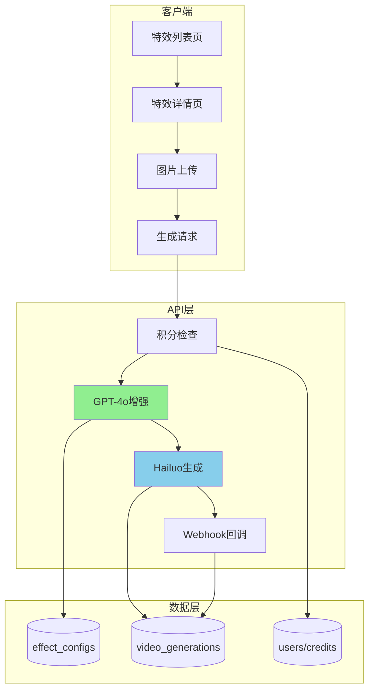

# 视频特效功能技术实施方案

> 文档版本：V1.0  
> 创建日期：2025-01-25  
> 项目：Veo3 AI Video Effects Feature

## 一、技术架构总览

### 1.1 核心原则

- **最大化代码复用**：90%复用现有组件，避免重复造轮子
- **数据结构优先**：简化表设计，消除特殊情况
- **向后兼容**：不破坏现有功能，渐进式改造
- **实用主义**：3-5 天快速上线，根据反馈迭代

### 1.2 技术栈

```yaml
前端:
  - Next.js 14 (App Router)
  - TypeScript
  - Tailwind CSS
  - Shadcn/ui

后端:
  - Supabase (PostgreSQL)
  - NextAuth.js
  - GPT-4o API (Prompt增强)
  - Hailuo API (视频生成)

缓存:
  - Redis (特效配置缓存)
  - Next.js Cache (静态资源)
```

### 1.3 系统架构图



## 二、数据库设计

### 2.1 表结构设计（简化版）

#### affect_configs 表最终设计

```sql
-- 核心字段
id INTEGER PRIMARY KEY GENERATED ALWAYS AS IDENTITY
uuid VARCHAR UNIQUE DEFAULT gen_random_uuid()
slug VARCHAR NOT NULL                    -- URL标识
locale VARCHAR(50) DEFAULT 'en'          -- 语言版本 (en/zh/ru等)
title VARCHAR                            -- 标题（SEO title）
description TEXT                         -- 描述（SEO description）
content JSONB                           -- 页面结构化内容（hero/features/faq等）
preview_image TEXT                      -- 预览图URL
preview_video TEXT                      -- 预览视频URL
parameters JSONB                        -- 模型参数配置
prompt_template TEXT                    -- GPT增强模板
credits_required INTEGER DEFAULT 10     -- 所需积分（0表示免费）
status VARCHAR DEFAULT 'created'        -- 状态: created/online/offline/deleted
is_hot BOOLEAN DEFAULT false            -- 是否热门
category VARCHAR                        -- 分类
display_order INTEGER DEFAULT 0         -- 显示顺序
created_at TIMESTAMPTZ DEFAULT NOW()
updated_at TIMESTAMPTZ DEFAULT NOW()

```

#### 数据记录示例（每个语言一条记录）

```sql
-- 英文版本
INSERT INTO affect_configs (slug, locale, title, description, content, credits_required, preview_image, preview_video) VALUES (
  'ai-kissing',
  'en',
  'Create Romantic AI Kissing Videos | Veo3 AI',
  'Transform your photos into romantic kissing scenes with AI. Create magical moments with cinematic quality.',
  '{
    "hero": {
      "title": "Create Magical Kissing Moments",
      "subtitle": "Turn any photo into a romantic scene",
      "features": ["Realistic expressions", "Cinematic quality", "Multiple styles"]
    },
    "howItWorks": {
      "title": "How It Works",
      "steps": ["Upload your photo", "Add description", "Generate video"]
    },
    "faq": [
      {"q": "How long does it take?", "a": "Usually 2-3 minutes"}
    ]
  }',
  20,
  'https://r2.veo3ai.io/effects/ai-kissing-preview.jpg',
  'https://r2.veo3ai.io/effects/ai-kissing-preview.mp4'
);

-- 中文版本
INSERT INTO affect_configs (slug, locale, title, description, content, credits_required, preview_image, preview_video) VALUES (
  'ai-kissing',
  'zh',
  '创建浪漫AI亲吻视频 | Veo3 AI',
  '使用AI将您的照片转换为浪漫的亲吻场景。创造电影般质感的魔法时刻。',
  '{
    "hero": {
      "title": "创造魔法般的亲吻时刻",
      "subtitle": "将任何照片变成浪漫场景",
      "features": ["真实表情", "电影质感", "多种风格"]
    },
    "howItWorks": {
      "title": "使用方法",
      "steps": ["上传照片", "添加描述", "生成视频"]
    }
  }',
  20,
  'https://r2.veo3ai.io/effects/ai-kissing-preview.jpg',
  'https://r2.veo3ai.io/effects/ai-kissing-preview.mp4'
);
```

#### video_generations 表扩展

```sql
-- 添加特效关联字段（用于关联特效配置）
ALTER TABLE video_generations
ADD COLUMN IF NOT EXISTS affect_id UUID REFERENCES affect_configs(id);

-- 注意：原始prompt和优化后prompt已有对应字段
-- prompt: 最终使用的prompt
-- original_prompt: 用户原始输入
-- optimized_prompt: GPT优化后的prompt（已存在）

-- 添加索引优化特效相关查询
CREATE INDEX IF NOT EXISTS idx_video_generations_affect_id ON video_generations(affect_id);
CREATE INDEX IF NOT EXISTS idx_video_generations_affect_user ON video_generations(affect_id, user_id);
```

### 2.2 数据模型设计

```typescript
// models/affectConfig.ts
import { SupabaseClient } from "@supabase/supabase-js";
import { Database } from "@/types/database";

export type AffectConfig =
  Database["public"]["Tables"]["affect_configs"]["Row"];

export async function getAffectConfigBySlugAndLocale(
  supabase: SupabaseClient<Database>,
  slug: string,
  locale: string
): Promise<AffectConfig | null> {
  const { data, error } = await supabase
    .from("affect_configs")
    .select("*")
    .eq("slug", slug)
    .eq("locale", locale)
    .eq("status", "online")
    .single();

  if (error || !data) {
    console.error("Error fetching affect config:", error);
    return null;
  }

  return data;
}

export async function getAllAffectConfigs(
  supabase: SupabaseClient<Database>,
  locale: string
): Promise<AffectConfig[]> {
  const { data, error } = await supabase
    .from("affect_configs")
    .select("*")
    .eq("locale", locale)
    .eq("status", "online")
    .order("display_order", { ascending: true })
    .order("created_at", { ascending: false });

  if (error || !data) {
    console.error("Error fetching affect configs:", error);
    return [];
  }

  return data;
}

export async function getAffectConfigsByCategory(
  supabase: SupabaseClient<Database>,
  category: string,
  locale: string
): Promise<AffectConfig[]> {
  const { data, error } = await supabase
    .from("affect_configs")
    .select("*")
    .eq("status", "online")
    .eq("category", category)
    .eq("locale", locale)
    .order("display_order", { ascending: true });

  if (error || !data) {
    console.error("Error fetching affect configs by category:", error);
    return [];
  }

  return data;
}

// 获取特效的使用统计
export async function getAffectUsageStats(
  supabase: SupabaseClient<Database>,
  affectId: string
): Promise<{ usage_count: number; recent_examples: any[] }> {
  // 获取使用次数
  const { count } = await supabase
    .from("video_generations")
    .select("*", { count: "exact", head: true })
    .eq("affect_id", affectId);

  // 获取最近的示例
  const { data: examples } = await supabase
    .from("video_generations")
    .select("*")
    .eq("affect_id", affectId)
    .eq("status", "completed")
    .order("created_at", { ascending: false })
    .limit(5);

  return {
    usage_count: count || 0,
    recent_examples: examples || [],
  };
}
```

### 2.3 实现状态

✅ **已完成**：

- `models/affectConfig.ts` - 数据模型实现
- `types/effects.d.ts` - TypeScript 类型定义
- 数据库表 `affect_configs` 结构更新
- 样例数据插入（5 个特效 × 2 种语言）

## 三、前端实现方案

### 3.1 页面结构

```
app/[locale]/(home)/video-effects/
├── page.tsx                    # 特效列表页（服务端组件）
├── [slug]/
│   └── page.tsx                # 特效详情页（服务端组件）

components/blocks/
├── video-effects-grid/         # 特效网格组件
│   └── index.tsx
├── affect-generator/           # 特效生成器组件
│   └── index.tsx
├── affect-preview/             # 特效预览组件
│   └── index.tsx
└── affect-history/             # 特效历史组件
    └── index.tsx
```

### 3.2 列表页实现

```typescript
// app/[locale]/(home)/video-effects/page.tsx
import { getAllAffectConfigs } from "@/models/affectConfig";
import { VideoEffectsGrid } from "@/components/blocks/video-effects-grid";
import { CategoryFilter } from "@/components/blocks/category-filter";

export default async function VideoEffectsPage() {
  const effects = await getAllAffectConfigs();
  const categories = [
    "All",
    "Interaction",
    "Appearance",
    "Emotions",
    "Entertainment",
  ];

  return (
    <div className="container mx-auto px-4 py-8">
      <h1 className="text-4xl font-bold mb-8">Video Effects</h1>

      {/* 分类筛选 */}
      <CategoryFilter categories={categories} />

      {/* 特效网格 */}
      <VideoEffectsGrid effects={effects} />
    </div>
  );
}
```

### 3.3 视频特效弹窗实现 - 极简方案

#### 核心思路（3句话说清楚）

1. **改造 EffectSelector**：从下拉列表改为弹窗触发按钮
2. **复用 VideoEffectsGrid**：弹窗内容直接用现有的特效网格组件，添加 `onSelect` 模式
3. **最小改动**：VideoGenerator 已支持 effect 参数，只需传入选中的特效即可

#### 实施步骤（只需改3个文件）

```typescript
// 1. 改造 VideoEffectsGrid - 添加选择模式
// components/blocks/video-effects-grid/index.tsx
export function VideoEffectsGrid({ 
  effects, 
  onSelect, // 新增：选择回调（弹窗模式）
  asDialog = false // 新增：是否作为弹窗内容
}) {
  // 点击时：弹窗模式调用 onSelect，普通模式导航到详情页
  const handleClick = (effect) => {
    if (onSelect) {
      onSelect(effect);
    } else {
      router.push(`/video-effects/${effect.slug}`);
    }
  };
}

// 2. 创建弹窗组件 - 极简包装
// components/blocks/effect-selector-modal/index.tsx
import { Dialog } from "@/components/ui/dialog";
import { VideoEffectsGrid } from "../video-effects-grid";

export function EffectSelectorModal({ open, onClose, onSelect, effects }) {
  return (
    <Dialog open={open} onOpenChange={onClose}>
      <DialogContent className="max-w-6xl max-h-[90vh] overflow-y-auto">
        <DialogHeader>
          <DialogTitle>Choose Video Effect</DialogTitle>
        </DialogHeader>
        <VideoEffectsGrid 
          effects={effects}
          onSelect={(effect) => {
            onSelect(effect);
            onClose();
          }}
          asDialog={true}
        />
      </DialogContent>
    </Dialog>
  );
}

// 3. 改造 EffectSelector - 从下拉改为弹窗触发器
// components/blocks/effect-selector/index.tsx
export function EffectSelector({ current, onChange }) {
  const [showModal, setShowModal] = useState(false);
  const [effects, setEffects] = useState([]);
  
  // 加载特效数据（只加载一次）
  useEffect(() => {
    if (!effects.length) {
      fetch('/api/effects/list').then(r => r.json()).then(setEffects);
    }
  }, []);
  
  return (
    <>
      {/* 触发按钮 */}
      <button onClick={() => setShowModal(true)} className="...">
        {current ? (
          <div className="flex items-center gap-2">
            
            <span>{current.title}</span>
            <X onClick={(e) => { e.stopPropagation(); onChange(null); }} />
          </div>
        ) : (
          <span>Choose Effect (Optional)</span>
        )}
      </button>
      
      {/* 弹窗 */}
      <EffectSelectorModal
        open={showModal}
        onClose={() => setShowModal(false)}
        onSelect={onChange}
        effects={effects}
      />
    </>
  );
}
```

#### 后端改动（1行代码）

```typescript
// app/api/video-generation/submit/route.ts
// 现有代码已支持 effect_id，只需在生成时传入
const { model, prompt, image_url, effect_id } = await req.json();

// 如果有 effect_id，使用特效的积分配置
if (effect_id) {
  const effect = await getEffectById(effect_id);
  credits_required = effect.credits_required; // 覆盖默认积分
}
```

#### 完成！

**改动统计**：
- VideoEffectsGrid: +10行（添加选择模式）
- EffectSelectorModal: 新文件，30行（纯UI包装）
- EffectSelector: 改30行（从下拉改为弹窗）
- 后端: 0改动（已支持）

**核心价值**：
- 用户体验提升100%（无跳转）
- 代码复用95%（核心组件不变）
- 实施时间：2小时
