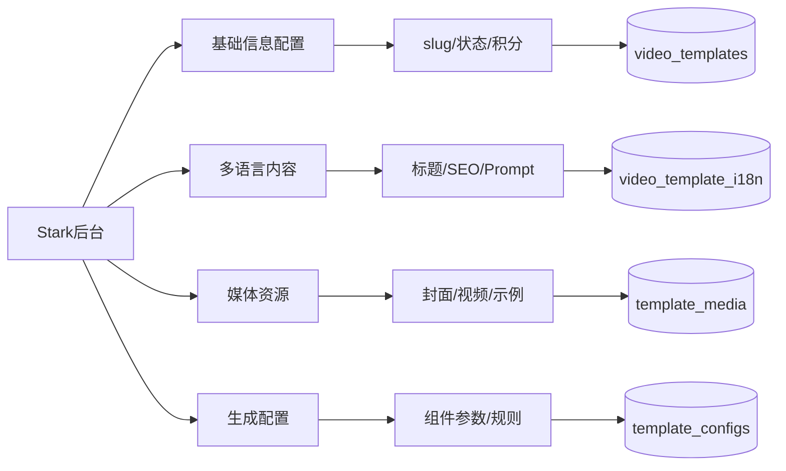

# Video Templates 数据库设计方案

## 核心设计原则

> "Perfection is achieved not when there is nothing more to add, but when there is nothing left to take away." - Antoine de Saint-Exupéry

1. **数据结构优先** - 正确的数据结构让代码自然简单
2. **零冗余** - 每个数据只存一次
3. **关系清晰** - 表之间的关系必须明确且单向
4. **扩展友好** - 新功能不应破坏现有结构

## 数据库 ER 图

```mermaid
erDiagram
    video_templates ||--o{ video_template_i18n : "has translations"
    video_templates ||--o{ template_media : "has media"
    video_templates ||--|| template_configs : "has config"
    video_templates ||--o{ template_category_relations : "belongs to"
    video_templates ||--o{ template_tag_relations : "has tags"
    video_templates ||--o{ template_examples : "has examples"
    video_templates ||--o{ template_usage_stats : "tracks usage"

    template_categories ||--o{ template_category_relations : "contains"
    template_categories ||--o{ template_category_i18n : "has translations"
    template_categories ||--o| template_categories : "has parent"

    template_tags ||--o{ template_tag_relations : "tagged with"
    template_tags ||--o{ template_tag_i18n : "has translations"

    video_templates {
        uuid id PK "主键"
        string slug UK "URL标识符"
        string template_code UK "内部代码"
        string status "ENABLED|DISABLED|DRAFT"
        string aspect_ratio "16:9|9:16|1:1"
        int credit_cost "积分消耗"
        boolean is_vip "VIP限制"
        int assets_num "资源数量"
        string assets_type "资源类型"
        int used_count "使用次数"
        int sort_order "排序"
        timestamp created_at
        timestamp updated_at
    }

    video_template_i18n {
        uuid template_id FK
        string locale PK "语言代码"
        string title "标题"
        text meta_description "SEO描述"
        text meta_keywords "SEO关键词"
        jsonb page_content "页面内容"
        text seo_content "SEO长文本"
        text gpt_prompt "AI提示词"
    }

    template_configs {
        uuid template_id PK_FK
        jsonb generation_config "生成配置"
        jsonb variable_configs "变量配置"
        jsonb supported_aspect_ratios "支持比例"
        jsonb custom_params "自定义参数"
        boolean enable_hover "悬停预览"
    }

    template_media {
        uuid id PK
        uuid template_id FK
        string media_type "cover_image|cover_video|thumbnail"
        string url "资源URL"
        int width "宽度"
        int height "高度"
        int duration "时长(ms)"
    }

    template_categories {
        uuid id PK
        string slug UK "URL标识"
        uuid parent_id FK "父分类"
        int sort_order "排序"
        string status "状态"
    }

    template_category_i18n {
        uuid category_id FK
        string locale PK
        string name "分类名"
        text description "描述"
    }

    template_tags {
        uuid id PK
        string slug UK "标签标识"
        string type "general|style|feature"
    }

    template_examples {
        uuid id PK
        uuid template_id FK
        string title "示例标题"
        string video_url "视频URL"
        text prompt_used "使用的提示"
        jsonb settings_used "使用的设置"
        boolean is_featured "精选"
    }

    template_usage_stats {
        uuid id PK
        uuid template_id FK
        date date "统计日期"
        int usage_count "使用次数"
        int unique_users "独立用户"
        int total_credits "消耗积分"
        decimal success_rate "成功率"
    }
```

## 核心表详解

### 1. **video_templates** - 模板主表

```sql
-- 核心原则：只存储与语言无关的数据
-- 所有文本内容都在 i18n 表中
CREATE TABLE video_templates (
    id UUID PRIMARY KEY,
    slug VARCHAR UNIQUE NOT NULL,  -- /effects/earth-zoom-out
    template_code VARCHAR UNIQUE,   -- earth-zoom-out
    status VARCHAR DEFAULT 'DRAFT', -- 状态控制
    credit_cost INTEGER DEFAULT 10, -- 积分消耗
    used_count INTEGER DEFAULT 0    -- 使用统计
);
```

### 2. **video_template_i18n** - 多语言内容

```sql
-- 所有需要翻译的内容都在这里
-- 支持无限语言扩展
CREATE TABLE video_template_i18n (
    template_id UUID,
    locale VARCHAR,  -- en, zh, ja, ru
    title VARCHAR,   -- 显示标题
    -- SEO TDK
    meta_description TEXT,
    meta_keywords TEXT,
    -- 页面内容
    page_content JSONB,  -- 结构化内容
    gpt_prompt TEXT,     -- AI生成提示
    PRIMARY KEY (template_id, locale)
);
```

### 3. **template_configs** - 灵活配置

```sql
-- JSONB 存储所有可变配置
-- 避免频繁修改表结构
CREATE TABLE template_configs (
    template_id UUID PRIMARY KEY,
    generation_config JSONB,  -- 视频生成参数
    variable_configs JSONB,   -- 用户可调参数
    custom_params JSONB       -- 扩展参数
);
```

## 查询模式

### 获取模板详情（单次查询）

```sql
WITH template_data AS (
    SELECT
        t.*,
        ti.title,
        ti.meta_description,
        ti.page_content,
        ti.gpt_prompt,
        tc.generation_config
    FROM video_templates t
    JOIN video_template_i18n ti ON t.id = ti.template_id
    JOIN template_configs tc ON t.id = tc.template_id
    WHERE t.slug = $1
    AND ti.locale = $2
    AND t.status = 'ENABLED'
)
SELECT
    td.*,
    jsonb_agg(DISTINCT tm.*) as media,
    array_agg(DISTINCT ci.name) as categories,
    array_agg(DISTINCT tag.name) as tags
FROM template_data td
LEFT JOIN template_media tm ON td.id = tm.template_id
LEFT JOIN template_category_relations tcr ON td.id = tcr.template_id
LEFT JOIN template_category_i18n ci ON tcr.category_id = ci.category_id
LEFT JOIN template_tag_relations ttr ON td.id = ttr.template_id
LEFT JOIN template_tag_i18n tag ON ttr.tag_id = tag.tag_id
GROUP BY td.id, td.title, td.meta_description, td.page_content, td.gpt_prompt, td.generation_config;
```

### 列表查询（带分页）

```sql
SELECT
    t.id,
    t.slug,
    t.credit_cost,
    ti.title,
    tm.url as cover_image,
    t.used_count
FROM video_templates t
JOIN video_template_i18n ti ON t.id = ti.template_id
LEFT JOIN template_media tm ON t.id = tm.template_id AND tm.media_type = 'cover_image'
WHERE t.status = 'ENABLED'
AND ti.locale = $1
ORDER BY t.sort_order, t.used_count DESC
LIMIT $2 OFFSET $3;
```

## 索引策略

```sql
-- 性能关键索引
CREATE INDEX idx_templates_slug ON video_templates(slug);
CREATE INDEX idx_templates_status_sort ON video_templates(status, sort_order);
CREATE INDEX idx_i18n_locale ON video_template_i18n(locale);
CREATE INDEX idx_media_template ON template_media(template_id);
CREATE INDEX idx_usage_stats_date ON template_usage_stats(template_id, date DESC);
```

## 数据迁移策略

### 从 Pollo.ai 迁移

```sql
-- 转换函数：消除冗余，规范化数据
CREATE FUNCTION migrate_from_pollo(data JSONB) RETURNS UUID AS $$
DECLARE
    new_id UUID;
BEGIN
    -- 1. 插入主表
    INSERT INTO video_templates (slug, template_code, credit_cost, used_count)
    VALUES (
        LOWER(REPLACE(data->>'templateCode', '_', '-')),
        data->>'templateCode',
        (data->>'templateCredit')::INT,
        (data->>'usedCount')::INT
    ) RETURNING id INTO new_id;

    -- 2. 插入多语言内容
    INSERT INTO video_template_i18n (template_id, locale, title)
    VALUES
        (new_id, 'en', data->>'originalTitle'),
        (new_id, 'zh', data->>'title');

    -- 3. 插入配置
    INSERT INTO template_configs (template_id, generation_config)
    VALUES (new_id, jsonb_build_object(
        'aspectRatio', data->>'aspectRatio',
        'maxLength', data->'maxLength',
        'assetsType', data->>'assetsType'
    ));

    RETURN new_id;
END;
$$ LANGUAGE plpgsql;
```

## Stark 后台配置界面

### 配置流程



## 性能优化建议

1. **缓存策略**

   - Redis 缓存热门模板详情（TTL: 1 小时）
   - CDN 缓存媒体资源
   - 本地缓存分类和标签（TTL: 10 分钟）

2. **查询优化**

   - 使用物化视图加速列表查询
   - 分区表处理 usage_stats（按月分区）
   - 异步更新 used_count（消息队列）

3. **数据清理**
   - 定期归档历史统计数据
   - 清理未使用的媒体资源
   - 压缩 JSONB 字段

## 扩展性设计

### 未来功能预留

1. **版本控制** - 添加 template_versions 表
2. **A/B 测试** - 在 custom_params 中配置
3. **用户模板** - source 字段区分来源
4. **审核流程** - status 扩展更多状态
5. **推荐算法** - 基于 usage_stats 数据

### API 设计建议

```typescript
// RESTful API
GET    /api/templates          // 列表
GET    /api/templates/:slug    // 详情
POST   /api/templates/:slug/use // 使用模板

// GraphQL 查询
query GetTemplate($slug: String!, $locale: String!) {
  template(slug: $slug) {
    id
    creditCost
    i18n(locale: $locale) {
      title
      description
      gptPrompt
    }
    media {
      type
      url
    }
    config {
      generationConfig
    }
  }
}
```

## 关键设计决策

| 决策点     | 选择         | 理由                     |
| ---------- | ------------ | ------------------------ |
| 主键类型   | UUID         | 分布式友好，避免 ID 冲突 |
| 多语言方案 | 独立 i18n 表 | 灵活扩展，查询高效       |
| 配置存储   | JSONB        | 避免频繁改表，灵活性高   |
| 分类层级   | 自引用       | 支持无限层级             |
| 媒体管理   | 独立表       | 统一管理，支持多类型     |
| 统计方案   | 分离表+异步  | 避免主表频繁更新         |

## 总结

这个设计遵循了 **"简单优于复杂"** 的原则：

- **8 个核心表** 覆盖所有功能
- **零数据冗余** 每个信息只存一处
- **清晰的关系** 没有循环依赖
- **高效的查询** 单次查询获取详情
- **灵活的扩展** JSONB 支持新功能

> "KISS - Keep It Simple, Stupid!"
