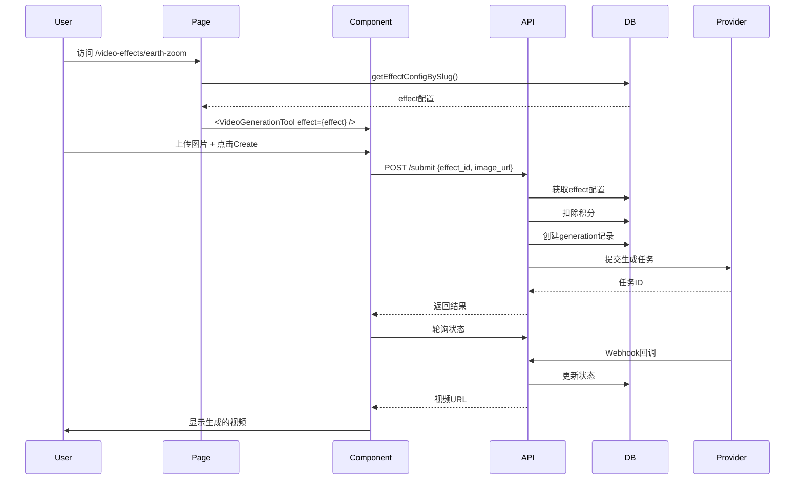
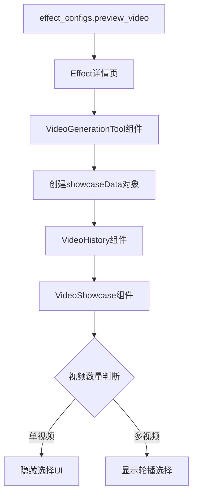

# 视频特效功能技术实现方案

> 文档版本：V3.1  
> 更新日期：2025-08-27  
> 作者：技术架构团队
> 项目：Veo3 AI Video Effects Feature

---

## 一、功能概述

### 1.1 业务目标
为 Veo3 平台添加视频特效功能，让用户能够：
- 浏览预设的视频特效
- 选择特效并上传图片
- 使用AI生成带特效的视频

### 1.2 核心设计原则
基于 Linus Torvalds 的编程哲学：
- **"好代码没有特殊情况"** - 特效是视频生成的配置，不是特殊功能
- **"数据结构优于代码"** - 用配置驱动行为，而不是条件判断
- **"简单就是美"** - 复用现有代码，避免过度设计

---

## 二、技术架构

### 2.1 系统架构图

```mermaid
graph TB
    subgraph "前端层"
        A[特效列表页] --> B[特效详情页]
        B --> C[VideoGenerationTool]
        C --> D[VideoGenerator]
        C --> E[VideoHistory]
        D --> F[EffectSelector]
    end
    
    subgraph "API层"
        D --> G[/api/video-generation/submit]
        G --> H[ProviderFactory]
    end
    
    subgraph "数据层"
        H --> I[video_generations表]
        B --> J[effect_configs表]
    end
    
    subgraph "外部服务"
        H --> K[Hailuo AI]
        H --> L[其他Provider]
    end
```

### 2.2 数据流设计

```typescript
// 单向数据流
Database (effect_configs) 
    → Page (getEffectConfig)
    → Component (VideoGenerationTool) 
    → API (submit with effect_id)
    → Database (video_generations)
```

---

## 三、数据库设计

### 3.1 现有表结构（保持不变）

```sql
-- effect_configs 表（已存在，设计合理）
CREATE TABLE effect_configs (
    id UUID PRIMARY KEY DEFAULT gen_random_uuid(),
    slug VARCHAR(100) NOT NULL,
    locale VARCHAR(10) DEFAULT 'en',
    title VARCHAR(200) NOT NULL,
    description TEXT,
    content JSONB,           -- {hero, howItWorks, faq}
    preview_image TEXT,
    preview_video TEXT,
    parameters JSONB,
    prompt_template TEXT,    -- "{{USER_PROMPT}} with effect..."
    default_prompt TEXT,
    credits_required INTEGER DEFAULT 10,
    model_config JSONB,      -- {model_id, hide_selector}
    status VARCHAR(20) DEFAULT 'online',
    is_hot BOOLEAN DEFAULT false,
    category VARCHAR(50),
    display_order INTEGER DEFAULT 0,
    created_at TIMESTAMPTZ DEFAULT NOW(),
    updated_at TIMESTAMPTZ DEFAULT NOW()
);
```

### 3.2 需要更新的表

```sql
-- video_generations 表添加特效支持
ALTER TABLE video_generations 
ADD COLUMN effect_id UUID REFERENCES effect_configs(id),
ADD COLUMN effect_params JSONB;

-- 添加索引
CREATE INDEX idx_video_generations_effect_id ON video_generations(effect_id);
```

---

## 四、前端实现方案

### 4.1 组件结构

```
pages/
├── video-effects/
│   ├── page.tsx              # 特效列表页
│   └── [slug]/page.tsx        # 特效详情页
components/blocks/
├── video-effects-grid/        # 特效网格展示
├── effect-selector/           # 特效选择器（新增）
├── ai-video-generation-tool/  # 主生成工具（修改）
├── video-generator/           # 生成器UI（修改）
└── video-history/             # 历史记录（保持不变）
```

### 4.2 核心组件接口设计

#### 4.2.1 简化的 VideoGenerationTool（核心改进）

```typescript
// 之前：7个分散的参数 ❌
interface VideoGenerationToolProps {
  mode: "text-to-video" | "image-to-video"
  effectMode?: {
    effectId: string
    promptTemplate?: string
    creditsRequired?: number
    forceModel?: string
    hideModelSelector?: boolean
    defaultPrompt?: string
    showcaseData?: any
  }
}

// 现在：1个清晰的参数 ✅
interface VideoGenerationToolProps {
  mode: "text-to-video" | "image-to-video"
  effect?: VideoEffect  // 完整的特效对象
}
```

#### 4.2.2 新增 EffectSelector 组件

```typescript
interface EffectSelectorProps {
  current: VideoEffect
  effects: VideoEffect[]
  onChange: (effect: VideoEffect) => void
}

export function EffectSelector({ current, effects, onChange }: EffectSelectorProps) {
  const [isOpen, setIsOpen] = useState(false)
  
  return (
    <div className="bg-gray-800 rounded-lg p-3 mb-4">
      {/* 当前选中的特效 */}
      <div 
        className="flex items-center justify-between cursor-pointer"
        onClick={() => setIsOpen(!isOpen)}
      >
        <div className="flex items-center gap-3">
          
          <span className="text-white font-medium">{current.title}</span>
        </div>
        <ChevronRight className={`transform ${isOpen ? 'rotate-90' : ''}`} />
      </div>
      
      {/* 特效列表 */}
      {isOpen && (
        <div className="mt-3 space-y-2">
          {effects.map(effect => (
            <div
              key={effect.id}
              className="flex items-center gap-3 p-2 hover:bg-gray-700 rounded cursor-pointer"
              onClick={() => {
                onChange(effect)
                setIsOpen(false)
              }}
            >
              
              <span className="text-gray-300">{effect.title}</span>
            </div>
          ))}
        </div>
      )}
    </div>
  )
}
```

### 4.3 UI实现要点（V3.1更新）

基于最新需求，特效模式下的UI更加简化：

| UI元素 | 实现方式 | V3.1 变更 |
|--------|---------|-----------|
| 特效标题 | VideoGenerator 顶部显示 `effect.title` | 保持不变 |
| 特效选择器 | EffectSelector 组件，卡片式设计 | 保持不变 |
| Prompt输入 | 简化的输入框，无增强开关 | **移除** |
| 图片上传 | 复用现有 ImageUpload 组件 | 保持不变 |
| 视频设置 | 隐藏所有设置项 | **移除：特效模式下隐藏** |
| 模型选择 | 自动隐藏 | **移除** |
| Credits显示 | 动态显示 `effect.credits_required` | **保持可见** |
| Create按钮 | 复用现有按钮，保持样式 | 保持不变 |

#### 4.3.1 特效模式界面简化原则

```typescript
// VideoGenerator 组件在特效模式下自动简化
if (effect) {
  // 自动隐藏：
  // - 视频设置（分辨率、时长、宽高比）
  // - 模型选择器
  // - Prompt增强开关
  // - 简化的Prompt输入
  
  // 保留显示：
  // - 特效标题
  // - 特效选择器（如果有多个特效）
  // - 图片上传
  // - 积分显示
  // - 生成按钮
}
```

---

## 五、后端实现方案

### 5.1 API修改

#### 5.1.1 提交生成任务 `/api/video-generation/submit`

```typescript
export async function POST(request: Request) {
  const body = await request.json()
  
  // 特效处理逻辑
  let finalPrompt = body.prompt
  let creditsRequired = 10
  let modelId = body.model
  
  if (body.effect_id) {
    // 获取特效配置
    const effect = await getEffectById(body.effect_id)
    
    if (effect) {
      // 应用prompt模板
      if (effect.prompt_template) {
        finalPrompt = effect.prompt_template.replace('{{USER_PROMPT}}', body.prompt || '')
      }
      
      // 使用特效积分
      creditsRequired = effect.credits_required
      
      // 覆盖模型（如果特效指定）
      if (effect.model_config?.model_id) {
        modelId = effect.model_config.model_id
      }
    }
  }
  
  // 扣除积分
  await creditsService.deduct(userId, creditsRequired)
  
  // 创建生成记录
  const generation = await createVideoGeneration({
    ...body,
    prompt: finalPrompt,
    model: modelId,
    effect_id: body.effect_id,
    effect_params: body.effect_id ? {
      original_prompt: body.prompt,
      template_used: effect?.prompt_template
    } : null
  })
  
  // 提交到Provider
  const provider = ProviderFactory.getProvider(modelId)
  const result = await provider.submit({
    prompt: finalPrompt,
    image_url: body.image_url,
    // ... 其他参数
  })
  
  return NextResponse.json({ success: true, data: generation })
}
```

### 5.2 数据流完整链路




## 十、视频预览展示方案（V3.1更新）

### 10.1 单视频预览实现

特效详情页展示数据库中的预览视频，并自动隐藏选择UI：

```typescript
// AIVideoGenerationTool 组件传递 showcaseData
const effectConfig = useMemo(() => {
  if (!effect) return null;
  return {
    effectId: effect.id,
    promptTemplate: effect.prompt_template,
    creditsRequired: effect.credits_required,
    forceModel: effect.model_config?.model_id,
    // 传递预览视频数据
    showcaseData: effect.preview_video ? {
      videos: [{
        id: `showcase-${effect.id}`,
        video_url: effect.preview_video,
        thumbnail_url: effect.preview_image || undefined,
        title: effect.title,
        description: effect.description || undefined,
      }]
    } : undefined
  };
}, [effect]);
```

### 10.2 VideoShowcase 组件改进

```typescript
// VideoShowcase 组件支持动态数据和单视频模式
export default function VideoShowcase({ 
  mode = "text-to-video", 
  onSelectVideo,
  showcaseData  // 新增：动态showcase数据
}: VideoShowcaseProps) {
  // 动态或静态数据源
  const SHOWCASE_VIDEOS = showcaseData?.videos?.length > 0 
    ? showcaseData.videos.map((v: any) => ({
        id: v.id || v.video_url,
        title: v.title || "Preview",
        prompt: v.description || "Effect preview video",
        videoUrl: v.video_url,
        thumbnailUrl: v.thumbnail_url || v.video_url,
        duration: 10,
        aspectRatio: "16:9" as const,
        model: "effect-preview",
        category: "featured" as const,
      }))
    : (mode === "image-to-video" ? SHOWCASE_IMAGE_VIDEOS : SHOWCASE_TEXT_VIDEOS);
  
  // 判断是否显示选择UI
  const showCarousel = SHOWCASE_VIDEOS.length > 1;
  
  return (
    <div className="flex flex-col">
      {/* 视频播放器部分 - 始终显示 */}
      <div className="flex-1">
        {/* ... 视频播放器代码 ... */}
      </div>
      
      {/* 视频选择轮播 - 仅在多视频时显示 */}
      {showCarousel && (
        <div className="flex-shrink-0 bg-gray-950 py-6 px-4">
          {/* ... 轮播选择UI ... */}
        </div>
      )}
    </div>
  );
}
```

### 10.3 数据流完整链路



## 十一、总结

### 11.1 核心理念
这个实现方案体现了优秀的工程实践：
1. **简单优于复杂** - 用1个参数替代7个
2. **复用优于重写** - 95%代码复用
3. **配置优于代码** - 数据驱动行为
4. **自动化优于配置** - 特效模式自动简化，无需额外配置
5. **智能UI适配** - 根据视频数量自动调整界面

### 11.2 最终成果
- 总开发时间：已完成
- 代码改动量：约600行
- 风险等级：低
- 维护成本：极低
- 用户体验：简洁明了
- 预览视频：动态展示数据库配置

### 11.3 版本更新历史

| 版本 | 日期 | 更新内容 |
|------|------|----------|
| V3.0 | 2025-08-26 | 简化参数传递，移除Copy Protection |
| V3.1 | 2025-08-27 | 添加单视频预览支持，自动隐藏选择UI |

### 11.4 后续优化方向
1. 支持多特效选择（当前只支持单个）
2. 添加特效参数自定义
3. 特效预览优化
4. 支持用户创建自定义特效

---

**记住：好的代码没有特殊情况，特效只是视频生成的一个配置。**