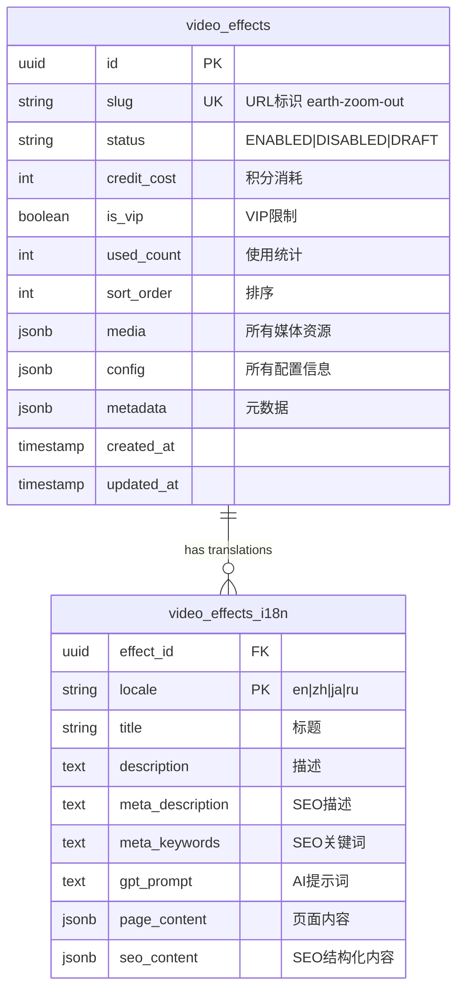

# Video Templates 数据库设计方案（极简版）

## 设计哲学

> "Complexity is the enemy. Simplicity is the goal." - Linus Torvalds

**核心原则：2 张表解决一切**

## 数据库架构



## 表结构详解

### 1. **video_effects** - 主表（所有非语言数据）

```sql
CREATE TABLE video_effects (
    id UUID PRIMARY KEY DEFAULT gen_random_uuid(),
    slug VARCHAR(255) UNIQUE NOT NULL, -- earth-zoom-out
    status VARCHAR(20) DEFAULT 'DRAFT', -- ENABLED, DISABLED, DRAFT

    -- 核心业务字段
    credit_cost INTEGER DEFAULT 10,
    is_vip BOOLEAN DEFAULT FALSE,
    used_count INTEGER DEFAULT 0,
    sort_order INTEGER DEFAULT 0,

    -- JSONB 存储所有复杂数据
    media JSONB DEFAULT '{}', -- 媒体资源
    config JSONB DEFAULT '{}', -- 配置信息
    metadata JSONB DEFAULT '{}', -- 元数据

    -- 时间戳
    created_at TIMESTAMPTZ DEFAULT NOW(),
    updated_at TIMESTAMPTZ DEFAULT NOW()
);

-- 索引
CREATE INDEX idx_effects_slug ON video_effects(slug);
CREATE INDEX idx_effects_status ON video_effects(status);
CREATE INDEX idx_effects_sort ON video_effects(sort_order);
CREATE INDEX idx_effects_media ON video_effects USING GIN(media);
CREATE INDEX idx_effects_config ON video_effects USING GIN(config);
```

**media 字段结构：**

```json
{
  "cover_image": "https://cdn.veo3.ai/effects/earth-zoom/cover.jpg",
  "cover_video": "https://cdn.veo3.ai/effects/earth-zoom/preview.mp4",
  "cover_webp": "https://cdn.veo3.ai/effects/earth-zoom/cover.webp",
  "thumbnails": ["thumb1.jpg", "thumb2.jpg"],
  "examples": [
    {
      "title": "Example 1",
      "video_url": "example1.mp4",
      "prompt": "A beautiful earth zoom effect"
    }
  ]
}
```

**config 字段结构：**

```json
{
  "template_code": "earth-zoom-out",
  "aspect_ratio": "16:9",
  "supported_ratios": ["16:9", "9:16", "1:1"],
  "max_duration": 4000,
  "assets_type": "image",
  "assets_num": 1,
  "min_assets_num": 1,

  "generation": {
    "provider": "kie",
    "model": "veo3",
    "params": {
      "quality": "high",
      "fps": 30
    }
  },

  "variables": [
    {
      "name": "zoom_speed",
      "type": "slider",
      "min": 0.5,
      "max": 2.0,
      "default": 1.0
    }
  ],

  "sound_info": {
    "enabled": true,
    "default_track": "epic_zoom.mp3"
  }
}
```

**metadata 字段结构：**

```json
{
  "category": "entertainment",
  "tags": ["zoom", "earth", "space", "trending"],
  "marks": ["new", "hot"],
  "source": "official",
  "open_type": "ALL",
  "enable_hover": true,
  "stats": {
    "success_rate": 0.95,
    "avg_generation_time": 3500
  }
}
```

### 2. **video_effects_i18n** - 多语言表（所有文本内容）

```sql
CREATE TABLE video_effects_i18n (
    effect_id UUID REFERENCES video_effects(id) ON DELETE CASCADE,
    locale VARCHAR(10) NOT NULL, -- en, zh, ja, ru

    -- 基础文本
    title VARCHAR(255) NOT NULL,
    description TEXT,

    -- SEO TDK
    meta_description TEXT,
    meta_keywords TEXT,

    -- AI生成
    gpt_prompt TEXT,

    -- 页面内容（JSONB存储结构化内容）
    page_content JSONB DEFAULT '{}',
    seo_content JSONB DEFAULT '{}',

    PRIMARY KEY (effect_id, locale)
);

-- 索引
CREATE INDEX idx_i18n_locale ON video_effects_i18n(locale);
```

**page_content 字段结构：**

```json
{
  "hero": {
    "title": "Earth Zoom Out Effect",
    "subtitle": "Create stunning zoom out effects from Earth",
    "cta": "Try Now"
  },
  "features": [
    {
      "title": "Realistic Animation",
      "description": "Physics-based zoom animation"
    }
  ],
  "instructions": {
    "steps": ["Upload your image", "Select zoom speed", "Generate video"]
  },
  "faq": [
    {
      "q": "How long does it take?",
      "a": "Usually 30-60 seconds"
    }
  ]
}
```

**seo_content 字段结构：**

```json
{
  "h1": "Earth Zoom Out Video Effect Generator",
  "intro": "Long SEO optimized introduction text...",
  "sections": [
    {
      "h2": "How to Create Earth Zoom Effects",
      "content": "Detailed content..."
    }
  ],
  "schema": {
    "@type": "SoftwareApplication",
    "name": "Earth Zoom Effect",
    "description": "AI-powered earth zoom video generator"
  }
}
```

## API 查询示例

### 获取特效详情（单表查询）

```sql
-- 超简单的查询，性能极高
SELECT
    e.*,
    i.title,
    i.description,
    i.meta_description,
    i.meta_keywords,
    i.gpt_prompt,
    i.page_content,
    i.seo_content
FROM video_effects e
LEFT JOIN video_effects_i18n i ON e.id = i.effect_id AND i.locale = $1
WHERE e.slug = $2 AND e.status = 'ENABLED';
```

### 获取特效列表

```sql
-- 带分类过滤的列表查询
SELECT
    e.id,
    e.slug,
    e.credit_cost,
    e.is_vip,
    e.used_count,
    e.media->>'cover_image' as cover,
    e.media->>'cover_video' as preview,
    e.metadata->>'category' as category,
    e.metadata->'tags' as tags,
    i.title,
    i.description
FROM video_effects e
LEFT JOIN video_effects_i18n i ON e.id = i.effect_id AND i.locale = $1
WHERE e.status = 'ENABLED'
AND ($2::text IS NULL OR e.metadata->>'category' = $2)
AND ($3::text IS NULL OR e.metadata->'tags' ? $3)
ORDER BY e.sort_order, e.used_count DESC
LIMIT $4 OFFSET $5;
```

### 搜索特效

```sql
-- 全文搜索
SELECT
    e.*,
    i.title,
    ts_rank(
        to_tsvector('english', i.title || ' ' || i.description),
        plainto_tsquery('english', $2)
    ) as rank
FROM video_effects e
JOIN video_effects_i18n i ON e.id = i.effect_id AND i.locale = $1
WHERE e.status = 'ENABLED'
AND to_tsvector('english', i.title || ' ' || i.description) @@ plainto_tsquery('english', $2)
ORDER BY rank DESC
LIMIT 20;
```

## 数据迁移示例

### 从 Pollo.ai 迁移

```sql
-- 一个简单的INSERT就搞定
INSERT INTO video_effects (
    slug,
    status,
    credit_cost,
    used_count,
    sort_order,
    media,
    config,
    metadata
) VALUES (
    'earth-zoom-out',
    'ENABLED',
    10,
    3195,
    1,
    jsonb_build_object(
        'cover_image', 'https://videocdn.pollo.ai/...',
        'cover_video', 'https://videocdn.pollo.ai/...',
        'cover_webp', 'https://videocdn.pollo.ai/...'
    ),
    jsonb_build_object(
        'template_code', 'earth-zoom-out',
        'aspect_ratio', '1:1',
        'max_duration', 4000,
        'assets_type', 'mergingImage',
        'assets_num', 1
    ),
    jsonb_build_object(
        'category', 'entertainment',
        'tags', ARRAY['new'],
        'source', 'official',
        'open_type', 'ALL'
    )
);

-- 插入多语言内容
INSERT INTO video_effects_i18n (effect_id, locale, title, description)
VALUES
    ((SELECT id FROM video_effects WHERE slug = 'earth-zoom-out'), 'en', 'Earth Zoom Out', 'Create amazing earth zoom effects'),
    ((SELECT id FROM video_effects WHERE slug = 'earth-zoom-out'), 'zh', '地球缩放', '创建惊人的地球缩放效果');
```

## TypeScript 类型定义

```typescript
// 与数据库结构完全对应
interface VideoEffect {
  id: string;
  slug: string;
  status: "ENABLED" | "DISABLED" | "DRAFT";
  credit_cost: number;
  is_vip: boolean;
  used_count: number;
  sort_order: number;

  media: {
    cover_image?: string;
    cover_video?: string;
    cover_webp?: string;
    thumbnails?: string[];
    examples?: Array<{
      title: string;
      video_url: string;
      prompt: string;
    }>;
  };

  config: {
    template_code: string;
    aspect_ratio: string;
    supported_ratios: string[];
    max_duration: number;
    assets_type: string;
    assets_num: number;
    generation: {
      provider: string;
      model: string;
      params: Record<string, any>;
    };
    variables?: Array<{
      name: string;
      type: string;
      [key: string]: any;
    }>;
  };

  metadata: {
    category: string;
    tags: string[];
    marks?: string[];
    source: string;
    open_type: string;
    [key: string]: any;
  };
}

interface VideoEffectI18n {
  effect_id: string;
  locale: string;
  title: string;
  description?: string;
  meta_description?: string;
  meta_keywords?: string;
  gpt_prompt?: string;
  page_content: Record<string, any>;
  seo_content: Record<string, any>;
}
```

## Stark 后台配置

### 配置界面设计

```
┌─────────────────────────────────────┐
│  基础信息                            │
├─────────────────────────────────────┤
│  Slug: [earth-zoom-out]             │
│  状态: [ENABLED ▼]                   │
│  积分: [10]                          │
│  VIP: [□]                            │
│  排序: [1]                           │
└─────────────────────────────────────┘

┌─────────────────────────────────────┐
│  媒体资源 (JSON编辑器)               │
├─────────────────────────────────────┤
│  {                                   │
│    "cover_image": "...",            │
│    "cover_video": "...",            │
│    "examples": [...]                │
│  }                                   │
└─────────────────────────────────────┘

┌─────────────────────────────────────┐
│  配置信息 (JSON编辑器)               │
├─────────────────────────────────────┤
│  {                                   │
│    "template_code": "...",          │
│    "generation": {...}              │
│  }                                   │
└─────────────────────────────────────┘

┌─────────────────────────────────────┐
│  多语言内容 [EN] [ZH] [JA]           │
├─────────────────────────────────────┤
│  标题: [_____________]               │
│  描述: [_____________]               │
│  SEO描述: [__________]               │
│  GPT提示: [__________]               │
│  页面内容: {JSON编辑器}              │
└─────────────────────────────────────┘
```

## 性能优化

### 1. 索引策略

```sql
-- GIN索引加速JSONB查询
CREATE INDEX idx_effects_category ON video_effects ((metadata->>'category'));
CREATE INDEX idx_effects_tags ON video_effects USING GIN ((metadata->'tags'));
CREATE INDEX idx_effects_vip ON video_effects (is_vip) WHERE status = 'ENABLED';
```

### 2. 缓存策略

```typescript
// Redis缓存热门特效
const CACHE_KEY = `effect:${slug}:${locale}`;
const CACHE_TTL = 3600; // 1小时

// 缓存列表页
const LIST_CACHE_KEY = `effects:list:${category}:${page}`;
const LIST_CACHE_TTL = 300; // 5分钟
```

### 3. 查询优化

- 单表查询，避免复杂 JOIN
- JSONB 字段使用 GIN 索引
- 使用部分索引优化特定查询

## 优势总结

| 特性           | 8 表方案      | 2 表方案       |
| -------------- | ------------- | -------------- |
| **复杂度**     | 高            | 极低           |
| **查询性能**   | 需要多表 JOIN | 单表查询       |
| **维护成本**   | 高            | 极低           |
| **灵活性**     | 受限于表结构  | JSONB 无限扩展 |
| **开发效率**   | 慢            | 快             |
| **数据一致性** | 复杂          | 简单           |

## 关键设计决策

1. **为什么只用 2 张表？**

   - 简单就是美
   - PostgreSQL 的 JSONB 足够强大
   - 避免过度设计

2. **为什么分离 i18n 表？**

   - 多语言是硬需求
   - 文本内容独立管理
   - 查询性能优化

3. **为什么大量使用 JSONB？**
   - 灵活扩展无需改表
   - PostgreSQL 原生支持查询
   - 减少表关联复杂度

## 总结

> "UNIX philosophy: Do one thing and do it well."

- **video_effects**: 存储所有非语言数据
- **video_effects_i18n**: 存储所有语言相关内容

2 张表，解决一切。简单、高效、可扩展。
