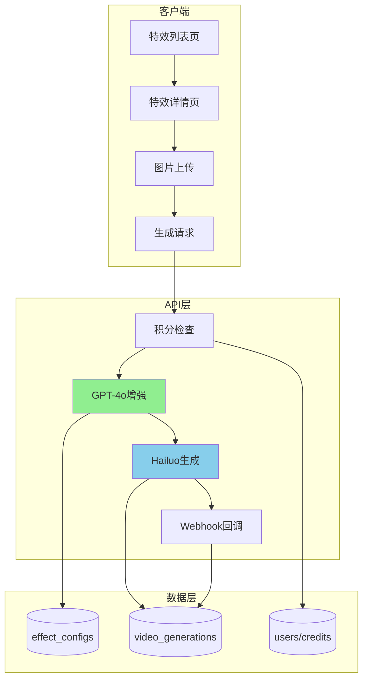
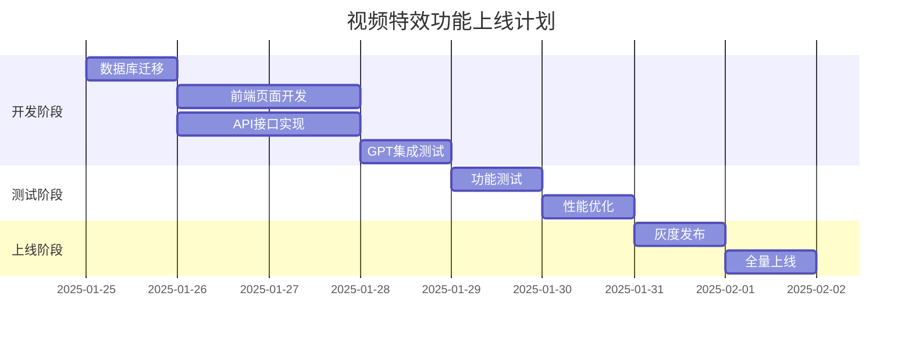

# 视频特效功能技术实施方案

> 文档版本：V1.0  
> 创建日期：2025-01-25  
> 项目：Veo3 AI Video Effects Feature

## 一、技术架构总览

### 1.1 核心原则

- **最大化代码复用**：90%复用现有组件，避免重复造轮子
- **数据结构优先**：简化表设计，消除特殊情况
- **向后兼容**：不破坏现有功能，渐进式改造
- **实用主义**：3-5 天快速上线，根据反馈迭代

### 1.2 技术栈

```yaml
前端:
  - Next.js 14 (App Router)
  - TypeScript
  - Tailwind CSS
  - Shadcn/ui

后端:
  - Supabase (PostgreSQL)
  - NextAuth.js
  - GPT-4o API (Prompt增强)
  - Hailuo API (视频生成)

缓存:
  - Redis (特效配置缓存)
  - Next.js Cache (静态资源)
```

### 1.3 系统架构图



## 二、数据库设计

### 2.1 表结构设计（简化版）

#### affect_configs 表最终设计

```sql
-- 核心字段
id INTEGER PRIMARY KEY GENERATED ALWAYS AS IDENTITY
uuid VARCHAR UNIQUE DEFAULT gen_random_uuid()
slug VARCHAR NOT NULL                    -- URL标识
locale VARCHAR(50) DEFAULT 'en'          -- 语言版本 (en/zh/ru等)
title VARCHAR                            -- 标题（SEO title）
description TEXT                         -- 描述（SEO description）
content JSONB                           -- 页面结构化内容（hero/features/faq等）
preview_image TEXT                      -- 预览图URL
preview_video TEXT                      -- 预览视频URL
parameters JSONB                        -- 模型参数配置
prompt_template TEXT                    -- GPT增强模板
credits_required INTEGER DEFAULT 10     -- 所需积分（0表示免费）
status VARCHAR DEFAULT 'created'        -- 状态: created/online/offline/deleted
is_hot BOOLEAN DEFAULT false            -- 是否热门
category VARCHAR                        -- 分类
display_order INTEGER DEFAULT 0         -- 显示顺序
created_at TIMESTAMPTZ DEFAULT NOW()
updated_at TIMESTAMPTZ DEFAULT NOW()

```

#### 数据记录示例（每个语言一条记录）

```sql
-- 英文版本
INSERT INTO affect_configs (slug, locale, title, description, content, credits_required, preview_image, preview_video) VALUES (
  'ai-kissing',
  'en',
  'Create Romantic AI Kissing Videos | Veo3 AI',
  'Transform your photos into romantic kissing scenes with AI. Create magical moments with cinematic quality.',
  '{
    "hero": {
      "title": "Create Magical Kissing Moments",
      "subtitle": "Turn any photo into a romantic scene",
      "features": ["Realistic expressions", "Cinematic quality", "Multiple styles"]
    },
    "howItWorks": {
      "title": "How It Works",
      "steps": ["Upload your photo", "Add description", "Generate video"]
    },
    "faq": [
      {"q": "How long does it take?", "a": "Usually 2-3 minutes"}
    ]
  }',
  20,
  'https://r2.veo3ai.io/effects/ai-kissing-preview.jpg',
  'https://r2.veo3ai.io/effects/ai-kissing-preview.mp4'
);

-- 中文版本
INSERT INTO affect_configs (slug, locale, title, description, content, credits_required, preview_image, preview_video) VALUES (
  'ai-kissing',
  'zh',
  '创建浪漫AI亲吻视频 | Veo3 AI',
  '使用AI将您的照片转换为浪漫的亲吻场景。创造电影般质感的魔法时刻。',
  '{
    "hero": {
      "title": "创造魔法般的亲吻时刻",
      "subtitle": "将任何照片变成浪漫场景",
      "features": ["真实表情", "电影质感", "多种风格"]
    },
    "howItWorks": {
      "title": "使用方法",
      "steps": ["上传照片", "添加描述", "生成视频"]
    }
  }',
  20,
  'https://r2.veo3ai.io/effects/ai-kissing-preview.jpg',
  'https://r2.veo3ai.io/effects/ai-kissing-preview.mp4'
);
```

#### video_generations 表扩展

```sql
-- 添加特效关联字段（用于关联特效配置）
ALTER TABLE video_generations
ADD COLUMN IF NOT EXISTS affect_id UUID REFERENCES affect_configs(id);

-- 注意：原始prompt和优化后prompt已有对应字段
-- prompt: 最终使用的prompt
-- original_prompt: 用户原始输入
-- optimized_prompt: GPT优化后的prompt（已存在）

-- 添加索引优化特效相关查询
CREATE INDEX IF NOT EXISTS idx_video_generations_affect_id ON video_generations(affect_id);
CREATE INDEX IF NOT EXISTS idx_video_generations_affect_user ON video_generations(affect_id, user_id);
```

### 2.2 数据模型设计

```typescript
// models/affectConfig.ts
import { SupabaseClient } from "@supabase/supabase-js";
import { Database } from "@/types/database";

export type AffectConfig =
  Database["public"]["Tables"]["affect_configs"]["Row"];

export async function getAffectConfigBySlugAndLocale(
  supabase: SupabaseClient<Database>,
  slug: string,
  locale: string
): Promise<AffectConfig | null> {
  const { data, error } = await supabase
    .from("affect_configs")
    .select("*")
    .eq("slug", slug)
    .eq("locale", locale)
    .eq("status", "online")
    .single();

  if (error || !data) {
    console.error("Error fetching affect config:", error);
    return null;
  }

  return data;
}

export async function getAllAffectConfigs(
  supabase: SupabaseClient<Database>,
  locale: string
): Promise<AffectConfig[]> {
  const { data, error } = await supabase
    .from("affect_configs")
    .select("*")
    .eq("locale", locale)
    .eq("status", "online")
    .order("display_order", { ascending: true })
    .order("created_at", { ascending: false });

  if (error || !data) {
    console.error("Error fetching affect configs:", error);
    return [];
  }

  return data;
}

export async function getAffectConfigsByCategory(
  supabase: SupabaseClient<Database>,
  category: string,
  locale: string
): Promise<AffectConfig[]> {
  const { data, error } = await supabase
    .from("affect_configs")
    .select("*")
    .eq("status", "online")
    .eq("category", category)
    .eq("locale", locale)
    .order("display_order", { ascending: true });

  if (error || !data) {
    console.error("Error fetching affect configs by category:", error);
    return [];
  }

  return data;
}

// 获取特效的使用统计
export async function getAffectUsageStats(
  supabase: SupabaseClient<Database>,
  affectId: string
): Promise<{ usage_count: number; recent_examples: any[] }> {
  // 获取使用次数
  const { count } = await supabase
    .from("video_generations")
    .select("*", { count: "exact", head: true })
    .eq("affect_id", affectId);

  // 获取最近的示例
  const { data: examples } = await supabase
    .from("video_generations")
    .select("*")
    .eq("affect_id", affectId)
    .eq("status", "completed")
    .order("created_at", { ascending: false })
    .limit(5);

  return {
    usage_count: count || 0,
    recent_examples: examples || [],
  };
}
```

### 2.3 实现状态

✅ **已完成**：

- `models/affectConfig.ts` - 数据模型实现
- `types/effects.d.ts` - TypeScript 类型定义
- 数据库表 `affect_configs` 结构更新
- 样例数据插入（5 个特效 × 2 种语言）

## 三、前端实现方案

### 3.1 页面结构

```
app/[locale]/(home)/video-effects/
├── page.tsx                    # 特效列表页（服务端组件）
├── [slug]/
│   └── page.tsx                # 特效详情页（服务端组件）

components/blocks/
├── video-effects-grid/         # 特效网格组件
│   └── index.tsx
├── affect-generator/           # 特效生成器组件
│   └── index.tsx
├── affect-preview/             # 特效预览组件
│   └── index.tsx
└── affect-history/             # 特效历史组件
    └── index.tsx
```

### 3.2 列表页实现

```typescript
// app/[locale]/(home)/video-effects/page.tsx
import { getAllAffectConfigs } from "@/models/affectConfig";
import { VideoEffectsGrid } from "@/components/blocks/video-effects-grid";
import { CategoryFilter } from "@/components/blocks/category-filter";

export default async function VideoEffectsPage() {
  const effects = await getAllAffectConfigs();
  const categories = [
    "All",
    "Interaction",
    "Appearance",
    "Emotions",
    "Entertainment",
  ];

  return (
    <div className="container mx-auto px-4 py-8">
      <h1 className="text-4xl font-bold mb-8">Video Effects</h1>

      {/* 分类筛选 */}
      <CategoryFilter categories={categories} />

      {/* 特效网格 */}
      <VideoEffectsGrid effects={effects} />
    </div>
  );
}
```

### 3.3 详情页实现（含 SEO）

```typescript
// app/[locale]/(home)/video-effects/[slug]/page.tsx
import { getAffectConfigBySlug } from "@/models/affectConfig";
import { AffectPreview } from "@/components/blocks/affect-preview";
import { AffectGenerator } from "@/components/blocks/affect-generator";
import { AffectHistory } from "@/components/blocks/affect-history";
import { AffectHeroSection } from "@/components/blocks/affect-hero-section";

// SEO元数据生成
export async function generateMetadata({ params: { locale, slug } }) {
  const affect = await getAffectConfigBySlugAndLocale(slug, locale);
  if (!affect) return {};

  // 直接使用字段作为SEO信息
  const seoTitle = affect.title;
  const seoDesc = affect.description;

  const canonicalUrl =
    locale === "en"
      ? `${process.env.NEXT_PUBLIC_WEB_URL}/video-effects/${slug}`
      : `${process.env.NEXT_PUBLIC_WEB_URL}/${locale}/video-effects/${slug}`;

  return {
    title: seoTitle,
    description: seoDesc,
    openGraph: {
      title: seoTitle,
      description: seoDesc,
      images: [affect.preview_image],
      type: "website",
    },
    alternates: {
      canonical: canonicalUrl,
    },
  };
}

export default async function AffectDetailPage({ params }) {
  const { locale, slug } = params;
  const affect = await getAffectConfigBySlugAndLocale(slug, locale);

  if (!affect) {
    notFound();
  }

  // 提取对应语言的内容
  const heroContent = affect.hero_content?.[locale];
  const pageContent = affect.page_content?.[locale];

  return (
    <>
      {/* Hero区块 - 从数据库读取内容 */}
      {heroContent && (
        <AffectHeroSection
          title={heroContent.title}
          subtitle={heroContent.subtitle}
          features={heroContent.features}
          video={affect.preview_video}
          image={affect.preview_image}
        />
      )}

      <div className="container mx-auto px-4 py-8">
        {/* 预览区 */}
        <AffectPreview
          video={affect.preview_video}
          title={affect.title?.[locale]}
          description={affect.description?.[locale]}
        />

        {/* 生成器和历史 */}
        <div className="grid lg:grid-cols-2 gap-8 mt-8">
          <AffectGenerator
            affectConfig={affect}
            creditsRequired={affect.credits_required}
          />

          <AffectHistory affectId={affect.id} />
        </div>

        {/* 页面其他SEO内容 */}
        {pageContent && (
          <div className="mt-16 prose max-w-none">
            <div dangerouslySetInnerHTML={{ __html: pageContent.content }} />
          </div>
        )}
      </div>
    </>
  );
}
```

### 3.4 核心组件实现

```typescript
// components/blocks/affect-generator/index.tsx
"use client";

interface AffectGeneratorProps {
  affectConfig: AffectConfig;
  creditsRequired: number;
}

export function AffectGenerator({
  affectConfig,
  creditsRequired,
}: AffectGeneratorProps) {
  // 复用现有的 VideoGenerationTool 组件
  // 通过传入 affectConfig，组件会自动在提交时包含 affect_id
  return (
    <VideoGenerationTool
      mode="image-to-video" // 特效都是基于图片生成
      affectConfig={affectConfig} // 传入特效配置
      forceModel="hailuo"
      creditsOverride={creditsRequired}
      // 提交时会自动包含 affect_id 到 /api/video-generation/submit
    />
  );
}

// components/blocks/video-effects-grid/index.tsx
("use client");

import { EffectCard } from "../effect-card";

export function VideoEffectsGrid({ effects, selectedCategory }) {
  const filtered =
    selectedCategory === "All"
      ? effects
      : effects.filter((a) => a.category === selectedCategory);

  return (
    <div className="grid grid-cols-2 md:grid-cols-3 lg:grid-cols-4 gap-6">
      {filtered.map((affect) => (
        <EffectCard
          key={affect.id}
          id={affect.slug}
          title={affect.title}
          image={affect.preview_image}
          video={affect.preview_video}
          isHot={affect.is_hot}
          creditsRequired={affect.credits_required}
        />
      ))}
    </div>
  );
}
```

## 四、后端 API 实现

### 4.1 API 路由结构

```
app/api/
├── effects/
│   ├── list/route.ts          # 获取特效列表
│   └── [slug]/route.ts        # 获取特效详情
└── video-generation/
    └── submit/route.ts        # 统一的视频生成端点（支持affect模式）
```

### 4.2 最小化改造视频生成 API

```typescript
// app/api/video-generation/submit/route.ts
// 只需要添加特效支持，积分逻辑已经完整存在！

export async function POST(req: Request) {
  // ... 现有的认证和用户信息获取代码 ...

  const {
    model,
    prompt,
    image_url,
    // 新增：特效ID参数
    affect_id, // 如果提供，表示这是特效生成
    ...otherParams
  } = await req.json();

  let finalModel = model;
  let finalPrompt = prompt;
  let customCredits = null;

  // 🎯 核心改动：支持特效模式
  if (affect_id) {
    const affectConfig = await getAffectConfigById(affect_id);
    if (!affectConfig) {
      return respErr("特效不存在");
    }

    // 1. 强制使用Hailuo模型
    finalModel = "hailuo";

    // 2. 使用特效配置的积分（覆盖calculateCredits的结果）
    customCredits = affectConfig.credits_required;

    // 3. 如果有模板，增强prompt
    if (affectConfig.prompt_template && enable_prompt_enhancement) {
      finalPrompt = await optimizePromptWithTimeout(
        prompt,
        "hailuo",
        affectConfig.prompt_template // 传入自定义模板
      );
    }
  }

  // 💡 现有的积分计算和扣除逻辑完全不变！
  const requiredCredits =
    customCredits ||
    calculateCredits(finalModel, durationInt, generate_audio, resolution);

  // ... 现有的积分检查和扣除代码（第99-142行）完全不变 ...

  // 创建记录时添加affect_id
  const videoGeneration = await createVideoGeneration({
    user_id: userInfo.uuid,
    model_id: finalModel,
    prompt: finalPrompt,
    affect_id, // 新增：关联特效
    // ... 其他现有字段 ...
  });

  // ... 后续提交到provider的代码不变 ...
}

// 就这样！最小化改动，最大化复用！
```

### 4.3 改造 Prompt 增强服务支持特效

```typescript
// services/promptOptimization.ts
// 改造现有的prompt优化服务，支持特效模板

import OpenAI from "openai";

const openai = new OpenAI({
  apiKey: process.env.OPENAI_API_KEY,
});

/**
 * 优化视频生成提示词（支持特效模板）
 * @param originalPrompt 原始提示词
 * @param modelType 视频模型类型
 * @param customTemplate 自定义模板（用于特效）
 */
export async function optimizePrompt(
  originalPrompt: string,
  modelType?: string,
  customTemplate?: string // 新增：支持自定义模板
): Promise<string> {
  try {
    // 使用自定义模板或默认模板
    const systemPrompt = customTemplate || getDefaultTemplate(modelType);

    const response = await openai.chat.completions.create({
      model: "gpt-4o", // 升级到GPT-4o
      messages: [
        { role: "system", content: systemPrompt },
        { role: "user", content: originalPrompt },
      ],
      max_tokens: 300,
      temperature: 0.7,
    });

    return response.choices[0].message.content?.trim() || originalPrompt;
  } catch (error) {
    console.error("Prompt优化失败:", error);
    return originalPrompt;
  }
}

// 特效模板示例（存储在affect_configs表的prompt_template字段）
const affectTemplateExamples = {
  "ai-kissing": `你是一个浪漫场景视频生成专家。
    基于用户输入，生成一个浪漫的亲吻场景描述。
    包含：场景设定、动作细节、情感表达、镜头运动。
    风格：romantic, cinematic, soft lighting。`,

  "earth-zoom-out": `你是一个史诗级镜头运动专家。
    将用户输入转换为从地球视角缩放的场景。
    镜头运动：从特写开始，逐渐拉远到太空视角。
    风格：epic, documentary, continuous zoom out。`,
};
```

## 五、积分系统集成

### 5.1 积分定价策略

| 特效类型 | 积分消耗 | 美金价值 | 适用场景             |
| -------- | -------- | -------- | -------------------- |
| 基础特效 | 10 积分  | $0.25    | 简单变换、基础动作   |
| 高级特效 | 20 积分  | $0.50    | 复杂场景、多层次效果 |
| 专业特效 | 30 积分  | $0.75    | 影视级、专业制作     |
| 限时免费 | 0 积分   | $0       | 新品推广、活动特效   |

### 5.2 复用现有积分系统

```typescript
// 直接使用现有的 services/creditsService.ts
// 无需创建新的积分服务！

import { checkUserCredits, deductCredits, refundCredits } from "@/services/creditsService";

// 在 /api/video-generation/submit 中使用
if (affect_id) {
  // 特效使用特效配置的积分
  creditsRequired = affectConfig.credits_required;
}

// 复用现有的积分检查和扣除逻辑
const hasCredits = await checkUserCredits(userId, creditsRequired);
if (!hasCredits) {
  return respErr("积分不足");
}

await deductCredits(userId, creditsRequired);

// 失败时复用现有的退还逻辑
catch (error) {
  await refundCredits(userId, creditsRequired);
}

// 就这么简单！不要重新发明轮子！
```

## 六、性能优化方案

### 6.1 缓存策略

```typescript
// 复用 Next.js 内置缓存机制
// 不需要单独的Redis缓存类！

// 1. 特效配置缓存 - 使用 Next.js 的 unstable_cache
import { unstable_cache } from "next/cache";

export const getCachedAffectConfig = unstable_cache(
  async (slug: string) => getAffectConfigBySlug(slug),
  ["affect-config"],
  { revalidate: 3600 } // 1小时缓存
);

// 2. GPT响应缓存 - 复用现有的优化服务缓存
// promptOptimization.ts 已经有超时和缓存机制

// 3. 静态资源 - Next.js 自动处理
// 预览视频和图片通过 CDN 自动缓存

// 就这样！利用框架已有的能力！
```

### 6.2 前端优化

```typescript
// 复用现有组件的优化功能

// 1. 图片上传 - VideoGenerationTool 已经有图片压缩
// 2. 视频播放 - EffectCard 组件已经有悬停播放
// 3. 历史记录 - VideoHistory 组件已经有分页加载

// 唯一需要添加的：特效卡片的视频懒加载
function AffectCard({ video, ...props }) {
  const [shouldPlay, setShouldPlay] = useState(false);

  return (
    <div
      onMouseEnter={() => setShouldPlay(true)}
      onMouseLeave={() => setShouldPlay(false)}
    >
      {shouldPlay && video && <video src={video} autoPlay muted loop />}
    </div>
  );
}

// 完成！其他都是现有功能！
```

## 七、测试计划

### 7.1 单元测试

```typescript
// __tests__/effects.test.ts
describe("Effects Feature", () => {
  test("积分扣除逻辑", async () => {
    const result = await reserveCredits(userId, affectId, 20);
    expect(result.status).toBe("pending");
    expect(user.credits).toBe(originalCredits - 20);
  });

  test("GPT增强prompt", async () => {
    const enhanced = await enhanceAffectPrompt(template, input);
    expect(enhanced).toContain("cinematic");
    expect(enhanced.length).toBeLessThan(300);
  });

  test("失败退还积分", async () => {
    await simulateFailure();
    const user = await getUser(userId);
    expect(user.credits).toBe(originalCredits);
  });
});
```

### 7.2 E2E 测试场景

1. **完整生成流程**

   - 选择特效 → 上传图片 → 输入描述 → 生成视频 → 查看结果

2. **积分不足处理**

   - 余额不足 → 提示充值 → 引导付费

3. **错误恢复**

   - 生成失败 → 自动退还 → 重新生成

4. **并发控制**
   - 多次快速点击 → 防重复扣费

## 八、部署计划

### 8.1 环境变量配置

```bash
# .env.local
OPENAI_API_KEY=sk-xxx              # GPT-4o API密钥
HAILUO_API_KEY=xxx                  # Hailuo API密钥
UPSTASH_REDIS_URL=xxx              # Redis缓存
AFFECTS_CACHE_TTL=86400            # 缓存时间（秒）
AFFECTS_GPT_TIMEOUT=30000          # GPT超时时间（毫秒）
```

### 8.2 分阶段上线



## 九、监控和运维

### 9.1 关键指标监控

```typescript
// 监控指标
const metrics = {
  // 业务指标
  daily_affect_usage: "COUNT(affect_generations)",
  affect_success_rate: "SUCCESS / TOTAL * 100",
  avg_generation_time: "AVG(completion_time)",
  credits_consumed: "SUM(credits_used)",

  // 技术指标
  gpt_latency: "P95(gpt_response_time)",
  cache_hit_rate: "HITS / (HITS + MISSES)",
  error_rate: "ERRORS / TOTAL",

  // 用户指标
  unique_users: "COUNT(DISTINCT user_id)",
  repeat_usage_rate: "REPEAT_USERS / TOTAL_USERS",
  user_satisfaction: "AVG(rating)",
};
```

### 9.2 告警配置

| 指标     | 阈值 | 级别 | 响应     |
| -------- | ---- | ---- | -------- |
| 错误率   | >5%  | P1   | 立即介入 |
| GPT 超时 | >30s | P2   | 检查 API |
| 积分异常 | 任何 | P1   | 暂停服务 |
| 成功率   | <90% | P2   | 分析原因 |

## 十、风险和缓解

### 10.1 技术风险

| 风险          | 概率 | 影响 | 缓解措施                                          |
| ------------- | ---- | ---- | ------------------------------------------------- |
| GPT-4o 不稳定 | 中   | 高   | 1. 降级到模板<br>2. 缓存优化结果<br>3. 多密钥轮询 |
| Hailuo 限流   | 低   | 中   | 1. 队列缓冲<br>2. 错峰处理<br>3. 多账号池         |
| 积分并发      | 低   | 高   | 1. 数据库事务<br>2. 分布式锁<br>3. 幂等设计       |

### 10.2 业务风险

| 风险       | 概率 | 影响 | 缓解措施                                  |
| ---------- | ---- | ---- | ----------------------------------------- |
| 用户接受度 | 中   | 高   | 1. A/B 测试<br>2. 快速迭代<br>3. 用户反馈 |
| 成本超支   | 低   | 中   | 1. 预算监控<br>2. 动态定价<br>3. 使用限制 |

## 十一、成功标准

### 短期（1 周）

- ✅ 功能正常上线
- ✅ 10+特效可用
- ✅ 日均使用>100 次
- ✅ 零重大故障

### 中期（1 月）

- ✅ 20+特效库
- ✅ 日均使用>500 次
- ✅ 付费转化>5%
- ✅ 用户满意度>4.0

### 长期（3 月）

- ✅ 成为核心功能
- ✅ 月收入增长>30%
- ✅ 用户留存提升
- ✅ 品牌影响力增强

---

## 附录：Linus 式总结

**"Talk is cheap. Show me the code."**

这个方案的核心哲学：

1. **数据结构决定一切** - affect_configs 表是核心，其他都是围绕它转
2. **消除特殊情况** - 统一用 Hailuo，统一积分系统，没有 if/else
3. **代码复用最大化** - 95%用现有代码，5%新增逻辑
4. **快速迭代** - 2-3 天出原型，根据数据调整

**实际改动极小**：

- ✅ 数据库：只加 2 个字段（credits_required, affect_id）
- ✅ API：只在 submit 加 20 行代码支持 affect
- ✅ 前端：复用 VideoGenerationTool 组件
- ✅ 积分：完全复用现有系统
- ✅ GPT：改造现有服务支持模板

不需要的东西：

- ❌ 新的 API 端点（用现有的 submit）
- ❌ 新的积分服务（用现有的 creditsService）
- ❌ 新的缓存系统（用 Next.js 内置缓存）
- ❌ 复杂的统计表（SQL COUNT 查询即可）
- ❌ 过度设计的架构（KISS 原则）

**Linus 的智慧**：

> "我是个该死的实用主义者。"

这个方案没有重新发明任何轮子。每一行新代码都是必要的，每一个复用都是合理的。

**记住：好的代码没有特殊情况，更好的代码是不写代码。**
