# 图片生成代码调用链分析

## 目录

- [整体架构流程](#整体架构流程)
- [核心文件映射](#核心文件映射)
- [详细流程图](#详细流程图)
  - [1. 普通模式提交流程](#1-普通模式提交流程)
  - [2. Agent 模式批量生成流程](#2-agent-模式批量生成流程)
  - [3. 异步回调处理流程](#3-异步回调处理流程)
  - [4. 前端轮询流程](#4-前端轮询流程)
  - [5. 历史记录查询流程](#5-历史记录查询流程)
- [关键字段说明](#关键字段说明)
- [积分扣费与退款逻辑](#积分扣费与退款逻辑)
- [状态机流转](#状态机流转)

---

## 整体架构流程

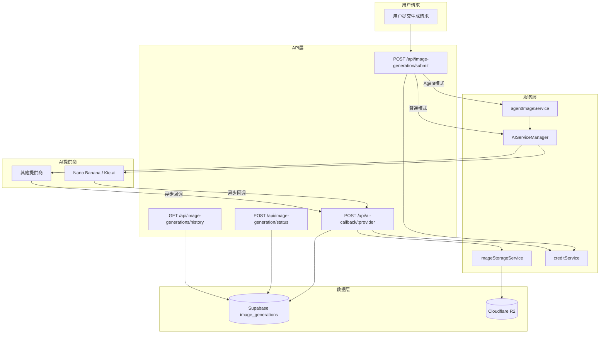

---

## 核心文件映射

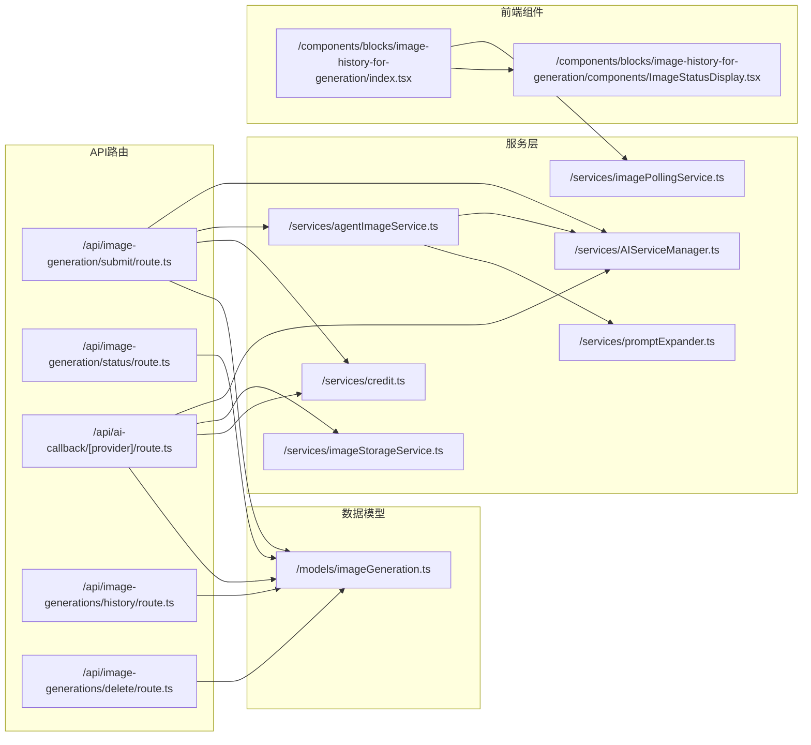

---

## 详细流程图

### 1. 普通模式提交流程

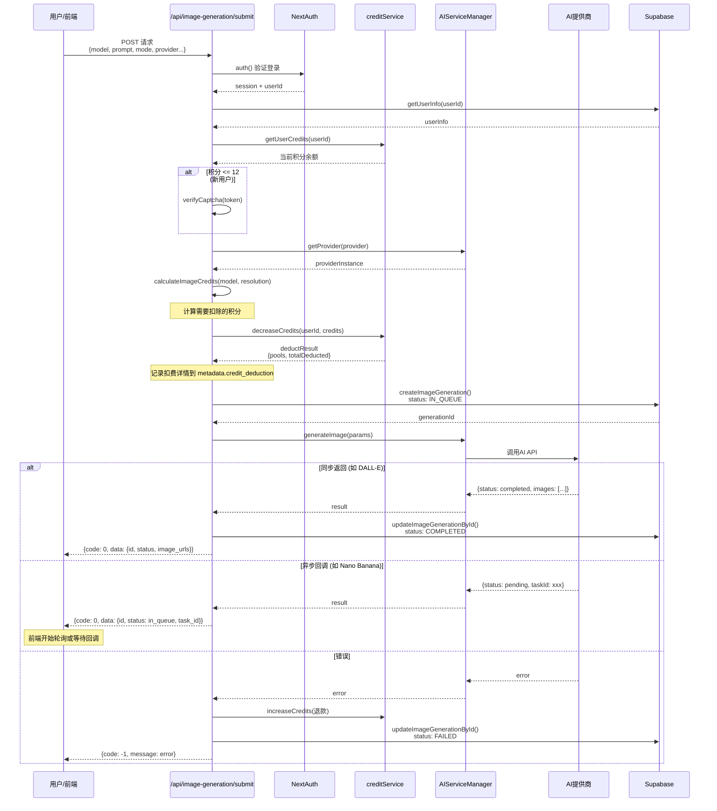

### 2. Agent 模式批量生成流程

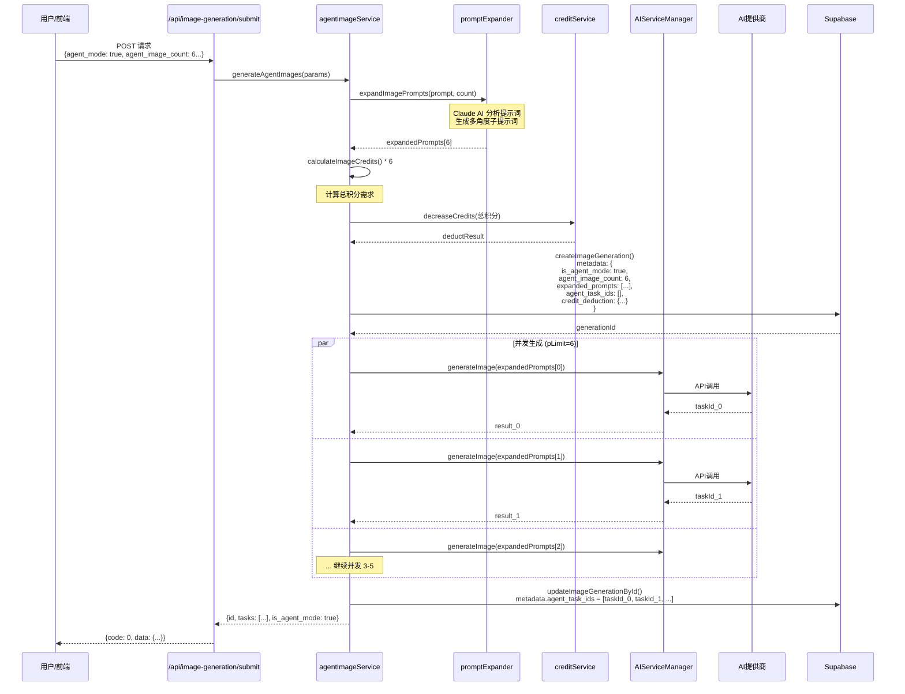

### 3. 异步回调处理流程

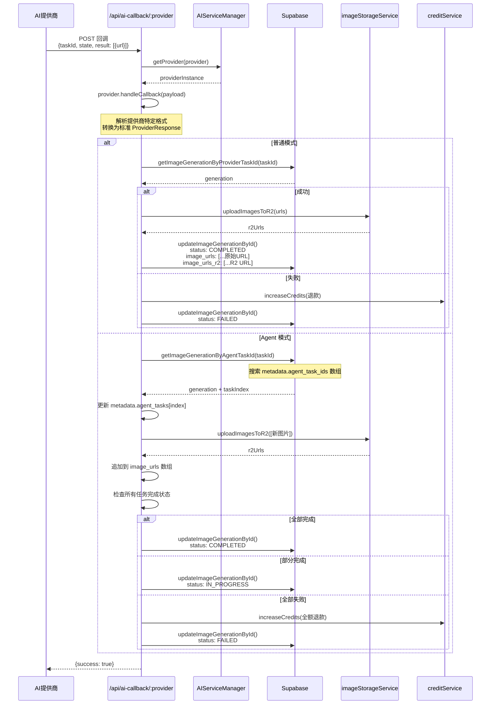

### 4. 前端轮询流程

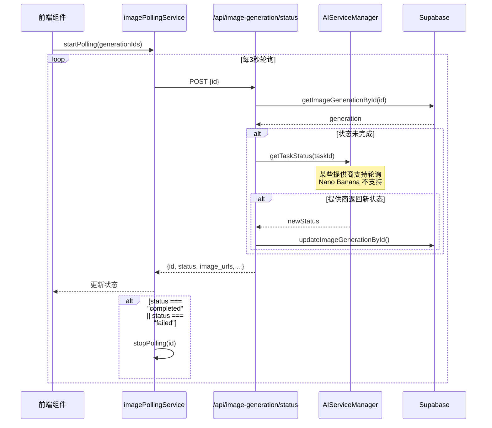

### 5. 历史记录查询流程

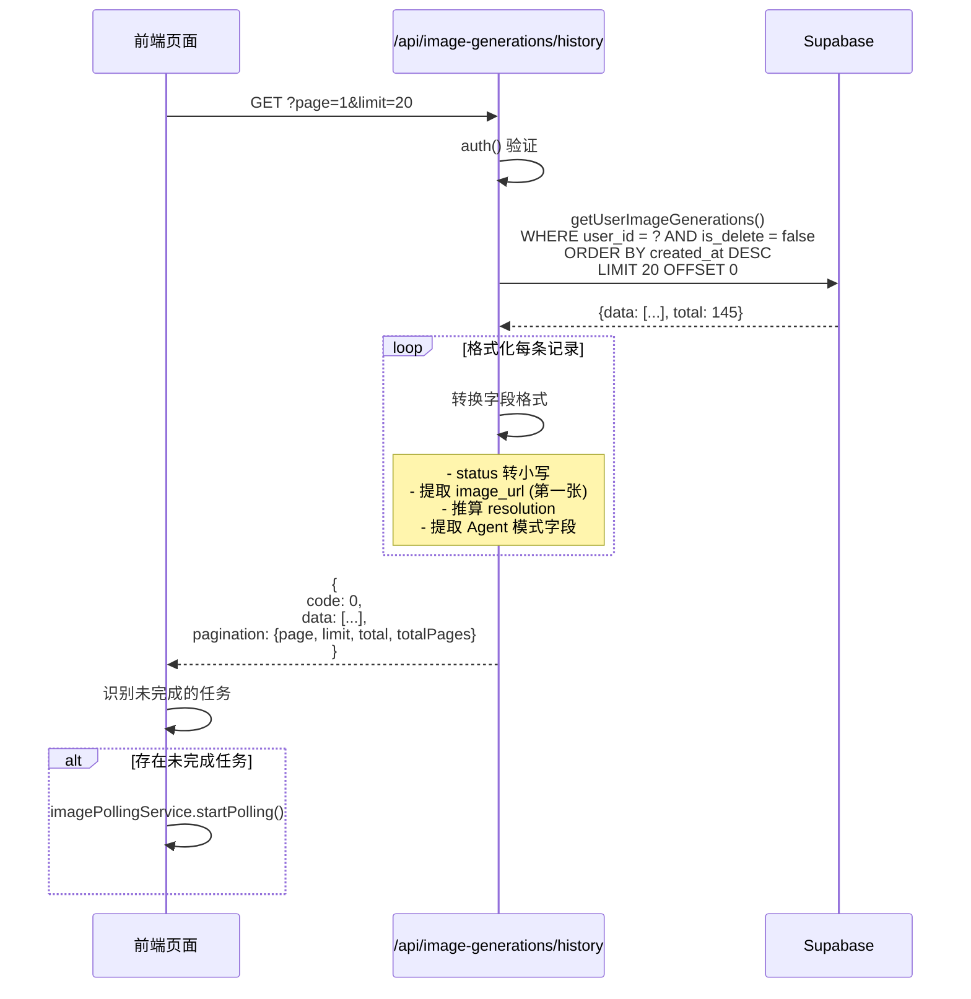

---

## 关键字段说明

### image_generations 表核心字段

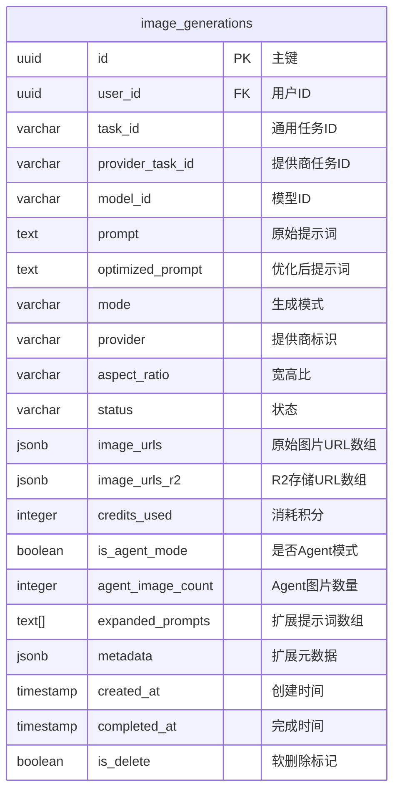

### metadata 字段结构

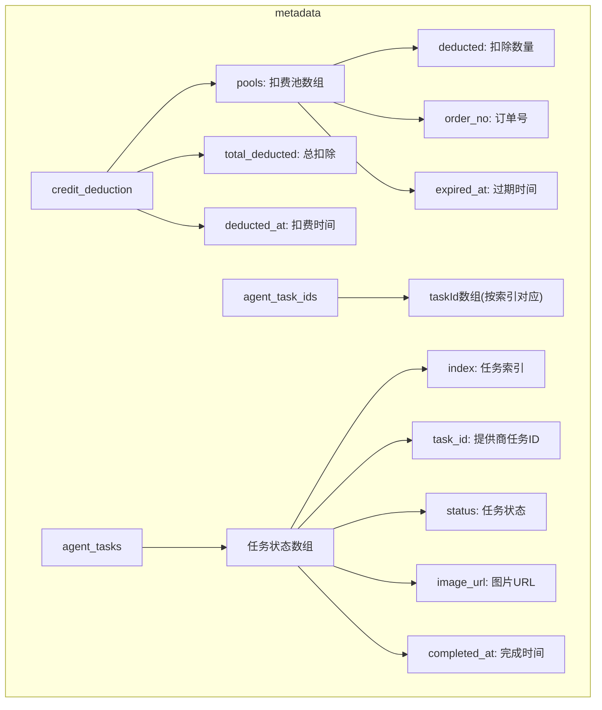

---

## 积分扣费与退款逻辑

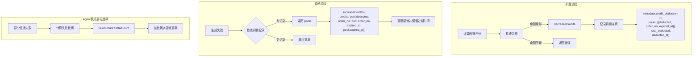

### 积分池示例

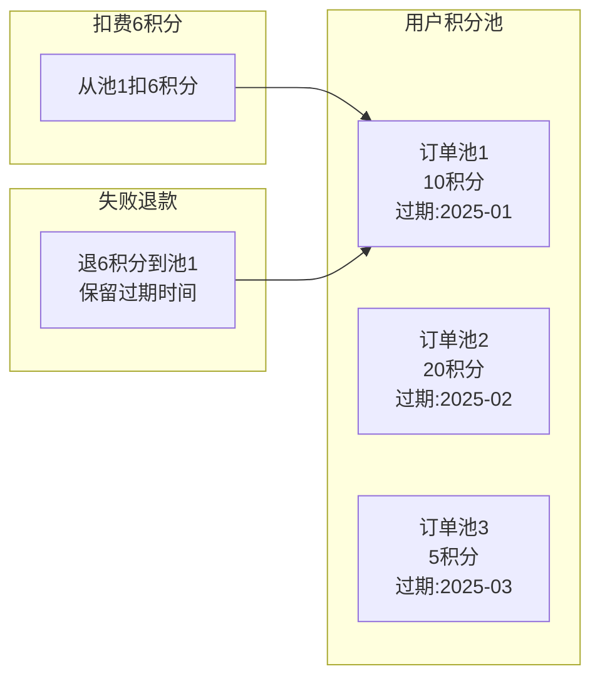

---

## 状态机流转

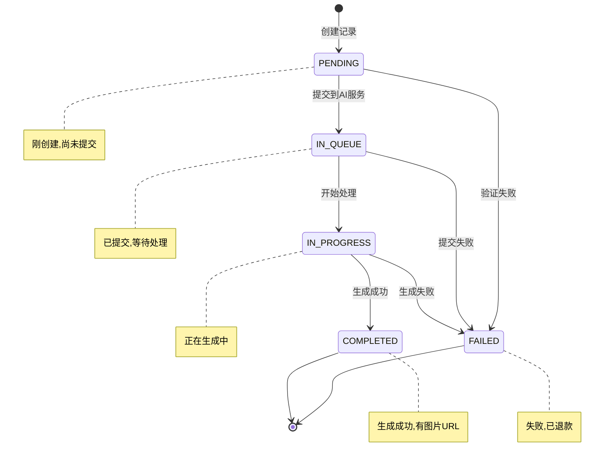

### Agent 模式子任务状态

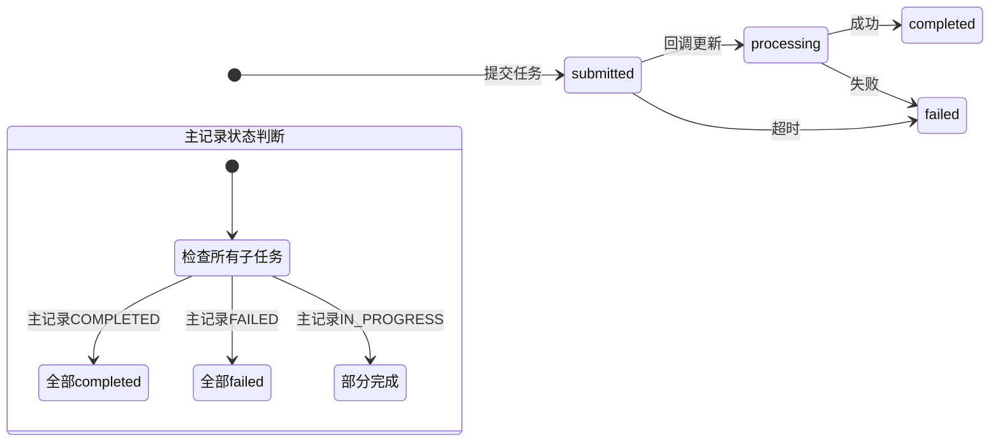

---

## 文件快速索引

| 功能 | 文件路径 |
|------|----------|
| 提交生成请求 | `/app/api/image-generation/submit/route.ts` |
| 查询生成状态 | `/app/api/image-generation/status/route.ts` |
| 异步回调处理 | `/app/api/ai-callback/[provider]/route.ts` |
| 获取历史记录 | `/app/api/image-generations/history/route.ts` |
| 删除图片记录 | `/app/api/image-generations/delete/route.ts` |
| 数据库操作 | `/models/imageGeneration.ts` |
| AI 服务管理 | `/services/AIServiceManager.ts` |
| Agent 模式逻辑 | `/services/agentImageService.ts` |
| 前端轮询 | `/services/imagePollingService.ts` |
| R2 云存储 | `/services/imageStorageService.ts` |
| 积分管理 | `/services/credit.ts` |
| 提示词扩展 | `/services/promptExpander.ts` |
| 类型定义 | `/types/image.d.ts` |
| 模型配置 | `/config/image-models.ts` |
| 历史展示组件 | `/components/blocks/image-history-for-generation/index.tsx` |
| 状态渲染组件 | `/components/blocks/image-history-for-generation/components/ImageStatusDisplay.tsx` |
