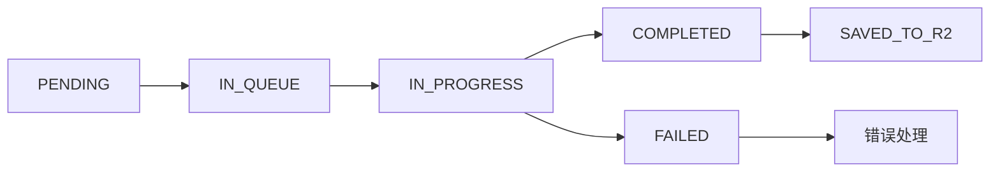
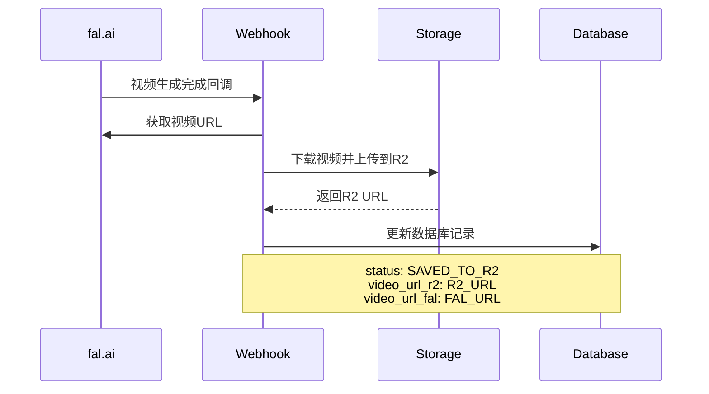

# 视频生成系统完整架构文档

> **项目**: Veo3 AI - 视频生成平台  
> **文档版本**: v1.0  
> **更新日期**: 2025-06-06

## 🎯 **核心架构概览**

这是一个基于 **fal.ai** 集成的视频生成平台，支持多种模型（Kling 1.6、2.1、Veo2、Veo3），具备完整的队列管理、状态跟踪、存储和展示功能。

### 技术栈

- **前端**: Next.js 14 + React + TypeScript
- **后端**: Next.js API Routes
- **数据库**: Supabase (PostgreSQL)
- **AI 服务**: fal.ai (Kling, Veo 系列模型)
- **存储**: Cloudflare R2
- **状态管理**: React Hooks + SWR

---

## 📋 **1. 提交阶段 (Submit)**

### 1.1 入口点

```
components/blocks/video-generator/index.tsx
    ↓
app/api/video-generation/submit/route.ts
```

### 1.2 关键流程

1. **用户认证**: 检查用户登录状态
2. **参数验证**: 验证模型、prompt、时长等参数
3. **积分检查**: 根据模型和时长计算所需积分
4. **积分预扣除**: 提交前先扣除积分（避免并发问题）
5. **数据库记录**: 在 `video_generations` 表创建记录
6. **提交队列**: 调用 `fal.queue.submit()` 提交到 fal.ai
7. **Webhook 配置**: 设置回调 URL 接收状态更新

### 1.3 积分计算逻辑

```typescript
// config/video-models.ts:204-221
function calculateCredits(
  modelId: string,
  duration: number,
  hasAudio: boolean = false
): number {
  const model = getVideoModel(modelId);
  if (!model) return 0;

  // 统一按秒计费
  let totalCredits = duration * model.perSecondCredits;

  // Veo3 模型支持音频，需要额外费用
  if (
    model.provider === VideoModelProvider.VEO3 &&
    hasAudio &&
    model.audioPremiumCredits
  ) {
    totalCredits += duration * model.audioPremiumCredits;
  }

  return Math.round(totalCredits);
}
```

### 1.4 支持的模型

| 模型系列           | 类型                | 积分/秒     | 支持时长 | 特性         |
| ------------------ | ------------------- | ----------- | -------- | ------------ |
| Kling 1.6 Standard | Text/Image to Video | 2           | 5s, 10s  | 高性价比     |
| Kling 1.6 Pro      | Text/Image to Video | 4           | 5s, 10s  | 专业品质     |
| Kling 2.1 Master   | Text/Image to Video | 12          | 5s, 10s  | 最新技术     |
| Veo2               | Image to Video      | 20          | 5s, 8s   | 720p 分辨率  |
| Veo3               | Text to Video       | 20+10(音频) | 8s       | 支持音频生成 |

---

## 🔄 **2. 状态变化机制**

### 2.1 状态流转图



### 2.2 状态定义

```typescript
export type VideoGenerationStatus =
  | "PENDING" // 初始状态，等待提交
  | "IN_QUEUE" // 已提交，在队列中等待
  | "IN_PROGRESS" // 正在生成中
  | "COMPLETED" // 生成完成，获得视频URL
  | "FAILED" // 生成失败
  | "SAVED_TO_R2"; // 已保存到R2存储（最终状态）
```

### 2.3 状态更新来源

1. **Webhook 被动更新**: `app/api/video-generation/webhook/route.ts`
2. **轮询主动查询**: `app/api/video-generation/status/route.ts`

---

## 🔍 **3. 轮询机制 (Polling)**

### 3.1 实现位置

`hooks/useVideoGeneration.ts:86-150`

### 3.2 轮询策略

- **轮询间隔**: 3 秒（正常），5 秒（出错重试）
- **首次延迟**: 1 秒
- **最大次数**: 100 次（约 5 分钟）
- **自动停止**: 完成/失败时自动停止
- **错误处理**: 网络错误时延长间隔继续重试

### 3.3 智能查询逻辑

```typescript
// 优先使用数据库状态，非最终状态时查询fal.ai
if (
  videoGeneration.status !== "COMPLETED" &&
  videoGeneration.status !== "SAVED_TO_R2" &&
  videoGeneration.status !== "FAILED" &&
  videoGeneration.fal_request_id
) {
  const modelConfig = getVideoModel(videoGeneration.model_id);
  const falStatus = await fal.queue.status(modelConfig.falEndpoint, {
    requestId: videoGeneration.fal_request_id,
    logs: true,
  });

  // 状态有更新时同步到数据库
  if (falStatus.status !== videoGeneration.status) {
    await updateVideoGenerationById(videoGeneration.id, {
      status: falStatus.status,
      logs: falStatus.logs,
    });
  }
}
```

---

## 📦 **4. 结果存储逻辑**

### 4.1 核心实现

`app/api/video-generation/webhook/route.ts:40-77`

### 4.2 存储流程



### 4.3 存储策略

1. **双 URL 存储**:

   - `video_url_fal`: fal.ai 原始 URL（临时）
   - `video_url_r2`: R2 存储 URL（永久，优先使用）

2. **容错机制**:

   - R2 上传失败时仍标记为 `COMPLETED`
   - 保留原始 URL 作为备用访问方式

3. **文件命名**:
   ```typescript
   const fileName = `videos/${videoGeneration.id}-${Date.now()}.mp4`;
   ```

### 4.4 存储配置 (`lib/storage.ts`)

```typescript
// 支持AWS S3兼容的存储服务
export class Storage {
  private s3: S3Client;

  async downloadAndUpload({
    url, // 源视频URL
    key, // 存储路径
    contentType, // MIME类型
    disposition, // 内容处理方式
  });
}
```

---

## 🎬 **5. 前端展示逻辑**

### 5.1 核心组件

`components/blocks/video-result/index.tsx`

### 5.2 智能展示策略

#### 5.2.1 状态展示

```typescript
const STATUS_MAP = {
  submitted: { label: "已提交", color: "bg-blue-500", icon: Clock },
  IN_QUEUE: { label: "排队中", color: "bg-yellow-500", icon: Clock },
  IN_PROGRESS: { label: "生成中", color: "bg-orange-500", icon: Loader2 },
  COMPLETED: { label: "已完成", color: "bg-green-500", icon: CheckCircle },
  SAVED_TO_R2: { label: "已完成", color: "bg-green-500", icon: CheckCircle },
  FAILED: { label: "失败", color: "bg-red-500", icon: XCircle },
};
```

#### 5.2.2 进度计算

```typescript
// 基于时间的进度估算（总等待时间3.5分钟）
const TOTAL_WAIT_TIME_SECONDS = 210;

const getProgressValue = () => {
  if (!isProcessing) return 100; // 完成状态

  const elapsedSeconds =
    (Date.now() - new Date(generation.created_at).getTime()) / 1000;
  return Math.min(100, (elapsedSeconds / TOTAL_WAIT_TIME_SECONDS) * 100);
};
```

#### 5.2.3 视频 URL 优先级

```typescript
// 优先使用R2 URL，降级到fal.ai URL
const videoUrl = videoGeneration.video_url_r2 || videoGeneration.video_url_fal;
```

#### 5.2.4 智能重试机制

```typescript
// 状态完成但无URL时主动获取
useEffect(() => {
  if (isCompleted && !videoUrl && generation.requestId && !isLoadingVideo) {
    fetchVideoResult();
  }
}, [isCompleted, videoUrl, generation.requestId]);

// 422错误自动重新检查状态
if (response.status === 422) {
  setTimeout(() => onRetry(), 2000);
}
```

### 5.3 用户体验优化

#### 5.3.1 错误提示映射

```typescript
const getFriendlyErrorMessage = (apiErrorMessage: string) => {
  // 状态码映射
  const statusCodeMatch = apiErrorMessage.match(/status code:\s*(\d+)/i);
  if (statusCodeMatch) {
    const statusCode = parseInt(statusCodeMatch[1]);
    switch (statusCode) {
      case 422:
        return "输入参数有问题，请检查设置后重试";
      case 500:
        return "服务器错误，请稍后重试";
      case 504:
        return "请求超时，请重试";
      default:
        return `发生错误 (${statusCode})，请重试`;
    }
  }
  return apiErrorMessage;
};
```

#### 5.3.2 视频播放优化

- 自适应宽高比显示
- 预加载 metadata
- 播放状态指示器
- 下载和新窗口打开功能

---

## 📊 **6. 历史记录管理**

### 6.1 API 接口

`app/api/video-generations/history/route.ts`

### 6.2 功能特性

- **分页查询**: 支持 1-100 条/页
- **状态过滤**: 可按状态筛选记录
- **隐私保护**: 不返回详细 logs/metrics
- **性能优化**: 只返回必要字段

### 6.3 数据结构

```typescript
interface VideoGenerationHistoryResponse {
  data: VideoGeneration[];
  pagination: {
    page: number;
    limit: number;
    total: number;
    totalPages: number;
    hasNext: boolean;
    hasPrev: boolean;
  };
}
```

---

## 🔧 **7. 技术架构要点**

### 7.1 模型配置中心化

```typescript
// config/video-models.ts - 统一管理所有模型配置
export const VIDEO_MODELS: Record<string, VideoModelConfig> = {
  "kling-1-6-text-to-video-std": {
    id: "kling-1-6-text-to-video-std",
    name: "Kling 1.6 Text-to-Video Standard",
    falEndpoint: "fal-ai/kling-video/v1.6/standard/text-to-video",
    perSecondCredits: 2,
    supportedDurations: [5, 10],
    supportedAspectRatios: ["16:9", "9:16", "1:1"],
  },
};
```

### 7.2 数据模型设计

```sql
-- video_generations 表结构
CREATE TABLE video_generations (
  id UUID PRIMARY KEY DEFAULT gen_random_uuid(),
  user_id TEXT NOT NULL REFERENCES users(uuid),
  fal_request_id TEXT,
  model_id TEXT NOT NULL,
  prompt TEXT NOT NULL,
  input_image_url TEXT,
  negative_prompt TEXT,
  aspect_ratio TEXT DEFAULT '16:9',
  duration_seconds INTEGER DEFAULT 5,
  cfg_scale DECIMAL,
  seed INTEGER,
  has_audio BOOLEAN DEFAULT false,
  status video_generation_status DEFAULT 'PENDING',
  video_url_r2 TEXT,
  video_url_fal TEXT,
  error_message TEXT,
  logs JSONB,
  metrics JSONB,
  created_at TIMESTAMPTZ DEFAULT NOW(),
  updated_at TIMESTAMPTZ DEFAULT NOW()
);
```

### 7.3 容错与重试策略

1. **网络层面**:

   - API 调用失败自动重试
   - 超时设置和错误处理
   - 降级策略（R2 失败使用原始 URL）

2. **业务层面**:

   - 状态不一致时重新查询
   - 积分预扣除避免并发问题
   - 多层级的错误提示

3. **用户体验**:
   - 智能重试机制
   - 友好的错误信息
   - 优雅降级展示

### 7.4 性能优化

1. **缓存策略**:

   - 模型配置缓存
   - 用户积分缓存
   - 状态查询防抖

2. **数据库优化**:

   - 索引优化（user_id, fal_request_id, status）
   - 分页查询
   - 只返回必要字段

3. **前端优化**:
   - 组件懒加载
   - 状态管理优化
   - 防重复提交

---

## 🚀 **8. 部署与配置**

### 8.1 环境变量

```bash
# fal.ai配置
FAL_KEY=your_fal_api_key

# 存储配置
STORAGE_ENDPOINT=your_r2_endpoint
STORAGE_REGION=auto
STORAGE_ACCESS_KEY=your_access_key
STORAGE_SECRET_KEY=your_secret_key
STORAGE_BUCKET=your_bucket_name
STORAGE_DOMAIN=your_custom_domain

# 数据库配置
NEXT_PUBLIC_SUPABASE_URL=your_supabase_url
NEXT_PUBLIC_SUPABASE_ANON_KEY=your_supabase_anon_key

# 应用配置
NEXT_PUBLIC_WEB_URL=your_app_url
```

### 8.2 Webhook 配置

确保 webhook URL 可以从外网访问：

```
https://your-app.com/api/video-generation/webhook
```

---

## 🔍 **9. 调试与监控**

### 9.1 日志策略

- API 调用日志记录在数据库 `logs` 字段
- 关键操作控制台输出
- 错误信息详细记录

### 9.2 状态监控

```typescript
// 状态统计API
GET / api / admin / statistics;
// 返回各状态数量、成功率等指标
```

### 9.3 常见问题排查

1. **视频生成失败**: 检查 fal.ai API key 和模型端点
2. **状态不更新**: 确认 webhook URL 可访问
3. **视频无法播放**: 检查 R2 配置和域名设置
4. **积分扣除异常**: 检查积分计算逻辑和数据库事务

---

## 📚 **10. 相关文件索引**

### 10.1 核心文件

- `config/video-models.ts` - 模型配置中心
- `models/videoGeneration.ts` - 数据库操作
- `hooks/useVideoGeneration.ts` - 前端状态管理
- `lib/storage.ts` - 存储服务封装

### 10.2 API 端点

- `app/api/video-generation/submit/route.ts` - 提交任务
- `app/api/video-generation/status/route.ts` - 查询状态
- `app/api/video-generation/webhook/route.ts` - 状态回调
- `app/api/video-generation/result/route.ts` - 获取结果
- `app/api/video-generations/history/route.ts` - 历史记录

### 10.3 前端组件

- `components/blocks/video-generator/index.tsx` - 生成器界面
- `components/blocks/video-result/index.tsx` - 结果展示
- `components/blocks/video-history/index.tsx` - 历史记录

---

## 🔄 **11. 更新日志**

### v1.0 (2025-01-06)

- 完整的视频生成流程文档
- 支持多模型配置
- Webhook + 轮询双重状态更新机制
- R2 存储集成
- 完善的错误处理和用户体验优化

---

> **注意**: 该文档记录了当前系统的完整架构。如有代码变更，请及时更新此文档以保持同步。
