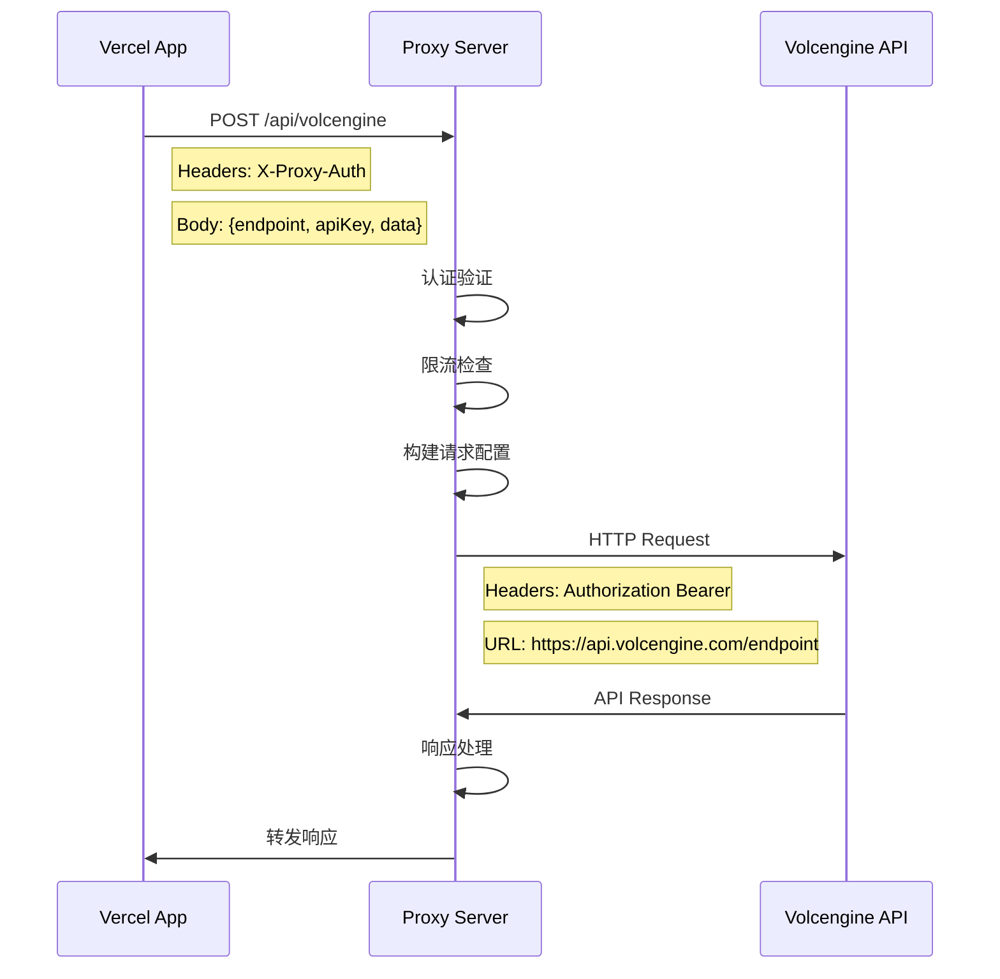
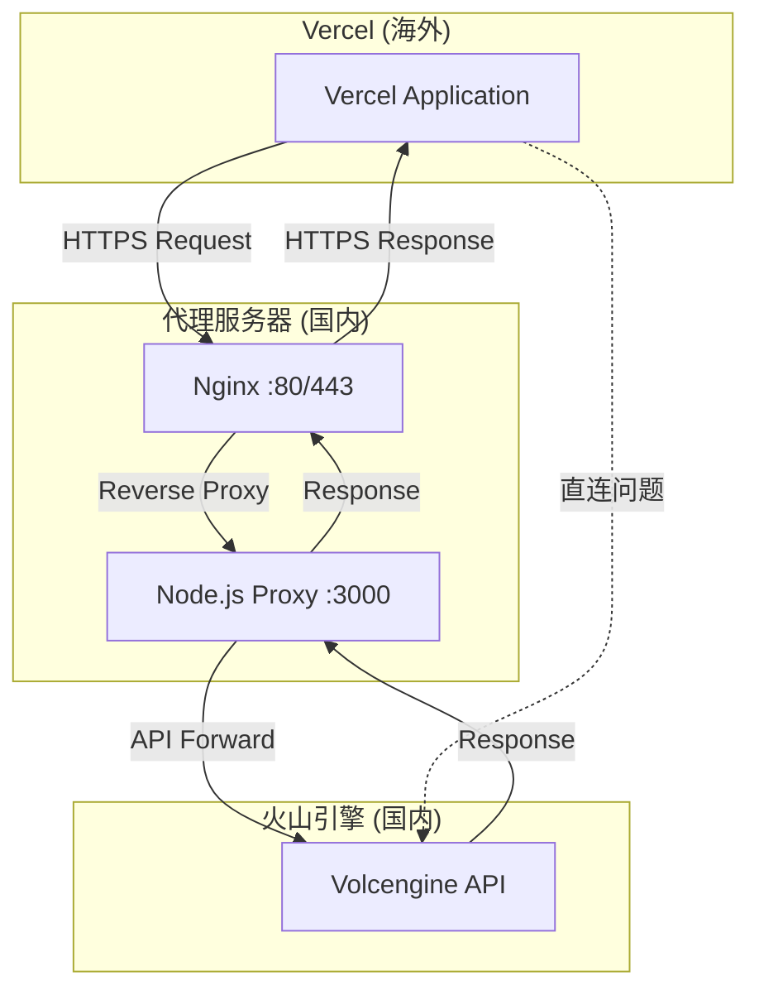

# 火山引擎 API 代理系统架构指南

## 1. 系统架构序列图

### 请求处理流程



### 完整系统架构图



## 2. 请求转发核心逻辑

### 2.1 认证机制

```javascript
// 认证中间件实现
const authenticate = (req, res, next) => {
  const authHeader = req.headers["x-proxy-auth"];
  if (authHeader !== PROXY_SECRET) {
    return res.status(401).json({ error: "Unauthorized" });
  }
  next();
};
```

**设计原理：**

- 使用自定义 HTTP 头部 `X-Proxy-Auth` 进行身份验证
- 对称密钥认证，简单高效
- 防止未授权访问代理服务

### 2.2 参数处理与验证

```javascript
// 参数提取与验证
const { endpoint, apiKey, data, method = "POST", headers = {} } = req.body;

// 必要参数验证
if (!endpoint || !apiKey) {
  return res.status(400).json({ error: "Missing required parameters" });
}
```

**核心功能：**

- 解构赋值提取请求参数
- 默认值设置（method = 'POST'）
- 必要参数验证防止无效请求

### 2.3 请求配置构建

```javascript
// 构建火山引擎API请求配置
const config = {
  method: method,
  url: `${VOLCENGINE_BASE_URL}${endpoint}`,
  headers: {
    "Content-Type": "application/json",
    Authorization: `Bearer ${apiKey}`,
    ...headers, // 支持自定义头部
  },
  timeout: 30000, // 30秒超时
};

// GET请求不需要body
if (method !== "GET") {
  config.data = data;
}
```

**设计要点：**

- 动态构建完整 API URL
- 标准化 Authorization 头部格式
- 支持自定义头部扩展
- 区分 GET 和其他方法的数据处理

### 2.4 请求转发与响应处理

```javascript
try {
  // 转发请求到火山引擎
  const response = await axios(config);

  // 记录性能指标
  const duration = Date.now() - startTime;
  console.log(`Success - ${endpoint} - ${duration}ms`);

  // 透明转发响应
  res.status(response.status).json(response.data);
} catch (error) {
  // 分层错误处理
  if (error.response) {
    // 火山引擎API错误
    res.status(error.response.status).json({
      error: error.response.data,
      proxyError: "Request failed at volcengine",
    });
  } else if (error.code === "ECONNABORTED") {
    // 超时错误
    res.status(504).json({
      error: "Gateway timeout",
      message: "Request to volcengine timed out",
    });
  } else {
    // 系统错误
    res.status(500).json({
      error: "Internal proxy error",
      message: error.message,
    });
  }
}
```

**错误处理策略：**

1. **API 响应错误**：透明转发上游错误
2. **网络超时**：返回 504 网关超时
3. **系统错误**：返回 500 内部错误

### 2.5 安全与性能优化

```javascript
// 限流配置
const limiter = rateLimit({
  windowMs: 1 * 60 * 1000, // 1分钟窗口
  max: 100, // 每IP最多100请求
  message: "Too many requests from this IP",
});

// IP白名单（可选）
const ipWhitelist = (req, res, next) => {
  if (ALLOWED_IPS.length > 0) {
    const clientIp =
      req.headers["x-forwarded-for"] || req.connection.remoteAddress;
    if (!ALLOWED_IPS.includes(clientIp)) {
      return res.status(403).json({ error: "IP not allowed" });
    }
  }
  next();
};

// 安全头部
app.use(helmet());
```

## 3. Vercel 代码改造分析

### 3.1 改造前后对比

#### 改造前 - 直连方式（有问题）

```javascript
// 直接调用火山引擎API
async function callVolcengineAPI() {
  const response = await fetch("https://api.volcengine.com/v1/models", {
    method: "POST",
    headers: {
      Authorization: `Bearer ${process.env.VOLCENGINE_API_KEY}`,
      "Content-Type": "application/json",
    },
    body: JSON.stringify(requestData),
  });

  return response.json();
}
```

**存在的问题：**

- 海外到国内网络不稳定
- 请求成功率低
- 延迟高，用户体验差

#### 改造后 - 代理方式（推荐）

```javascript
// 通过代理服务器调用
async function callVolcengineAPI(endpoint, data, method = "POST") {
  const response = await fetch(`${process.env.PROXY_URL}/api/volcengine`, {
    method: "POST",
    headers: {
      "Content-Type": "application/json",
      "X-Proxy-Auth": process.env.PROXY_SECRET, // 新增认证
    },
    body: JSON.stringify({
      endpoint: endpoint, // 端点路径
      apiKey: process.env.VOLCENGINE_API_KEY, // API密钥
      data: data, // 请求数据
      method: method, // HTTP方法
    }),
  });

  if (!response.ok) {
    throw new Error(`HTTP error! status: ${response.status}`);
  }

  return response.json();
}
```

### 3.2 环境变量配置

```bash
# Vercel 项目环境变量
PROXY_URL=http://173.242.125.44
PROXY_SECRET=jUXTv+M2jKybx0/+/TFCh1JroltTGyzHvZoCwecNciE=
```

### 3.3 封装工具函数

创建 `utils/volcengine-client.js`：

```javascript
/**
 * 火山引擎API客户端
 */
export class VolcengineClient {
  constructor() {
    this.proxyUrl = process.env.PROXY_URL;
    this.proxySecret = process.env.PROXY_SECRET;
    this.apiKey = process.env.VOLCENGINE_API_KEY;

    if (!this.proxyUrl || !this.proxySecret || !this.apiKey) {
      throw new Error("Missing required environment variables");
    }
  }

  /**
   * 调用火山引擎API
   * @param {string} endpoint - API端点路径
   * @param {object} data - 请求数据
   * @param {string} method - HTTP方法
   * @param {object} headers - 自定义头部
   */
  async call(endpoint, data = {}, method = "POST", headers = {}) {
    try {
      const response = await fetch(`${this.proxyUrl}/api/volcengine`, {
        method: "POST",
        headers: {
          "Content-Type": "application/json",
          "X-Proxy-Auth": this.proxySecret,
        },
        body: JSON.stringify({
          endpoint,
          apiKey: this.apiKey,
          data,
          method,
          headers,
        }),
      });

      if (!response.ok) {
        const errorData = await response.json();
        throw new Error(
          `API call failed: ${errorData.error || response.statusText}`
        );
      }

      return await response.json();
    } catch (error) {
      console.error("Volcengine API call failed:", error);
      throw error;
    }
  }

  // 便捷方法
  async get(endpoint, headers = {}) {
    return this.call(endpoint, {}, "GET", headers);
  }

  async post(endpoint, data, headers = {}) {
    return this.call(endpoint, data, "POST", headers);
  }

  async put(endpoint, data, headers = {}) {
    return this.call(endpoint, data, "PUT", headers);
  }

  async delete(endpoint, headers = {}) {
    return this.call(endpoint, {}, "DELETE", headers);
  }
}

// 创建全局实例
export const volcengineClient = new VolcengineClient();
```

### 3.4 业务代码改造示例

#### API 路由改造

```javascript
// pages/api/models.js - 改造前
export default async function handler(req, res) {
  try {
    const response = await fetch("https://api.volcengine.com/v1/models", {
      headers: {
        Authorization: `Bearer ${process.env.VOLCENGINE_API_KEY}`,
      },
    });

    const data = await response.json();
    res.status(200).json(data);
  } catch (error) {
    res.status(500).json({ error: error.message });
  }
}
```

```javascript
// pages/api/models.js - 改造后
import { volcengineClient } from "../../utils/volcengine-client";

export default async function handler(req, res) {
  try {
    const data = await volcengineClient.get("/v1/models");
    res.status(200).json(data);
  } catch (error) {
    res.status(500).json({ error: error.message });
  }
}
```

#### 客户端调用改造

```javascript
// 改造前
const models = await fetch("/api/direct-volcengine");

// 改造后
const models = await fetch("/api/models"); // 使用改造后的API
```

### 3.5 错误处理增强

```javascript
// utils/error-handler.js
export function handleVolcengineError(error) {
  if (error.response) {
    // 代理服务器返回的错误
    if (error.response.proxyError) {
      console.error("Proxy error:", error.response);
      return {
        type: "proxy_error",
        message: "代理服务器错误",
        details: error.response.error,
      };
    }

    // 火山引擎API错误
    return {
      type: "api_error",
      message: "火山引擎API错误",
      details: error.response.error,
    };
  }

  // 网络错误
  return {
    type: "network_error",
    message: "网络连接错误",
    details: error.message,
  };
}
```

### 3.6 改造工作量评估

| 改造项目     | 工作量 | 风险等级 | 说明              |
| ------------ | ------ | -------- | ----------------- |
| 环境变量配置 | 低     | 低       | 添加 3 个环境变量 |
| 工具函数封装 | 中     | 低       | 创建客户端封装类  |
| API 路由改造 | 中     | 中       | 替换直连调用      |
| 错误处理优化 | 低     | 低       | 增强错误处理逻辑  |
| 测试验证     | 中     | 中       | 确保功能正常      |

**总体评估：**

- **改造难度**：中等
- **风险等级**：低到中等
- **预估工期**：1-2 天
- **向后兼容**：可保持 API 接口不变

## 4. 部署与运维

### 4.1 代理服务器部署

```bash
# 1. 服务器环境准备
sudo apt update
sudo apt install nodejs npm nginx

# 2. 项目部署
git clone your-proxy-repo
cd volcengine-proxy
npm install

# 3. 环境配置
cp .env.example .env
# 编辑 .env 设置 PROXY_SECRET

# 4. 启动服务
npm install -g pm2
pm2 start ecosystem.config.js

# 5. 配置 Nginx + SSL
sudo certbot --nginx -d your-proxy-domain.com
```

### 4.2 监控与日志

```javascript
// 性能监控
const startTime = Date.now();
// ... 请求处理
const duration = Date.now() - startTime;
console.log(`[${new Date().toISOString()}] ${endpoint} - ${duration}ms`);

// 健康检查
app.get("/health", (req, res) => {
  res.json({
    status: "ok",
    timestamp: new Date().toISOString(),
    uptime: process.uptime(),
  });
});
```

## 5. 最佳实践建议

### 5.1 安全建议

- 使用强随机字符串作为 `PROXY_SECRET`
- 启用 HTTPS 和 HTTP/2
- 配置防火墙和 IP 白名单
- 定期更新依赖包

### 5.2 性能优化

- 使用 PM2 集群模式
- 配置 Nginx 缓存
- 监控内存和 CPU 使用率
- 设置合适的超时时间

### 5.3 故障排查

- 检查代理服务器日志
- 验证网络连通性
- 确认环境变量配置
- 监控 API 调用成功率

---

**文档版本：** 1.0  
**最后更新：** 2025-01-08  
**维护者：** 开发团队
